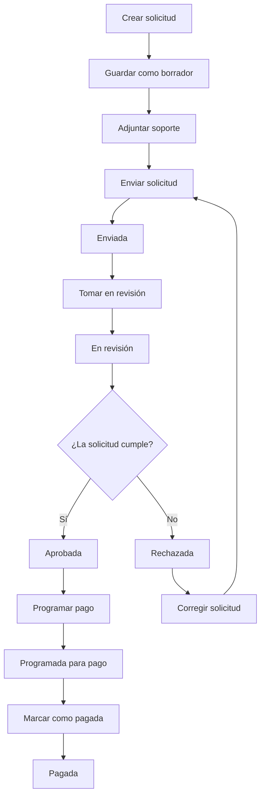

# 02. Proceso de negocio

## Descripción general

El proceso inicia cuando un usuario crea una solicitud de pago asociada a una obra, proveedor, ítem, descripción y valores económicos. La solicitud puede permanecer como borrador mientras el usuario completa la información y adjunta los soportes correspondientes.

Una vez completada, la solicitud es enviada para revisión. Los usuarios administrativos verifican la información, revisan soportes, agregan comentarios si es necesario y cambian el estado según corresponda. Si la solicitud cumple con las condiciones requeridas, puede ser aprobada, programada para pago y finalmente marcada como pagada.

## Flujo principal

1. El usuario solicitante crea una solicitud de pago.
2. El sistema registra la solicitud en estado Borrador.
3. El usuario adjunta uno o varios soportes.
4. El usuario envía la solicitud.
5. El sistema valida que la solicitud tenga soporte adjunto.
6. La solicitud pasa a estado Enviada.
7. Un revisor toma la solicitud para revisión.
8. La solicitud pasa a estado En revisión.
9. El revisor o aprobador valida la información.
10. La solicitud puede ser aprobada o rechazada.
11. Si es rechazada, debe quedar una observación obligatoria.
12. Si es aprobada, el área de pagos puede programarla para pago.
13. El área de pagos marca la solicitud como pagada.
14. El sistema registra todo cambio de estado en el historial.

## Flujo de estados

```text
Borrador
   ↓
Enviada
   ↓
En revisión
   ↓
Aprobada / Rechazada
   ↓
Programada para pago
   ↓
Pagada
```



