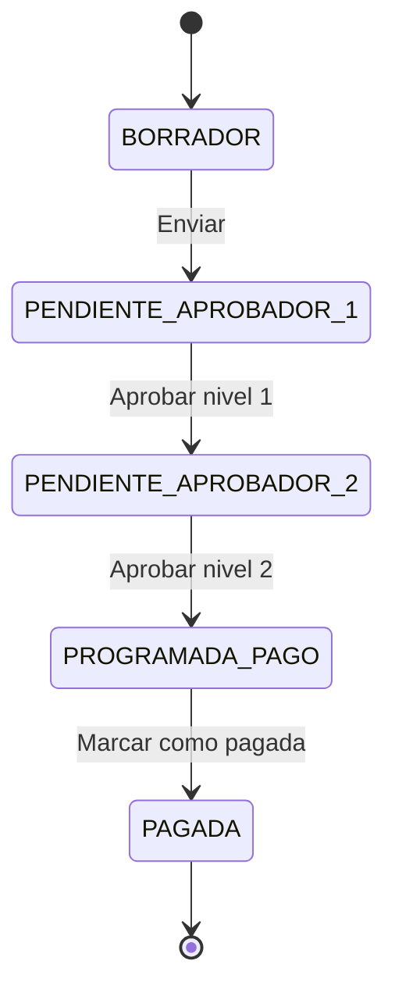
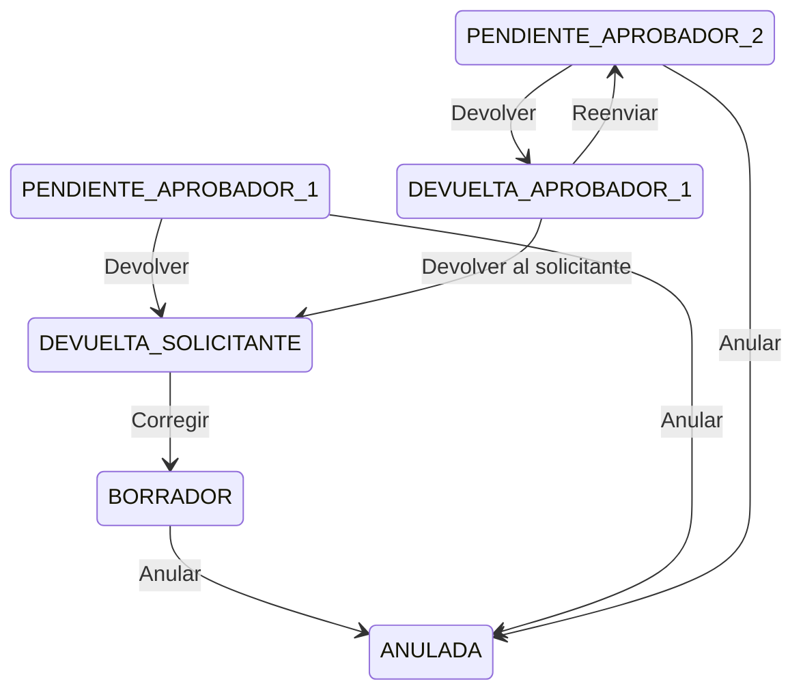
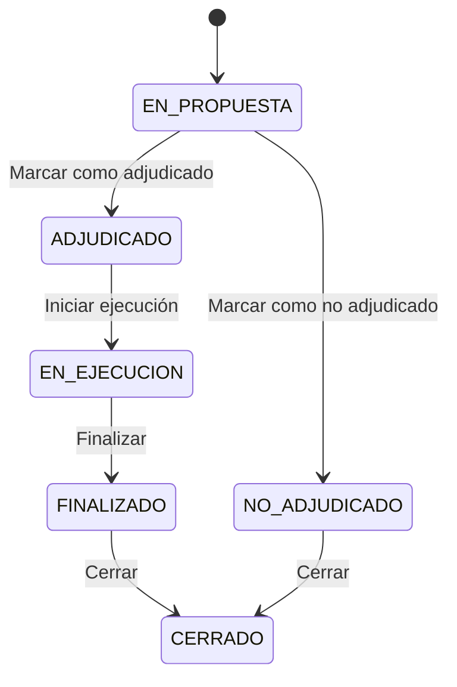
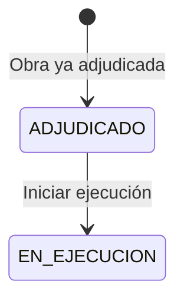
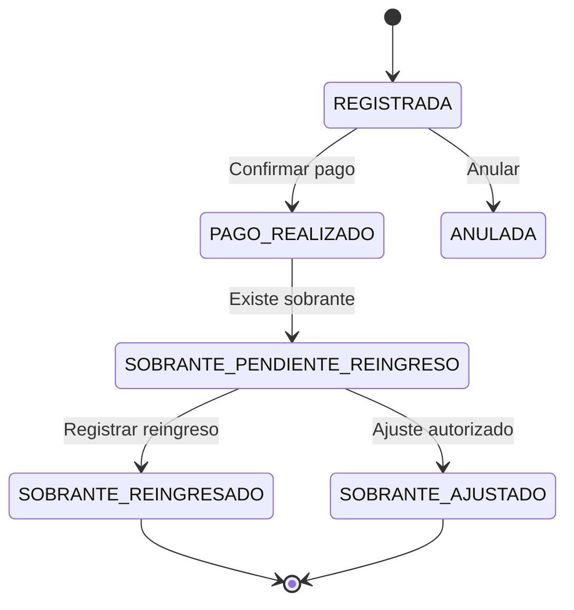

# 04. Máquinas de estado

## Solicitudes de pago

### Estados

```text
BORRADOR
PENDIENTE_APROBADOR_1
PENDIENTE_APROBADOR_2
DEVUELTA_APROBADOR_1
DEVUELTA_SOLICITANTE
PROGRAMADA_PAGO
PAGADA
ANULADA
```

### Flujo principal



### Flujos alternos



## Centro de costo

### Estados

```text
EN_PROPUESTA
NO_ADJUDICADO
ADJUDICADO
EN_EJECUCION
FINALIZADO
CERRADO
```

### Flujo estándar



### Flujo de carga inicial



## Operaciones de efectivo

```text
REGISTRADA
PAGO_REALIZADO
SOBRANTE_PENDIENTE_REINGRESO
SOBRANTE_REINGRESADO
SOBRANTE_AJUSTADO
ANULADA
```



## Impuestos y retenciones

Estados de registro:

```text
REGISTRADO
AJUSTADO
ANULADO
```

No usan doble aprobación independiente.

## Reglas transversales

- La aprobación de segundo nivel deja la solicitud en `PROGRAMADA_PAGO`.
- Pagos solo marca como `PAGADA`.
- Reingresos de sobrantes no pasan por aprobación.
- Impuestos y retenciones no crean workflow independiente.
- Cambios posteriores a aprobación requieren auditoría.

## Movimientos financieros

Los movimientos financieros no usan la máquina de estados de solicitudes. Se registran como hechos contables/operativos controlados por permisos.

Estados sugeridos de registro financiero:

```text
REGISTRADO
ANULADO
AJUSTADO
```

Aplica para:

- Reingreso de sobrantes.
- Cargos financieros.
- Pagos tributarios independientes.
- Ajustes autorizados.
