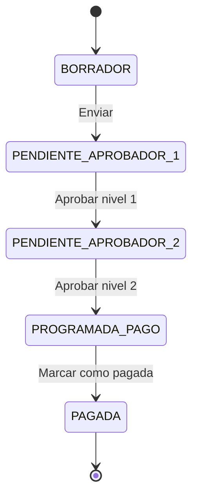
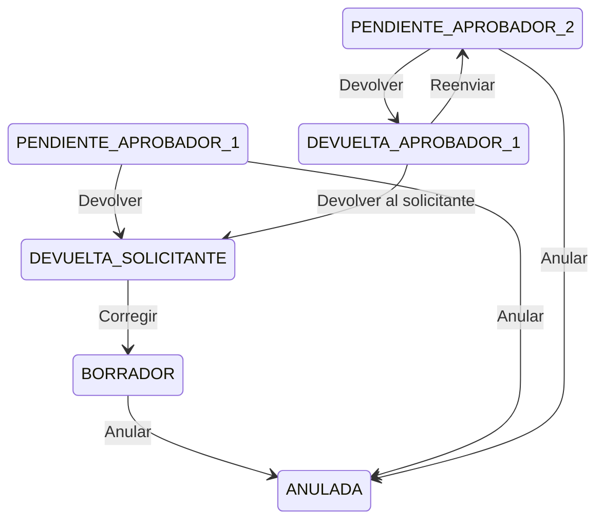
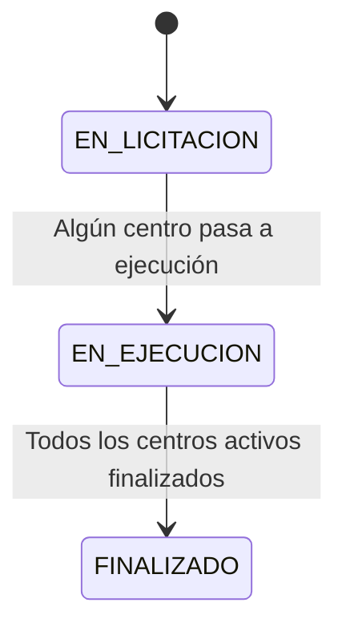
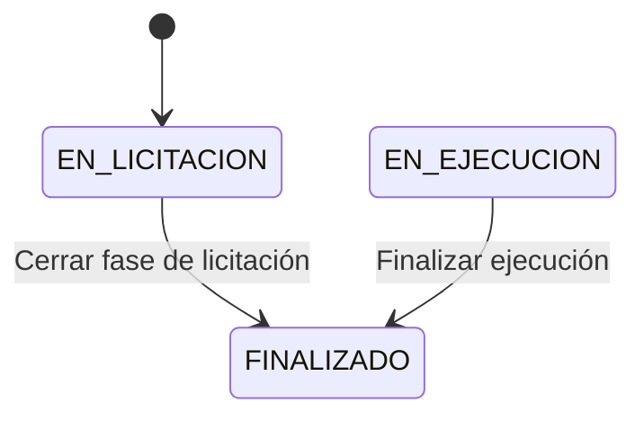
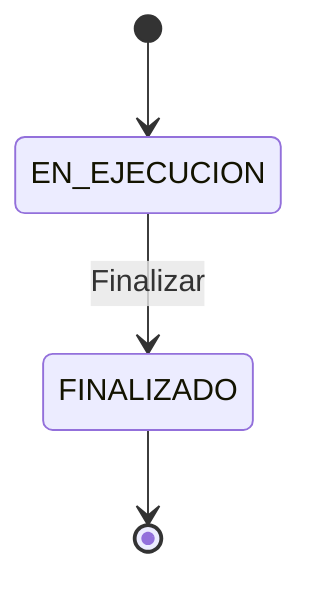
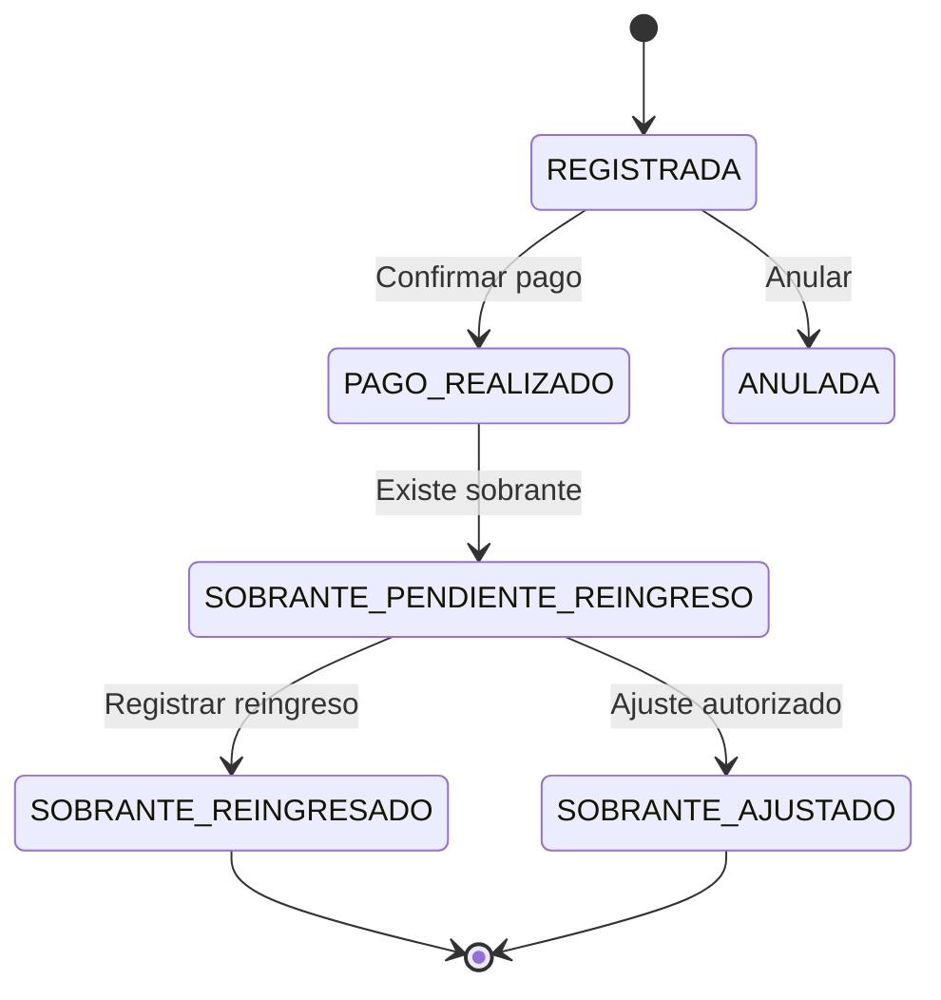

# 04. Máquinas de estado

## Solicitudes de pago

### Estados

```text
BORRADOR
PENDIENTE_APROBADOR_1
PENDIENTE_APROBADOR_2
DEVUELTA_APROBADOR_1
DEVUELTA_SOLICITANTE
PROGRAMADA_PAGO
PAGADA
ANULADA
```

### Flujo principal



### Flujos alternos



## Proyecto base

### Estados

```text
EN_LICITACION
EN_EJECUCION
FINALIZADO
```

### Flujo estándar



Reglas:

- El proyecto base inicia en `EN_LICITACION`.
- Si cualquier centro activo está en `EN_EJECUCION`, el proyecto queda en `EN_EJECUCION`.
- Si todos los centros activos están en `FINALIZADO`, el proyecto queda en `FINALIZADO`.

## Centros de costo

### Estados

```text
EN_LICITACION
EN_EJECUCION
FINALIZADO
```

### Flujo de licitación a ejecución



El paso de licitación a ejecución no convierte el mismo registro a `EN_EJECUCION`. El sistema finaliza el centro de licitación y crea un nuevo centro de ejecución.

```text
PRO-OBRA EN_LICITACION → PRO-OBRA FINALIZADO + OBRA EN_EJECUCION
PRO-INT  EN_LICITACION → PRO-INT  FINALIZADO + INT  EN_EJECUCION
```

### Flujo de ejecución



## Beneficiarios

Los beneficiarios no tienen una máquina de estados compleja en el MVP. Usan estado lógico mediante campo `activo`.

```text
ACTIVO
INACTIVO
```

Reglas:

- Solo beneficiarios activos se usan para nuevas solicitudes.
- La inactivación no elimina historial de solicitudes ni movimientos.
- La deduplicación de creación se valida sobre beneficiarios activos por tipo y número de documento.

## Operaciones de efectivo

```text
REGISTRADA
PAGO_REALIZADO
SOBRANTE_PENDIENTE_REINGRESO
SOBRANTE_REINGRESADO
SOBRANTE_AJUSTADO
ANULADA
```



## Impuestos y retenciones

Estados de registro:

```text
REGISTRADO
AJUSTADO
ANULADO
```

No usan doble aprobación independiente.

## Reglas transversales

- La aprobación de segundo nivel deja la solicitud en `PROGRAMADA_PAGO`.
- Pagos solo marca como `PAGADA`.
- Reingresos de sobrantes no pasan por aprobación.
- Impuestos y retenciones no crean workflow independiente.
- Cambios posteriores a aprobación requieren auditoría.
- Cambios de proyecto, centro, solicitud o pago deben validar permisos en backend.
- La base de datos debe reforzar estados críticos mediante restricciones `CHECK`.

## Movimientos financieros

Los movimientos financieros no usan la máquina de estados de solicitudes. Se registran como hechos contables/operativos controlados por permisos.

Estados sugeridos de registro financiero:

```text
REGISTRADO
ANULADO
AJUSTADO
```

Aplica para:

- Reingreso de sobrantes.
- Cargos financieros.
- Pagos tributarios independientes.
- Ajustes autorizados.
