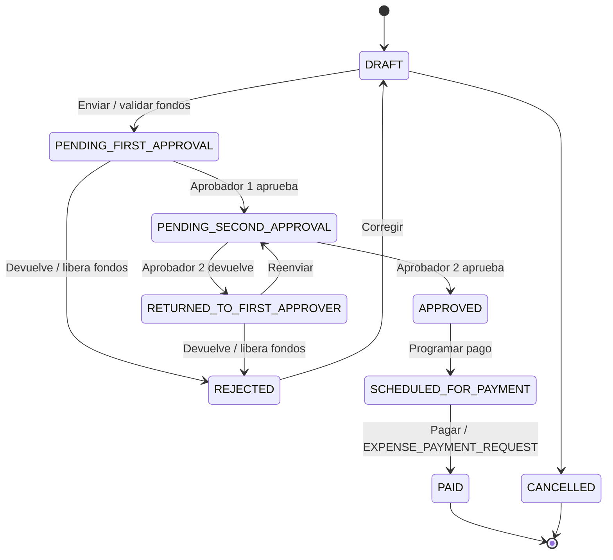

# 04. Máquina de estados

## Objetivo

Definir los estados permitidos para solicitudes de pago e integrar el impacto financiero sobre fondos de obra. El módulo de préstamos tiene su propia máquina de estados.

## Estados de solicitud

| Estado técnico | Nombre visible |
|---|---|
| `DRAFT` | Borrador |
| `PENDING_FIRST_APPROVAL` | Pendiente de revisión de Aprobador 1 |
| `PENDING_SECOND_APPROVAL` | Pendiente de revisión de Aprobador 2 |
| `RETURNED_TO_FIRST_APPROVER` | Devuelta al Aprobador 1 |
| `REJECTED` | Devuelta al Solicitante |
| `APPROVED` | Aprobada |
| `SCHEDULED_FOR_PAYMENT` | Programada para pago |
| `PAID` | Pagada |
| `CANCELLED` | Anulada |

## Transiciones de solicitud

| Desde | Hacia | Acción | Impacto financiero |
|---|---|---|---|
| `DRAFT` | `PENDING_FIRST_APPROVAL` | Enviar solicitud | Valida fondos y puede reservar |
| `PENDING_FIRST_APPROVAL` | `PENDING_SECOND_APPROVAL` | Aprobar primer nivel | Sin egreso definitivo |
| `PENDING_FIRST_APPROVAL` | `REJECTED` | Devolver al Solicitante | Libera reserva si aplica |
| `PENDING_SECOND_APPROVAL` | `APPROVED` | Aprobar segundo nivel | Sin egreso definitivo |
| `PENDING_SECOND_APPROVAL` | `RETURNED_TO_FIRST_APPROVER` | Devolver al Aprobador 1 | Mantiene reserva si aplica |
| `RETURNED_TO_FIRST_APPROVER` | `PENDING_SECOND_APPROVAL` | Reenviar a Aprobador 2 | Mantiene reserva si aplica |
| `RETURNED_TO_FIRST_APPROVER` | `REJECTED` | Devolver al Solicitante | Libera reserva si aplica |
| `REJECTED` | `DRAFT` | Corregir solicitud | Sin movimiento financiero |
| `APPROVED` | `SCHEDULED_FOR_PAYMENT` | Programar pago | Sin egreso definitivo |
| `SCHEDULED_FOR_PAYMENT` | `PAID` | Marcar pagada | Registra `EXPENSE_PAYMENT_REQUEST` |
| Estados permitidos | `CANCELLED` | Anular | Libera reserva si aplica |

## Estados de préstamo

| Estado técnico | Descripción |
|---|---|
| `PENDING` | Préstamo pendiente por pagar |
| `PARTIALLY_PAID` | Préstamo con pagos parciales |
| `PAID` | Préstamo completamente pagado |
| `CANCELLED` | Préstamo anulado administrativamente |

