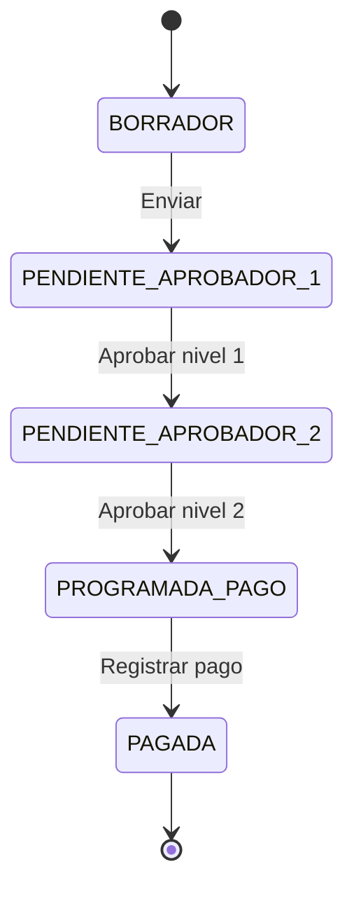
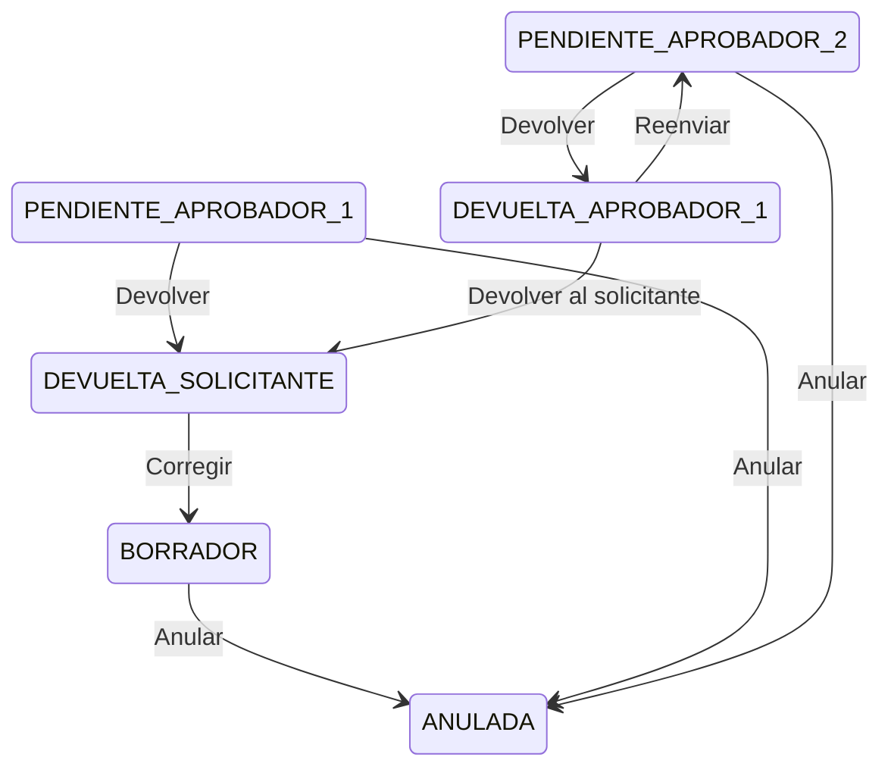
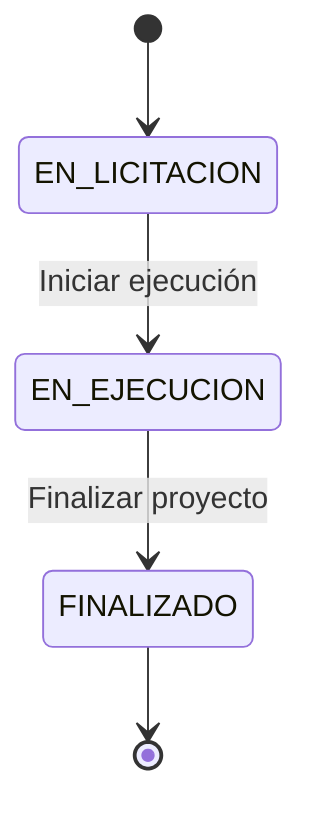
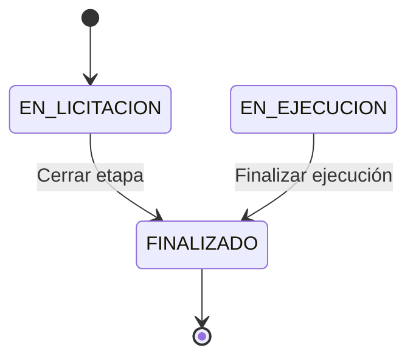
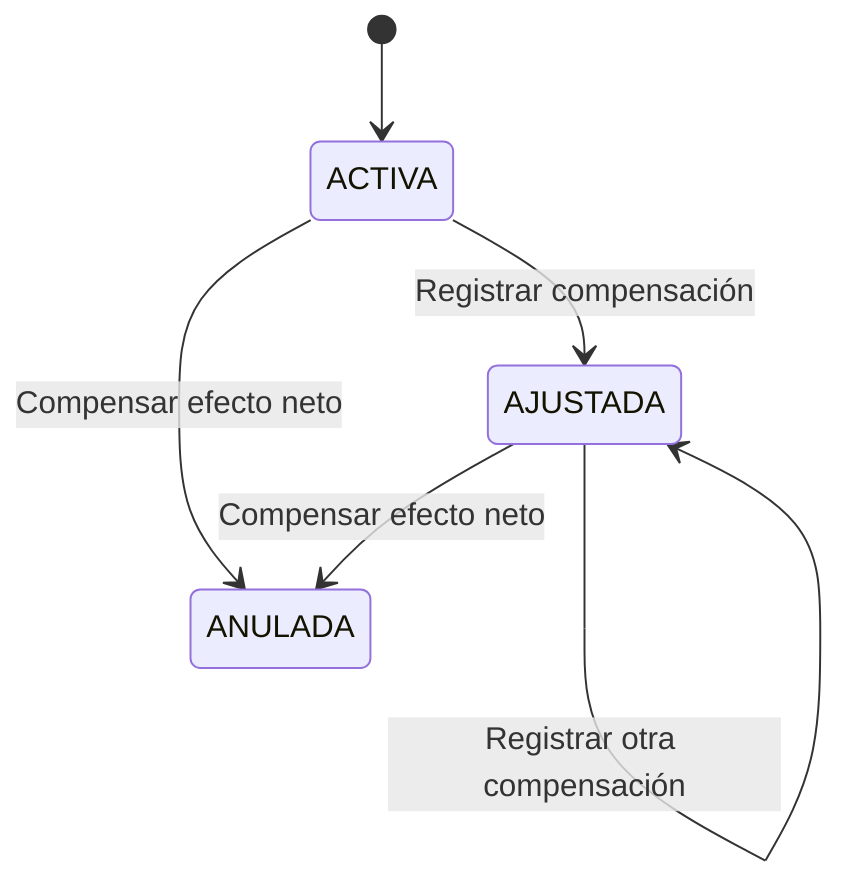

# 04. Máquinas de estado

> Última actualización funcional: 18 de julio de 2026.

Este documento describe las máquinas de estado utilizadas por el Sistema de Gestión de Solicitudes de Pago.

Cada máquina de estados define los posibles estados de una entidad, las transiciones permitidas entre ellos y las reglas generales que gobiernan su ciclo de vida.

Las reglas funcionales de cada proceso se encuentran documentadas en **02-business-process.md**.

---

# 1. Solicitudes de pago

Las solicitudes de pago representan la entidad principal del sistema.

Independientemente del tipo de solicitud (proveedores, nómina, impuestos o reembolsos), todas utilizan la misma máquina de estados.

## 1.1 Estados

```text
BORRADOR

PENDIENTE_APROBADOR_1

PENDIENTE_APROBADOR_2

DEVUELTA_APROBADOR_1

DEVUELTA_SOLICITANTE

PROGRAMADA_PAGO

PAGADA

ANULADA
```

---

## 1.2 Flujo principal


```mermaid
stateDiagram-v2
    [*] --> BORRADOR

    BORRADOR --> PENDIENTE_APROBADOR_1 : Enviar

    PENDIENTE_APROBADOR_1 --> PENDIENTE_APROBADOR_2 : Aprobar nivel 1

    PENDIENTE_APROBADOR_2 --> PROGRAMADA_PAGO : Aprobar nivel 2

    PROGRAMADA_PAGO --> PAGADA : Registrar pago

    PAGADA --> [*]
```

---

## 1.3 Flujos alternos


```mermaid
stateDiagram-v2

    PENDIENTE_APROBADOR_1 --> DEVUELTA_SOLICITANTE : Devolver

    DEVUELTA_SOLICITANTE --> BORRADOR : Corregir

    PENDIENTE_APROBADOR_2 --> DEVUELTA_APROBADOR_1 : Devolver

    DEVUELTA_APROBADOR_1 --> PENDIENTE_APROBADOR_2 : Reenviar

    DEVUELTA_APROBADOR_1 --> DEVUELTA_SOLICITANTE : Devolver al solicitante

    BORRADOR --> ANULADA : Anular

    PENDIENTE_APROBADOR_1 --> ANULADA : Anular

    PENDIENTE_APROBADOR_2 --> ANULADA : Anular
```

---

## 1.4 Reglas generales

- Toda solicitud inicia en estado **BORRADOR**.
- Una solicitud únicamente podrá avanzar siguiendo las transiciones definidas en esta máquina de estados.
- La aprobación del segundo nivel cambia automáticamente el estado a **PROGRAMADA_PAGO**.
- El rol **PAGOS** únicamente podrá ejecutar la transición hacia **PAGADA**.
- Toda transición deberá registrarse en la auditoría del sistema.
- No se permitirán cambios de estado que no estén definidos explícitamente en esta máquina.

---

# 2. Proyectos base

El Proyecto Base representa la unidad principal de gestión del sistema.

Su estado refleja el avance general del proyecto durante su ciclo de vida.

## 2.1 Estados

```text
EN_LICITACIÓN

EN_EJECUCIÓN

FINALIZADO
```

---

## 2.2 Máquina de estados


```mermaid
stateDiagram-v2
    [*] --> EN_LICITACION

    EN_LICITACION --> EN_EJECUCION : Iniciar ejecución

    EN_EJECUCION --> FINALIZADO : Finalizar proyecto

    FINALIZADO --> [*]
```

---

## 2.3 Reglas generales

- Todo proyecto base inicia en estado **EN_LICITACIÓN**.
- El cambio a **EN_EJECUCIÓN** ocurre cuando inicia la fase de ejecución del proyecto.
- Un proyecto únicamente podrá finalizar cuando cumpla las condiciones establecidas por el negocio.
- El estado del proyecto será utilizado como referencia para habilitar o restringir determinadas operaciones del sistema.

---

# 3. Centros de costo

Los centros de costo representan las unidades presupuestales asociadas a un proyecto base.

Su ciclo de vida depende de la línea de negocio correspondiente.

## 3.1 Estados

```text
EN_LICITACIÓN

EN_EJECUCIÓN

FINALIZADO
```

---

## 3.2 Máquina de estados


```mermaid
stateDiagram-v2
    [*] --> EN_LICITACION

    EN_LICITACION --> FINALIZADO : Cerrar etapa

    EN_EJECUCION --> FINALIZADO : Finalizar ejecución

    FINALIZADO --> [*]
```

---

## 3.3 Reglas generales

- Los centros correspondientes a la etapa de licitación finalizan al iniciar la etapa de ejecución.
- El inicio de la ejecución genera los nuevos centros de costo operativos definidos para dicha fase.
- Los centros finalizados conservan toda su información histórica y no podrán reutilizarse.

---

# 4. Beneficiarios

Los beneficiarios no requieren una máquina de estados compleja dentro del MVP.

Su disponibilidad se controla mediante un estado lógico.

## 4.1 Estados

```text
ACTIVO

INACTIVO
```

---

## 4.2 Reglas generales

- Solo los beneficiarios activos podrán utilizarse en nuevas solicitudes de pago.
- La inactivación de un beneficiario no afecta las solicitudes ni los movimientos financieros previamente registrados.
- Un beneficiario podrá reactivarse cuando las condiciones del negocio lo permitan.

---

# 5. Operaciones de efectivo

Las operaciones de efectivo controlan el ciclo de vida de los retiros de dinero y el manejo de los sobrantes generados durante la ejecución de pagos en efectivo.

## 5.1 Comportamiento implementado

En el alcance de HU-0903, el retiro y sus pagos se registran en una única
transacción. La operación posee un estado propio para conservar la
trazabilidad de ajustes y anulaciones.

La confirmación de la operación:

- crea la operación y sus detalles;
- genera `EGRESO_RETIRO_EFECTIVO`;
- cambia cada solicitud asociada de `PROGRAMADA_PAGO` a `PAGADA`;
- puede generar `INGRESO_REINTEGRO_EFECTIVO` cuando el sobrante se reintegra
  inmediatamente;
- revierte todos los cambios si falla cualquier elemento.

---

## 5.2 Estados implementados

```text
ACTIVA
AJUSTADA
ANULADA
```


```mermaid
stateDiagram-v2
    [*] --> ACTIVA
    ACTIVA --> AJUSTADA : Registrar compensación
    AJUSTADA --> AJUSTADA : Registrar otra compensación
    ACTIVA --> ANULADA : Compensar efecto neto
    AJUSTADA --> ANULADA : Compensar efecto neto
```

`ANULADA` es terminal. La anulación no cambia las solicitudes `PAGADA`, no
elimina pagos ni altera movimientos anteriores.

Un ajuste de ingreso que agota el pendiente deja el seguimiento en
`SOBRANTE_AJUSTADO`. Un ajuste de egreso incrementa el pendiente y conserva
`SOBRANTE_PENDIENTE_REINGRESO` hasta su devolución.

---

## 5.3 Reglas generales

- Una operación de efectivo puede asociar una o varias solicitudes de pago
  en `EFECTIVO` o `CONSIGNACION`.
- Todas las solicitudes de la operación pertenecen al mismo proyecto y fondo.
- Cada solicitud conservará su propia máquina de estados independiente.
- El registro de la operación cambia las solicitudes asociadas a `PAGADA`.
- El retiro afecta el fondo una sola vez; las solicitudes asociadas no
  generan egresos adicionales.
- Todo reingreso o ajuste deberá generar los movimientos financieros correspondientes.

---

# 6. Movimientos financieros

Los movimientos financieros representan registros contables y operativos derivados de las diferentes operaciones del sistema.

No participan en flujos de aprobación ni poseen una máquina de estados compleja.

## 6.1 Estados

```text
REGISTRADO

AJUSTADO

ANULADO
```

---

## 6.2 Reglas generales

- Todo movimiento financiero se genera a partir de una operación autorizada del sistema.
- Los movimientos financieros conservan su historial y trazabilidad.
- Un movimiento ajustado deberá conservar el registro del movimiento original.
- La anulación de un movimiento no elimina el registro histórico.

---

# 7. Reglas generales

Las siguientes reglas aplican a todas las máquinas de estado definidas en el sistema:

- Las transiciones solo podrán realizarse entre estados permitidos.
- No se permitirán cambios directos entre estados que no estén definidos en la máquina correspondiente.
- Toda transición deberá ejecutarse desde el backend.
- Cada cambio de estado deberá registrarse en la auditoría del sistema.
- Los permisos del usuario serán validados antes de ejecutar cualquier transición.
- Las restricciones de integridad implementadas en la base de datos deberán garantizar la consistencia de los estados registrados.
