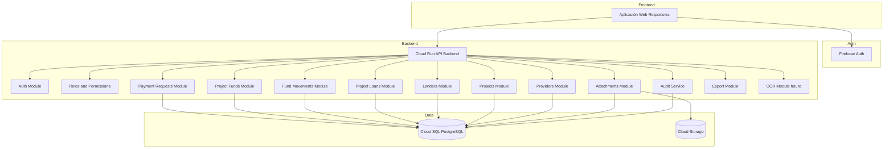

# 05. Arquitectura del sistema

## Objetivo

Definir la arquitectura técnica completa del sistema de solicitudes de pago y fondos de obra.

## Arquitectura general

## Principios

- La Aplicación Web nunca se conecta directamente a la base de datos.
- Toda lógica de negocio vive en el backend.
- Firebase Auth autentica; el backend autoriza.
- Los archivos se almacenan en Cloud Storage.
- Los fondos de obra y movimientos financieros se gestionan únicamente desde backend.
- Toda afectación de fondos debe ser transaccional.
- Todo ingreso, egreso, préstamo, devolución, ajuste o pago debe quedar trazado.
- El backend resuelve la cuenta de fondos según el proyecto de la solicitud.

## Módulos principales

- Auth Module.
- Users and Roles Module.
- Projects Module.
- Providers Module.
- Payment Requests Module.
- Project Funds Module.
- Project Fund Movements Module.
- Project Loans Module.
- Lenders Module.
- Attachments Module.
- Audit Module.
- Export Module.
- OCR Module futuro.
