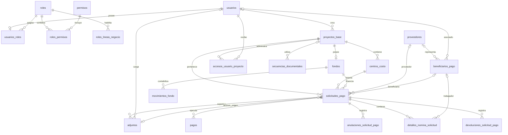

# 06. Modelo Entidad–Relación (ER) - Vista General

> **Última actualización:**  18 Julio de 2026
> **Fuente de verdad:** `schema.prisma`

---

# Objetivo

Este documento presenta una vista de alto nivel del modelo Entidad–Relación (ER) del Sistema de Gestión de Solicitudes de Pago.

Su propósito es mostrar la organización general de las entidades implementadas y las relaciones principales entre los módulos del sistema, sin entrar en el detalle de atributos o reglas específicas.

---

# Vista general del modelo

El sistema se organiza alrededor de la entidad:

```text
solicitudes_pago
```

La solicitud de pago constituye el núcleo del modelo y se relaciona principalmente con los módulos de:

- Seguridad;
- Organización;
- Beneficiarios;
- Gestión documental;
- Nómina;
- Aprobaciones, pagos y movimientos financieros.

---

# Diagrama general



---

# Organización por dominios

## Seguridad

Entidades principales:

- usuarios;
- roles;
- permisos;
- usuarios_roles;
- roles_permisos;
- roles_lineas_negocio.

Documento relacionado:

```text
06-04-database-model-er-security.md
```

---

## Organización

Entidades principales:

- proyectos_base;
- centros_costo;
- fondos;
- accesos_usuario_proyecto;
- secuencias_documentales.

Documento relacionado:

```text
06-05-database-model-er-organizacion.md
```

---

## Beneficiarios

Entidades principales:

- proveedores;
- beneficiarios_pago.

Documento relacionado:

```text
06-06-database-model-er-beneficiarios.md
```

---

## Solicitudes de pago

Entidades principales:

- solicitudes_pago;
- detalles_nomina_solicitud.

Documento relacionado:

```text
06-07-01-database-model-er-solicitudes-pago.md
```

---

## Gestión documental

Entidad principal:

- adjuntos.

Documento relacionado:

```text
06-07-03-database-model-er-gestion-documental.md
```

---

# Flujo general del modelo

```text
Usuarios
      │
      ▼
Accesos a proyectos
      │
      ▼
Proyecto Base
      │
      ▼
Centro de costo
      │
      ▼
Fondo
      │
      ▼
Solicitud de pago
      ├────────► Beneficiario
      ├────────► Proveedor
      ├────────► Adjuntos
      └────────► Detalles de nómina
```

---

# Consideraciones

Este documento presenta únicamente la estructura general del modelo.

El detalle de:

- atributos;
- relaciones Prisma;
- cardinalidades;
- restricciones;
- reglas de eliminación;
- dependencias funcionales;

se desarrolla en los documentos especializados de cada módulo.

---

# Documentos relacionados

- `06-04-database-model-er-security.md`
- `06-05-database-model-er-organizacion.md`
- `06-06-database-model-er-beneficiarios.md`
- `06-07-01-database-model-er-solicitudes-pago.md`
- `06-07-02-database-model-er-nomina.md`
- `06-07-03-database-model-er-gestion-documental.md`
- `06-07-04-database-model-er-roadmap.md`
