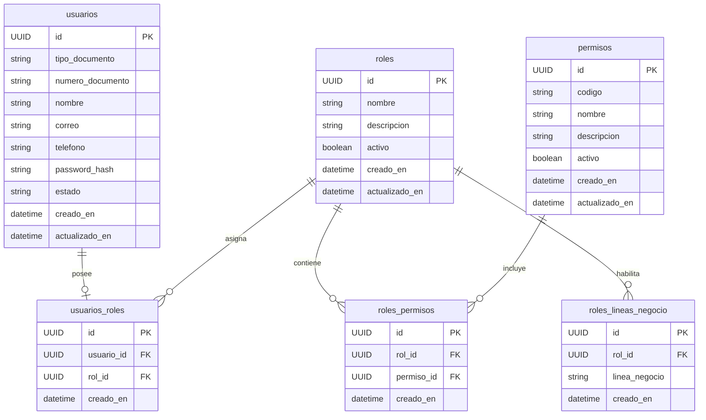

# 06. Modelo Entidad–Relación (ER) - Seguridad

> **Última actualización:** Julio de 2026
> **Fuente de verdad:** `schema.prisma`

---

# Objetivo

Este documento describe el modelo Entidad–Relación correspondiente al módulo de Seguridad del Sistema de Gestión de Solicitudes de Pago.

Este módulo administra la autenticación, autorización y control de acceso mediante usuarios, roles, permisos y líneas de negocio.

---

# Entidades

| Entidad | Descripción |
|----------|-------------|
| `usuarios` | Usuarios autenticados del sistema. |
| `roles` | Roles funcionales del sistema. |
| `permisos` | Permisos disponibles. |
| `usuarios_roles` | Asignación de roles a usuarios. |
| `roles_permisos` | Asignación de permisos a roles. |
| `roles_lineas_negocio` | Líneas de negocio habilitadas para cada rol. |

---

# Diagrama ER



---

# Relaciones principales

| Entidad origen | Entidad destino | Cardinalidad |
|----------------|-----------------|--------------|
| usuarios | usuarios_roles | 1 : 0..1 |
| roles | usuarios_roles | 1 : 0..N |
| roles | roles_permisos | 1 : 0..N |
| permisos | roles_permisos | 1 : 0..N |
| roles | roles_lineas_negocio | 1 : 0..N |

---

# Descripción de las relaciones

## usuarios → usuarios_roles

Cada usuario puede tener como máximo un rol asignado.

La relación utiliza:

```text
usuario_id
```

La restricción:

```text
@@unique([usuario_id])
```

garantiza que un usuario no pueda tener más de un registro en `usuarios_roles`.

Cardinalidad:

```text
USUARIO 1 → 0..1 USUARIO_ROL
```

---

## roles → usuarios_roles

Un rol puede estar asociado a múltiples usuarios.

La relación utiliza:

```text
rol_id
```

Cardinalidad:

```text
ROL 1 → 0..N USUARIOS_ROLES
```

---

## roles → roles_permisos

Un rol puede agrupar múltiples permisos.

La relación utiliza:

```text
rol_id
```

Cardinalidad:

```text
ROL 1 → 0..N ROLES_PERMISOS
```

---

## permisos → roles_permisos

Un permiso puede pertenecer a múltiples roles.

La relación utiliza:

```text
permiso_id
```

Cardinalidad:

```text
PERMISO 1 → 0..N ROLES_PERMISOS
```

---

## roles → roles_lineas_negocio

Cada rol puede habilitar una o varias líneas de negocio.

La relación utiliza:

```text
rol_id
```

Cardinalidad:

```text
ROL 1 → 0..N ROLES_LINEAS_NEGOCIO
```

---

# Reglas del modelo

## Un rol por usuario

El modelo físico implementa una única asignación de rol por usuario mediante la restricción:

```text
@@unique([usuario_id])
```

---

## Relación muchos a muchos

La asignación entre:

- roles y permisos;

se implementa mediante la tabla intermedia:

```text
roles_permisos
```

---

## Líneas de negocio

Las líneas de negocio se asignan a los roles y son heredadas por los usuarios que poseen dicho rol.

---

## Eliminación

Las relaciones implementan las reglas de integridad definidas en `schema.prisma`.

Las eliminaciones en cascada se aplican donde el modelo Prisma las define explícitamente.

---

# Integración con otros módulos

La entidad `usuarios` participa además en:

- organización;
- beneficiarios;
- solicitudes de pago;
- gestión documental.

Por esta razón constituye una de las entidades principales del modelo de datos.

---

# Resumen

El módulo de Seguridad implementa el esquema de autenticación y autorización del sistema mediante usuarios, roles, permisos y líneas de negocio.

Todas las relaciones descritas corresponden al modelo físico implementado actualmente en `schema.prisma`.