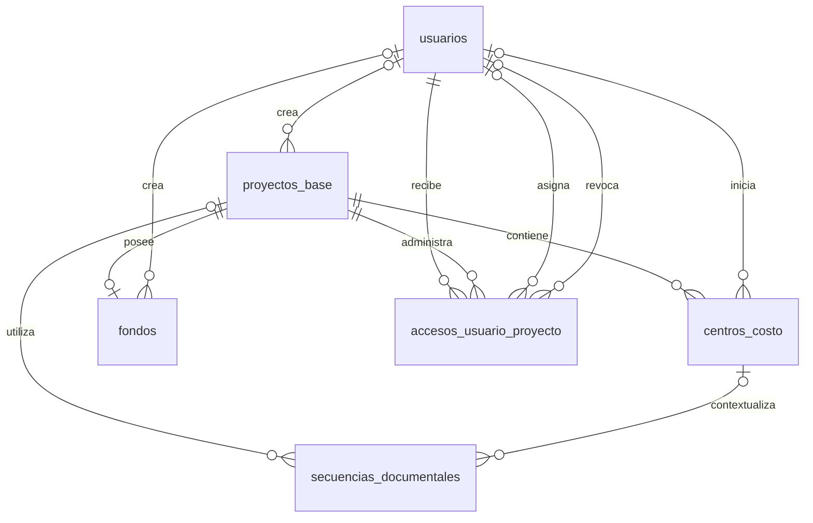

# 06. Modelo Entidad–Relación (ER) - Organización

> **Última actualización:** Julio de 2026
> **Fuente de verdad:** `schema.prisma`

---

# Objetivo

Este documento describe el modelo Entidad–Relación correspondiente al módulo de Organización del Sistema de Gestión de Solicitudes de Pago.

Este módulo representa la estructura administrativa sobre la cual opera el sistema, permitiendo administrar proyectos base, centros de costo, fondos, accesos de usuarios y secuencias documentales.

Toda la información aquí presentada corresponde al modelo implementado actualmente en `schema.prisma`.

---

# Entidades

| Entidad | Descripción |
|----------|-------------|
| `proyectos_base` | Proyecto principal administrado por la organización. |
| `centros_costo` | Centros de costo pertenecientes a un proyecto base. |
| `fondos` | Fondo financiero asociado a un proyecto base. |
| `accesos_usuario_proyecto` | Accesos de usuarios a proyectos y líneas de negocio. |
| `secuencias_documentales` | Administración de consecutivos documentales. |
| `usuarios` | Usuarios responsables de crear o administrar registros organizacionales. |

---

# Diagrama ER



---

# Relaciones principales

| Entidad origen | Entidad destino | Cardinalidad |
|----------------|-----------------|--------------|
| usuarios | proyectos_base | 1 : 0..N |
| proyectos_base | centros_costo | 1 : 0..N |
| usuarios | centros_costo | 1 : 0..N |
| proyectos_base | fondos | 1 : 0..1 |
| usuarios | fondos | 1 : 0..N |
| usuarios | accesos_usuario_proyecto | 1 : 0..N |
| proyectos_base | accesos_usuario_proyecto | 1 : 0..N |
| usuarios | accesos_usuario_proyecto (asignador) | 1 : 0..N |
| usuarios | accesos_usuario_proyecto (revocador) | 1 : 0..N |
| proyectos_base | secuencias_documentales | 1 : 0..N (opcional) |
| centros_costo | secuencias_documentales | 1 : 0..N (opcional) |

---

# Descripción de las relaciones

## usuarios → proyectos_base

El sistema puede registrar el usuario que creó un proyecto base.

La relación utiliza:

```text
creado_por
```

Este campo es opcional.

Cardinalidad:

```text
USUARIO 1 → 0..N PROYECTOS_BASE
```

---

## proyectos_base → centros_costo

Cada proyecto base puede contener múltiples centros de costo.

La relación utiliza:

```text
proyecto_base_id
```

Cardinalidad:

```text
PROYECTO_BASE 1 → 0..N CENTROS_COSTO
```

---

## usuarios → centros_costo

El sistema puede registrar el usuario responsable del inicio de ejecución del centro de costo.

La relación utiliza:

```text
inicio_ejecucion_por
```

Este campo es opcional.

Cardinalidad:

```text
USUARIO 1 → 0..N CENTROS_COSTO
```

---

## proyectos_base → fondos

Cada proyecto base puede tener un único fondo asociado.

La relación utiliza:

```text
proyecto_base_id
```

La restricción:

```text
@unique
```

garantiza la relación uno a uno.

Cardinalidad:

```text
PROYECTO_BASE 1 → 0..1 FONDO
```

---

## usuarios → fondos

El sistema puede registrar el usuario que creó un fondo.

La relación utiliza:

```text
creado_por
```

Este campo es opcional.

Cardinalidad:

```text
USUARIO 1 → 0..N FONDOS
```

---

## usuarios → accesos_usuario_proyecto

Cada acceso pertenece obligatoriamente a un usuario.

La relación utiliza:

```text
usuario_id
```

Cardinalidad:

```text
USUARIO 1 → 0..N ACCESOS
```

---

## proyectos_base → accesos_usuario_proyecto

Cada acceso pertenece obligatoriamente a un proyecto base.

La relación utiliza:

```text
proyecto_base_id
```

Cardinalidad:

```text
PROYECTO_BASE 1 → 0..N ACCESOS
```

---

## usuarios → accesos_usuario_proyecto (asignador)

El sistema puede registrar el usuario que otorgó un acceso.

La relación utiliza:

```text
asignado_por
```

Este campo es opcional.

Cardinalidad:

```text
USUARIO 1 → 0..N ACCESOS ASIGNADOS
```

---

## usuarios → accesos_usuario_proyecto (revocador)

El sistema puede registrar el usuario que revocó un acceso.

La relación utiliza:

```text
revocado_por
```

Este campo es opcional.

Cardinalidad:

```text
USUARIO 1 → 0..N ACCESOS REVOCADOS
```

---

## proyectos_base → secuencias_documentales

Una secuencia documental puede asociarse a un proyecto base.

La relación utiliza:

```text
proyecto_base_id
```

Este campo es opcional.

Cardinalidad:

```text
PROYECTO_BASE 1 → 0..N SECUENCIAS_DOCUMENTALES
```

Desde la perspectiva de la secuencia:

```text
SECUENCIA_DOCUMENTAL N → 0..1 PROYECTO_BASE
```

---

## centros_costo → secuencias_documentales

Una secuencia documental puede asociarse a un centro de costo.

La relación utiliza:

```text
centro_costo_id
```

Este campo es opcional.

Cardinalidad:

```text
CENTRO_COSTO 1 → 0..N SECUENCIAS_DOCUMENTALES
```

Desde la perspectiva de la secuencia:

```text
SECUENCIA_DOCUMENTAL N → 0..1 CENTRO_COSTO
```

---

# Reglas del modelo

## Fondo único por proyecto

Cada proyecto base puede tener un único fondo.

Esta regla se implementa mediante:

```text
@unique(proyecto_base_id)
```

---

## Centro de costo único

El modelo impide registrar dos centros de costo con la misma combinación de:

```text
proyecto_base_id
linea_negocio
fase_centro_costo
```

---

## Acceso único por proyecto y línea

Un usuario solamente puede tener un acceso por la combinación:

```text
usuario_id
proyecto_base_id
linea_negocio
```

Implementado mediante:

```text
@@unique(
    usuario_id,
    proyecto_base_id,
    linea_negocio
)
```

---

## Secuencias documentales

Las secuencias documentales pueden ser:

- globales;
- asociadas a un proyecto base;
- asociadas a un centro de costo.

La asociación con proyecto y centro de costo es opcional y depende del contexto funcional de cada secuencia.

---

# Integración con otros módulos

Las entidades de Organización sirven como base para:

- beneficiarios;
- solicitudes de pago;
- gestión documental.

Las entidades más reutilizadas por el resto del modelo son:

- proyectos_base;
- centros_costo;
- fondos.

---

# Resumen

El módulo de Organización define la estructura administrativa sobre la cual opera el sistema.

Su diseño permite administrar proyectos base, centros de costo, fondos, accesos de usuarios y secuencias documentales mediante relaciones implementadas directamente en `schema.prisma`.