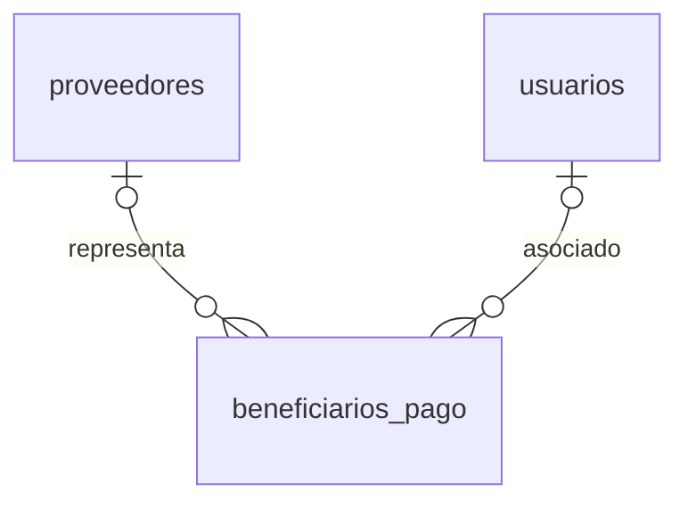

# 06. Modelo Entidad–Relación (ER) - Beneficiarios

> **Última actualización:** Julio de 2026
> **Fuente de verdad:** `schema.prisma`

---

# Objetivo

Este documento describe el modelo Entidad–Relación correspondiente al módulo de Beneficiarios del Sistema de Gestión de Solicitudes de Pago.

Este módulo administra las personas o entidades que pueden recibir pagos, permitiendo registrar tanto proveedores como trabajadores u otros beneficiarios asociados a usuarios internos.

Toda la información aquí presentada corresponde al modelo implementado actualmente en `schema.prisma`.

---

# Entidades

| Entidad | Descripción |
|----------|-------------|
| `proveedores` | Personas naturales o jurídicas registradas como proveedores. |
| `beneficiarios_pago` | Beneficiarios habilitados para recibir pagos. |
| `usuarios` | Usuarios internos asociados opcionalmente a un beneficiario. |

---

# Diagrama ER



---

# Relaciones principales

| Entidad origen | Entidad destino | Cardinalidad |
|----------------|-----------------|--------------|
| proveedores | beneficiarios_pago | 1 : 0..N (opcional) |
| usuarios | beneficiarios_pago | 1 : 0..N (opcional) |

---

# Descripción de las relaciones

## proveedores → beneficiarios_pago

Un beneficiario puede representar a un proveedor registrado.

La relación utiliza:

```text
proveedor_id
```

Este campo es opcional.

Cardinalidad:

```text
PROVEEDOR 1 → 0..N BENEFICIARIOS_PAGO
```

Desde la perspectiva del beneficiario:

```text
BENEFICIARIO_PAGO N → 0..1 PROVEEDOR
```

---

## usuarios → beneficiarios_pago

Un beneficiario puede asociarse a un usuario del sistema.

Esta relación se utiliza principalmente para trabajadores y otros beneficiarios internos.

La relación utiliza:

```text
usuario_id
```

Este campo es opcional.

Cardinalidad:

```text
USUARIO 1 → 0..N BENEFICIARIOS_PAGO
```

Desde la perspectiva del beneficiario:

```text
BENEFICIARIO_PAGO N → 0..1 USUARIO
```

---

# Reglas del modelo

## Documento único

No pueden existir dos beneficiarios con la misma combinación de:

```text
tipo_documento
numero_documento
```

La restricción implementada es:

```text
@@unique([tipo_documento, numero_documento])
```

---

## Asociación opcional

Un beneficiario puede existir sin estar asociado a:

- un proveedor;
- un usuario.

Esto permite registrar beneficiarios externos e internos utilizando una única entidad.

---

## Beneficiario único

Toda solicitud de pago referencia únicamente un beneficiario mediante:

```text
beneficiario_id
```

independientemente de si corresponde a un proveedor, un trabajador u otro tipo de beneficiario.

---

# Integración con otros módulos

Las entidades de Beneficiarios se relacionan principalmente con:

- solicitudes de pago;
- detalles de nómina.

De esta manera, un mismo beneficiario puede participar en diferentes procesos de pago sin duplicar información.

---

# Resumen

El módulo de Beneficiarios centraliza la administración de las personas y entidades que pueden recibir pagos dentro del sistema.

Su diseño permite reutilizar una única entidad para representar proveedores, trabajadores y demás beneficiarios, manteniendo la integridad del modelo implementado en `schema.prisma`.