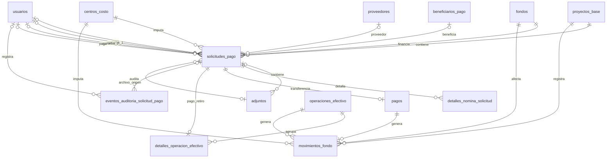

# 06. Modelo Entidad–Relación (ER) - Solicitudes de Pago

> **Última actualización:** Julio de 2026
> **Fuente de verdad:** `schema.prisma`

---

# Objetivo

Este documento describe la entidad `solicitudes_pago` y sus relaciones principales dentro del Sistema de Gestión de Solicitudes de Pago.

Esta entidad representa la cabecera común para las solicitudes de proveedores, nómina, impuestos, reembolsos y demás modalidades implementadas.

---

# Entidades involucradas

| Entidad | Descripción |
|----------|-------------|
| `solicitudes_pago` | Cabecera de la solicitud de pago. |
| `proyectos_base` | Proyecto al cual pertenece la solicitud. |
| `centros_costo` | Centro de costo al cual se imputa el gasto. |
| `fondos` | Fondo que financia la solicitud. |
| `beneficiarios_pago` | Beneficiario asociado, cuando aplica. |
| `proveedores` | Proveedor asociado, cuando aplica. |
| `usuarios` | Usuarios que crean, aprueban o pagan la solicitud. |
| `adjuntos` | Archivos asociados a la solicitud. |
| `detalles_nomina_solicitud` | Detalle de trabajadores en solicitudes de nómina. |
| `pagos` | Pago de una transferencia directa. |
| `operaciones_efectivo` | Cabecera de un retiro agrupado. |
| `detalles_operacion_efectivo` | Pago individual cubierto por un retiro. |
| `movimientos_fondo` | Egresos e ingresos que afectan el fondo. |
| `eventos_auditoria_solicitud_pago` | Eventos complementarios del historial funcional. |

---

# Diagrama ER



---

# Relaciones principales

| Entidad origen | Entidad destino | Cardinalidad |
|----------------|-----------------|--------------|
| proyectos_base | solicitudes_pago | 1 : 0..N |
| centros_costo | solicitudes_pago | 1 : 0..N |
| fondos | solicitudes_pago | 1 : 0..N |
| beneficiarios_pago | solicitudes_pago | 1 : 0..N, asociación opcional |
| proveedores | solicitudes_pago | 1 : 0..N, asociación opcional |
| usuarios | solicitudes_pago | 1 : 0..N, asociación opcional |
| solicitudes_pago | adjuntos | 1 : 0..N |
| adjuntos | solicitudes_pago | 1 : 0..N, asociación opcional |
| solicitudes_pago | detalles_nomina_solicitud | 1 : 0..N |
| solicitudes_pago | pagos | 1 : 0..1 |
| solicitudes_pago | detalles_operacion_efectivo | 1 : 0..1 |
| operaciones_efectivo | detalles_operacion_efectivo | 1 : 1..N |
| operaciones_efectivo | movimientos_fondo | 1 : 1..N |
| pagos | movimientos_fondo | 1 : 0..1 |

---

# Relaciones organizacionales

Toda solicitud debe asociarse obligatoriamente con:

```text
proyecto_base_id
fondo_id
centro_costo_id
```

Por tanto, cada solicitud pertenece a un proyecto base, utiliza un fondo y se imputa a un centro de costo.

Cardinalidades:

```text
PROYECTO_BASE 1 → 0..N SOLICITUDES_PAGO
FONDO 1 → 0..N SOLICITUDES_PAGO
CENTRO_COSTO 1 → 0..N SOLICITUDES_PAGO
```

---

# Beneficiario y proveedor

Los campos:

```text
beneficiario_id
proveedor_id
```

son opcionales.

Su utilización depende del tipo de solicitud.

Cardinalidades:

```text
BENEFICIARIO_PAGO 1 → 0..N SOLICITUDES_PAGO
PROVEEDOR 1 → 0..N SOLICITUDES_PAGO
```

Desde la perspectiva de la solicitud, cada relación corresponde a:

```text
SOLICITUD_PAGO N → 0..1 BENEFICIARIO_PAGO
SOLICITUD_PAGO N → 0..1 PROVEEDOR
```

---

# Usuarios responsables

La solicitud puede registrar los siguientes usuarios:

```text
creado_por
aprobado_1_por
aprobado_2_por
pagado_por
```

Todos estos campos son opcionales.

Las relaciones Prisma se denominan:

```text
SolicitudesCreadasPor
SolicitudesAprobadas1Por
SolicitudesAprobadas2Por
SolicitudesPagadasPor
```

Un usuario puede intervenir en múltiples solicitudes.

---

# Gestión documental

Una solicitud puede tener múltiples adjuntos mediante:

```text
adjuntos.solicitud_pago_id
```

La relación Prisma se denomina:

```text
AdjuntosSolicitudPago
```

También puede referenciar un adjunto como archivo de origen mediante:

```text
adjunto_archivo_origen_id
```

La relación Prisma se denomina:

```text
SolicitudPagoArchivoOrigen
```

Este campo es opcional y un mismo adjunto puede ser archivo de origen de múltiples solicitudes.

---

# Detalle de nómina

Una solicitud puede contener múltiples registros de:

```text
detalles_nomina_solicitud
```

Cardinalidad:

```text
SOLICITUD_PAGO 1 → 0..N DETALLES_NOMINA
```

La eliminación física de una solicitud elimina en cascada sus detalles de nómina.

---

# Clasificación

La modalidad de la solicitud se identifica principalmente mediante:

```text
tipo_solicitud
```

El modelo también dispone de campos especializados:

```text
modalidad_nomina
periodo_nomina
categoria_gasto
categoria_reembolso
concepto_nomina
tipo_impuesto
periodo_impuesto
medio_pago
```

Su uso depende del tipo de solicitud y de las reglas de negocio de la aplicación.

---

# Información financiera

Los valores consolidados de la solicitud se almacenan en:

```text
valor_bruto
valor_impuestos_retenciones
valor_descuentos
valor_neto
valor_pagado
valor_reservado
```

Los campos:

```text
valor_pagado
valor_reservado
```

son opcionales.

---

# Estado y fechas

El estado actual se almacena mediante:

```text
estado_actual
```

La entidad registra además las fechas de los principales eventos:

```text
enviado_en
aprobado_1_en
aprobado_2_en
devuelto_aprobador_1_en
devuelto_solicitante_en
pagado_en
```

Estos campos no constituyen un historial completo de transiciones.

Las devoluciones y anulaciones conservan trazabilidad propia en:

```text
devoluciones_solicitud_pago
anulaciones_solicitud_pago
```

Los eventos que no poseen una entidad operativa propia se conservan en:

```text
eventos_auditoria_solicitud_pago
```

Cada registro conserva la referencia estable de la solicitud, número oficial,
acción, estados anterior y nuevo, descripción, cambios por campo, responsable
y fecha. La relación con `solicitudes_pago` admite `SetNull` para preservar la
evidencia histórica si se elimina un borrador, mientras `solicitud_ref_id`
mantiene su identificación original.

La anulación registra la solicitud, el estado de origen, el motivo, el usuario
y la fecha. No elimina la solicitud ni sus documentos asociados.

---

# Restricciones principales

El número de solicitud es único:

```text
numero_solicitud @unique
```

El modelo incluye índices para facilitar las consultas por:

- proyecto, fondo y centro de costo;
- beneficiario y proveedor;
- tipo y estado de solicitud;
- modalidad y periodo de nómina;
- impuesto y periodo;
- usuarios y fechas principales.

---

# Resumen

`solicitudes_pago` constituye la entidad central del sistema.

Su diseño concentra la información organizacional, financiera y operativa de cada solicitud, y permite ampliar su contenido mediante relaciones con beneficiarios, proveedores, adjuntos y detalles de nómina.

---

# Ejecución de pagos

Los pagos electrónicos directos (`TRANSFERENCIA`, `PSE` o `PORTAL`) se
registran en `pagos`. Cada fila pertenece a
una única solicitud, exige un soporte y puede originar un
`EGRESO_SOLICITUD_PAGO`.

Los pagos en `EFECTIVO` o `CONSIGNACION` se registran mediante:

```text
operaciones_efectivo
└── detalles_operacion_efectivo
    └── solicitudes_pago
```

La cabecera conserva proyecto, fondo, fecha, soporte general y valores
requerido, retirado, pagado y sobrante. Cada detalle conserva solicitud,
medio de pago, valor, soporte y referencia cuando corresponde.

Una solicitud solo puede tener un `pago` directo o un
`detalle_operacion_efectivo`. El retiro genera el egreso del fondo; sus
detalles no generan un segundo descuento.

`movimientos_fondo` conserva el saldo anterior y nuevo y puede relacionarse
con una solicitud, un pago directo o una operación de efectivo. El centro de
costo es una imputación opcional del movimiento; no administra saldo propio.
