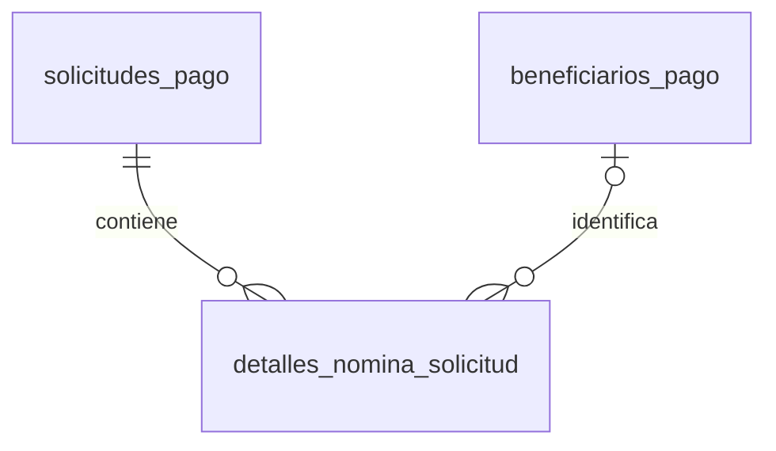

# 06. Modelo Entidad–Relación (ER) - Nómina

> **Última actualización:** Julio de 2026
> **Fuente de verdad:** `schema.prisma`

---

# Objetivo

Este documento describe el modelo Entidad–Relación correspondiente al detalle de las solicitudes de pago de nómina.

La cabecera de la nómina se almacena en `solicitudes_pago`, mientras que cada trabajador incluido en una nómina grupal se registra en `detalles_nomina_solicitud`.

---

# Entidades involucradas

| Entidad | Descripción |
|----------|-------------|
| `solicitudes_pago` | Cabecera de la solicitud de nómina. |
| `detalles_nomina_solicitud` | Registros individuales de los trabajadores incluidos en la solicitud. |
| `beneficiarios_pago` | Beneficiario asociado opcionalmente a cada trabajador. |

---

# Diagrama ER



---

# Relaciones principales

| Entidad origen | Entidad destino | Cardinalidad |
|----------------|-----------------|--------------|
| solicitudes_pago | detalles_nomina_solicitud | 1 : 0..N |
| beneficiarios_pago | detalles_nomina_solicitud | 1 : 0..N, asociación opcional |

---

# Cabecera de nómina

Las solicitudes de nómina utilizan la entidad:

```text
solicitudes_pago
```

Los campos principales para su clasificación son:

```text
tipo_solicitud
modalidad_nomina
periodo_nomina
concepto_nomina
```

La modalidad puede representar una nómina individual o grupal según las reglas implementadas por la aplicación.

---

# Detalle de nómina

Cada fila de una nómina grupal se almacena en:

```text
detalles_nomina_solicitud
```

La relación con la solicitud utiliza:

```text
solicitud_pago_id
```

Este campo es obligatorio.

Cardinalidad:

```text
SOLICITUD_PAGO 1 → 0..N DETALLES_NOMINA
```

La eliminación física de la solicitud elimina en cascada sus registros de detalle mediante:

```text
ON DELETE CASCADE
```

---

# Asociación con beneficiarios

Cada detalle puede asociarse con un beneficiario mediante:

```text
beneficiario_id
```

Este campo es opcional.

Cardinalidad:

```text
BENEFICIARIO_PAGO 1 → 0..N DETALLES_NOMINA
```

Desde la perspectiva del detalle:

```text
DETALLE_NOMINA N → 0..1 BENEFICIARIO_PAGO
```

Los datos documentales del trabajador también se almacenan directamente en el detalle, por lo que el registro puede conservarse aunque todavía no exista una asociación con `beneficiarios_pago`.

---

# Identificación del trabajador

Cada detalle almacena:

```text
tipo_documento
numero_documento
nombre_trabajador
```

Estos campos permiten identificar al trabajador dentro del archivo o proceso de nómina.

---

# Información de pago

Cada registro contiene:

```text
concepto_nomina
medio_pago
banco
tipo_cuenta_bancaria
numero_cuenta_bancaria
```

Los campos bancarios son opcionales.

---

# Valores financieros

Los valores registrados por cada trabajador son:

```text
valor_bruto
valor_retenciones
valor_descuentos
valor_neto
```

Los campos:

```text
valor_retenciones
valor_descuentos
```

tienen valor predeterminado de cero.

---

# Validación

Cada detalle almacena el resultado de su validación mediante:

```text
estado_validacion
errores_validacion
```

El estado predeterminado es:

```text
VALIDO
```

`errores_validacion` permite almacenar en formato JSON los errores encontrados durante la carga o validación de la fila.

---

# Número de fila

El campo:

```text
numero_fila
```

identifica la posición del registro dentro de la solicitud.

La combinación:

```text
solicitud_pago_id
numero_fila
```

debe ser única.

Esta regla se implementa mediante:

```text
@@unique([solicitud_pago_id, numero_fila])
```

---

# Índices

El modelo incluye índices para consultas por:

- solicitud de pago;
- beneficiario;
- tipo y número de documento;
- estado de validación.

---

# Resumen

El módulo de Nómina separa la cabecera general de la solicitud y el detalle individual de cada trabajador.

`solicitudes_pago` concentra la información general de la nómina y `detalles_nomina_solicitud` almacena la identificación, forma de pago, valores y resultado de validación de cada fila.