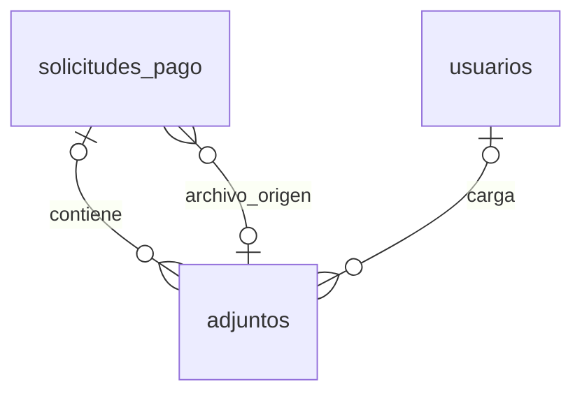

# 06. Modelo Entidad–Relación (ER) - Gestión Documental

> **Última actualización:** Julio de 2026
> **Fuente de verdad:** `schema.prisma`

---

# Objetivo

Este documento describe el modelo Entidad–Relación correspondiente al módulo de Gestión Documental del Sistema de Gestión de Solicitudes de Pago.

Este módulo administra los archivos asociados a las solicitudes de pago, permitiendo almacenar documentos de soporte, conservar el resultado del procesamiento OCR y reutilizar archivos como origen para nuevas solicitudes.

---

# Entidades involucradas

| Entidad | Descripción |
|----------|-------------|
| `adjuntos` | Archivos almacenados por el sistema. |
| `solicitudes_pago` | Solicitudes de pago asociadas a los archivos. |
| `usuarios` | Usuarios que cargan los archivos. |

---

# Diagrama ER



---

# Relaciones principales

| Entidad origen | Entidad destino | Cardinalidad |
|----------------|-----------------|--------------|
| solicitudes_pago | adjuntos | 1 : 0..N, asociación opcional |
| usuarios | adjuntos | 1 : 0..N, asociación opcional |
| adjuntos | solicitudes_pago | 1 : 0..N, asociación opcional |

---

# Asociación con solicitudes

Un archivo puede asociarse a una solicitud mediante:

```text
solicitud_pago_id
```

Este campo es opcional.

Cardinalidad:

```text
SOLICITUD_PAGO 1 → 0..N ADJUNTOS
```

Desde la perspectiva del adjunto:

```text
ADJUNTO N → 0..1 SOLICITUD_PAGO
```

La relación Prisma se denomina:

```text
AdjuntosSolicitudPago
```

La eliminación utiliza:

```text
ON DELETE CASCADE
```

Por tanto, si una solicitud se elimina físicamente, también se eliminan los registros de adjuntos asociados.

---

# Usuario que carga el archivo

El sistema puede registrar el usuario que cargó el archivo mediante:

```text
subido_por
```

Este campo es opcional.

Cardinalidad:

```text
USUARIO 1 → 0..N ADJUNTOS
```

Desde la perspectiva del adjunto:

```text
ADJUNTO N → 0..1 USUARIO
```

La relación Prisma se denomina:

```text
AdjuntosSubidosPor
```

---

# Archivo de origen

Una solicitud puede indicar el archivo desde el cual fue creada mediante:

```text
adjunto_archivo_origen_id
```

Este campo es opcional.

La relación Prisma se denomina:

```text
SolicitudPagoArchivoOrigen
```

Cardinalidad:

```text
ADJUNTO 1 → 0..N SOLICITUDES_PAGO
```

Desde la perspectiva de la solicitud:

```text
SOLICITUD_PAGO N → 0..1 ADJUNTO
```

Un mismo archivo puede servir como origen para múltiples solicitudes.

---

# Información del archivo

Cada registro almacena información básica del documento:

```text
nombre_original
nombre_storage
mime_type
extension
tamano_bytes
checksum_sha256
storage_bucket
storage_path
storage_provider
```

Estos campos permiten identificar físicamente el archivo almacenado.

---

# Clasificación

Cada archivo registra información para su clasificación mediante:

```text
categoria
tipo_documento
```

Además, puede indicar si fue generado automáticamente mediante:

```text
generado_por_sistema
```

---

# Procesamiento OCR

El resultado del procesamiento OCR se conserva en la misma entidad mediante:

```text
estado_ocr
texto_ocr
json_ocr
```

Estos campos permiten almacenar tanto el texto reconocido como la estructura procesada por el motor OCR.

---

# Estado del archivo

Cada adjunto registra su estado mediante:

```text
estado
```

El modelo también almacena:

```text
fecha_documento
```

cuando dicha información puede obtenerse del documento.

---

# Auditoría

La entidad conserva información de auditoría mediante:

```text
creado_en
actualizado_en
```

Los soportes operativos admiten archivos PDF, PNG y JPEG. La captura mediante
cámara es una alternativa de adquisición del frontend: la imagen resultante se
almacena como un `adjunto` normal y conserva las mismas reglas de tamaño,
propiedad, asociación y trazabilidad.

---

# Índices

El modelo incluye índices para consultas por:

- solicitud de pago;
- usuario que cargó el archivo;
- categoría;
- tipo de documento;
- estado;
- estado del OCR.

---

# Resumen

El módulo de Gestión Documental centraliza el almacenamiento y administración de los archivos del sistema.

Cada adjunto puede asociarse a una solicitud, conservar el resultado del procesamiento OCR, registrar el usuario que realizó la carga y reutilizarse como archivo de origen para nuevas solicitudes, conforme al modelo implementado en `schema.prisma`.
