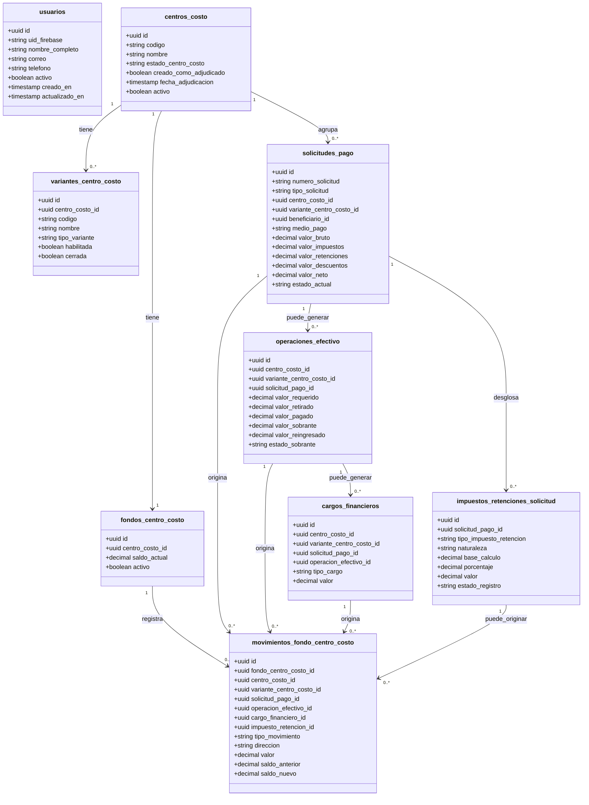

# 06. Modelo de base de datos

## Objetivo

Definir el modelo completo de base de datos para solicitudes de pago, usuarios, roles, acceso por centro de costo y variante, beneficiarios, proveedores, trabajadores, nómina, carga de Excel, fondos por centro de costo, préstamos, anticipos, devoluciones, movimientos financieros, operaciones de efectivo, reingresos de sobrantes, cargos financieros, impuestos, retenciones, adjuntos, historial, comentarios, auditoría, referencias internas y OCR futuro.

## Convención de nombres en español

Para reducir fricción entre desarrollo y operación, las convenciones técnicas del sistema se documentan en español.

Esto aplica a:

- Nombres de tablas.
- Nombres de campos.
- Estados.
- Tipos de solicitud.
- Tipos de beneficiario.
- Tipos de movimiento financiero.
- Estados de validación del Excel.
- Endpoints de API.

Los valores técnicos deben mantenerse consistentes entre frontend, backend y base de datos.

Ejemplos:

| Concepto | Convención |
|---|---|
| Solicitud en borrador | `BORRADOR` |
| Pago a proveedor | `PAGO_PROVEEDOR` |
| Nómina agrupada por Excel | `AGRUPADA_EXCEL` |
| Reembolso | `REEMBOLSO` |
| Beneficiario trabajador | `TRABAJADOR` |
| Movimiento de egreso por solicitud pagada | `EGRESO_SOLICITUD_PAGO` |
| Advertencia por nombre diferente | `ADVERTENCIA_NOMBRE_DIFERENTE` |


## Entidades

- `usuarios`
- `roles`
- `usuarios_roles`
- `centros_costo`
- `variantes_centro_costo`
- `accesos_usuario_centro_costo`
- `proveedores`
- `beneficiarios_pago`
- `prestamistas`
- `secuencias_documentales`
- `fondos_centro_costo`
- `prestamos_obra`
- `devoluciones_prestamo`
- `anticipos_centro_costo`
- `solicitudes_pago`
- `items_solicitud_pago`
- `impuestos_retenciones_solicitud`
- `operaciones_efectivo`
- `cargos_financieros`
- `movimientos_fondo_centro_costo`
- `adjuntos`
- `historial_estados_solicitud`
- `historial_estados_centro_costo`
- `comentarios`
- `auditoria`
- `resultados_ocr`

La entidad `obras` queda absorbida funcionalmente por el modelo de `centros_costo` y `variantes_centro_costo`. Si existiera por migración o compatibilidad histórica, no debe ser la entidad financiera principal.

## Regla financiera transversal

`solicitudes_pago.tipo_solicitud` clasifica la solicitud, pero no determina por sí solo el movimiento financiero.

Toda operación que afecte el saldo consolidado del centro de costo debe registrarse en:

```text
movimientos_fondo_centro_costo
```

La tabla `fondos_centro_costo` conserva el saldo actual. Las variantes `PROYECTO`, `OBRA` e `INTERVENTORIA` clasifican la imputación, pero no tienen saldos independientes.

Para nómina agrupada, `items_solicitud_pago` almacena el detalle de trabajadores y conceptos, pero el descuento financiero se realiza sobre `solicitudes_pago.valor_neto`.

Los reingresos de sobrantes de retiros, cargos financieros y pagos de impuestos o retenciones que afecten saldo también deben registrarse en `movimientos_fondo_centro_costo`.

| Caso | Tabla de detalle | Movimiento que afecta saldo |
|---|---|---|
| Pago de solicitud | `solicitudes_pago` | `EGRESO_SOLICITUD_PAGO` |
| Reingreso de sobrante | `operaciones_efectivo` | `INGRESO_REINGRESO_SOBRANTE_EFECTIVO` |
| Cargo financiero | `cargos_financieros` | `EGRESO_CARGO_FINANCIERO` |
| Pago de impuesto o retención independiente | `impuestos_retenciones_solicitud` | `EGRESO_IMPUESTO_RETENCION` |
| Anticipo recibido | `anticipos_centro_costo` | `INGRESO_ANTICIPO` |
| Préstamo recibido | `prestamos_obra` | `INGRESO_PRESTAMO_PERSONA` o `INGRESO_PRESTAMO_OBRA` |

## Reglas de beneficiarios y nómina en el modelo

La tabla `beneficiarios_pago` representa personas o entidades que reciben pagos. No todos los beneficiarios son usuarios del sistema.

El campo `beneficiarios_pago.usuario_id` es opcional:

- Si `usuario_id` es `NULL`, el beneficiario no tiene acceso al sistema.
- Si `usuario_id` tiene valor, el beneficiario está asociado a un usuario interno.

Para nómina agrupada, `items_solicitud_pago` conserva datos originales del Excel:

- `nombre_beneficiario_original`
- `tipo_documento_original`
- `numero_documento_original`
- `numero_fila_origen`

Esto permite auditar diferencias entre el nombre registrado del beneficiario y el nombre cargado en el Excel.

El sistema deduplica trabajadores por `tipo_documento_original + numero_documento_original`, no por nombre.

Un documento puede aparecer varias veces en el Excel si corresponde a conceptos diferentes. En ese caso, el sistema debe marcar advertencia `ADVERTENCIA_DOCUMENTO_REPETIDO_ARCHIVO`, pero no bloquear automáticamente la carga.

## Diagrama entidad-relación

```mermaid
erDiagram
    USUARIOS {
        uuid id PK
        string uid_firebase
        string nombre_completo
        string correo
        string telefono
        boolean activo
        timestamp creado_en
        timestamp actualizado_en
    }

    ROLES {
        uuid id PK
        string nombre
        text descripcion
    }

    USUARIOS_ROLES {
        uuid usuario_id FK
        uuid rol_id FK
        timestamp creado_en
    }

    CENTROS_COSTO {
        uuid id PK
        string codigo
        string nombre
        text descripcion
        string estado_centro_costo
        boolean creado_como_adjudicado
        text motivo_creacion_adjudicada
        timestamp fecha_adjudicacion
        boolean activo
        timestamp creado_en
        timestamp actualizado_en
    }

    VARIANTES_CENTRO_COSTO {
        uuid id PK
        uuid centro_costo_id FK
        string codigo
        string nombre
        string tipo_variante
        boolean habilitada
        boolean cerrada
        timestamp creado_en
        timestamp actualizado_en
    }

    ACCESOS_USUARIO_CENTRO_COSTO {
        uuid id PK
        uuid usuario_id FK
        uuid centro_costo_id FK
        uuid variante_centro_costo_id FK
        boolean puede_crear_solicitudes
        boolean puede_ver_solicitudes
        boolean puede_gestionar_fondos
        boolean puede_ver_saldo
        boolean puede_exportar
        boolean activo
    }

    PROVEEDORES {
        uuid id PK
        string nombre
        string numero_documento
        string correo
        string telefono
        text direccion
        boolean activo
    }

    BENEFICIARIOS_PAGO {
        uuid id PK
        string tipo_beneficiario
        uuid proveedor_id FK
        uuid usuario_id FK
        string nombre
        string tipo_documento
        string numero_documento
        string medio_pago_preferido
        string banco
        string tipo_cuenta_bancaria
        string numero_cuenta_bancaria
        boolean activo
    }

    PRESTAMISTAS {
        uuid id PK
        string nombre
        string numero_documento
        string telefono
        string correo
    }

    SECUENCIAS_DOCUMENTALES {
        uuid id PK
        string tipo_secuencia
        uuid centro_costo_id FK
        string prefijo
        int anio
        int valor_actual
    }

    FONDOS_CENTRO_COSTO {
        uuid id PK
        uuid centro_costo_id FK
        decimal saldo_actual
        boolean activo
    }

    PRESTAMOS_OBRA {
        uuid id PK
        string referencia_sistema
        string referencia_documental
        uuid centro_costo_deudor_id FK
        uuid centro_costo_prestamista_id FK
        uuid prestamista_id FK
        string tipo_prestamo
        decimal valor_principal
        decimal saldo_pendiente
        string estado
    }

    DEVOLUCIONES_PRESTAMO {
        uuid id PK
        uuid prestamo_obra_id FK
        uuid centro_costo_id FK
        decimal valor
        string referencia_sistema
        string referencia_documental
        timestamp creado_en
    }

    ANTICIPOS_CENTRO_COSTO {
        uuid id PK
        uuid centro_costo_id FK
        uuid variante_centro_costo_id FK
        decimal valor
        string referencia_sistema
        string referencia_documental
        timestamp creado_en
    }

    SOLICITUDES_PAGO {
        uuid id PK
        string numero_solicitud
        string tipo_solicitud
        uuid centro_costo_id FK
        uuid variante_centro_costo_id FK
        uuid beneficiario_id FK
        string categoria_gasto
        string categoria_reembolso
        string concepto_nomina
        string modalidad_nomina
        string medio_pago
        decimal valor_bruto
        decimal valor_impuestos
        decimal valor_retenciones
        decimal valor_descuentos
        decimal valor_neto
        string estado_actual
    }

    ITEMS_SOLICITUD_PAGO {
        uuid id PK
        uuid solicitud_pago_id FK
        uuid beneficiario_id FK
        int numero_fila_origen
        string nombre_beneficiario_original
        string tipo_documento_original
        string numero_documento_original
        string concepto_nomina
        string estado_validacion
        text mensaje_validacion
        decimal valor_bruto
        decimal valor_neto
    }

    IMPUESTOS_RETENCIONES_SOLICITUD {
        uuid id PK
        uuid solicitud_pago_id FK
        string tipo_impuesto_retencion
        string naturaleza
        decimal base_calculo
        decimal porcentaje
        decimal valor
        boolean afecta_valor_neto
        string estado_registro
    }

    OPERACIONES_EFECTIVO {
        uuid id PK
        uuid centro_costo_id FK
        uuid variante_centro_costo_id FK
        uuid solicitud_pago_id FK
        string referencia_sistema
        string referencia_retiro
        string referencia_reingreso
        decimal valor_requerido
        decimal valor_retirado
        decimal valor_pagado
        decimal valor_sobrante
        decimal valor_reingresado
        string estado_sobrante
    }

    CARGOS_FINANCIEROS {
        uuid id PK
        uuid centro_costo_id FK
        uuid variante_centro_costo_id FK
        uuid solicitud_pago_id FK
        uuid operacion_efectivo_id FK
        uuid prestamo_obra_id FK
        string tipo_cargo
        decimal valor
        string referencia_sistema
        string referencia_documental
    }

    MOVIMIENTOS_FONDO_CENTRO_COSTO {
        uuid id PK
        uuid fondo_centro_costo_id FK
        uuid centro_costo_id FK
        uuid variante_centro_costo_id FK
        uuid solicitud_pago_id FK
        uuid prestamo_obra_id FK
        uuid devolucion_prestamo_id FK
        uuid anticipo_centro_costo_id FK
        uuid operacion_efectivo_id FK
        uuid cargo_financiero_id FK
        uuid impuesto_retencion_id FK
        string tipo_movimiento
        string direccion
        decimal valor
        decimal saldo_anterior
        decimal saldo_nuevo
    }

    ADJUNTOS {
        uuid id PK
        uuid solicitud_pago_id FK
        string nombre_archivo
        text ruta_archivo
        string estado_ocr
    }

    HISTORIAL_ESTADOS_SOLICITUD {
        uuid id PK
        uuid solicitud_pago_id FK
        string estado_anterior
        string estado_nuevo
        string accion
    }

    HISTORIAL_ESTADOS_CENTRO_COSTO {
        uuid id PK
        uuid centro_costo_id FK
        string estado_anterior
        string estado_nuevo
        uuid cambiado_por FK
    }

    COMENTARIOS {
        uuid id PK
        uuid solicitud_pago_id FK
        uuid usuario_id FK
        text comentario
    }

    AUDITORIA {
        uuid id PK
        uuid usuario_id FK
        string tipo_entidad
        uuid entidad_id
        string accion
    }

    RESULTADOS_OCR {
        uuid id PK
        uuid adjunto_id FK
        uuid solicitud_pago_id FK
    }

    USUARIOS ||--o{ USUARIOS_ROLES : tiene
    ROLES ||--o{ USUARIOS_ROLES : asigna
    USUARIOS ||--o{ ACCESOS_USUARIO_CENTRO_COSTO : recibe
    CENTROS_COSTO ||--o{ ACCESOS_USUARIO_CENTRO_COSTO : controla
    CENTROS_COSTO ||--o{ VARIANTES_CENTRO_COSTO : tiene
    CENTROS_COSTO ||--|| FONDOS_CENTRO_COSTO : tiene
    PROVEEDORES ||--o{ BENEFICIARIOS_PAGO : origina
    USUARIOS ||--o{ BENEFICIARIOS_PAGO : puede_asociarse
    BENEFICIARIOS_PAGO ||--o{ SOLICITUDES_PAGO : recibe
    BENEFICIARIOS_PAGO ||--o{ ITEMS_SOLICITUD_PAGO : recibe
    CENTROS_COSTO ||--o{ SOLICITUDES_PAGO : agrupa
    VARIANTES_CENTRO_COSTO ||--o{ SOLICITUDES_PAGO : clasifica
    SOLICITUDES_PAGO ||--o{ ITEMS_SOLICITUD_PAGO : contiene
    SOLICITUDES_PAGO ||--o{ IMPUESTOS_RETENCIONES_SOLICITUD : desglosa
    SOLICITUDES_PAGO ||--o{ OPERACIONES_EFECTIVO : puede_generar
    OPERACIONES_EFECTIVO ||--o{ CARGOS_FINANCIEROS : puede_generar
    FONDOS_CENTRO_COSTO ||--o{ MOVIMIENTOS_FONDO_CENTRO_COSTO : registra
    SOLICITUDES_PAGO ||--o{ MOVIMIENTOS_FONDO_CENTRO_COSTO : origina
    OPERACIONES_EFECTIVO ||--o{ MOVIMIENTOS_FONDO_CENTRO_COSTO : origina
    CARGOS_FINANCIEROS ||--o{ MOVIMIENTOS_FONDO_CENTRO_COSTO : origina
    IMPUESTOS_RETENCIONES_SOLICITUD ||--o{ MOVIMIENTOS_FONDO_CENTRO_COSTO : puede_originar
    PRESTAMOS_OBRA ||--o{ MOVIMIENTOS_FONDO_CENTRO_COSTO : origina
    ANTICIPOS_CENTRO_COSTO ||--o{ MOVIMIENTOS_FONDO_CENTRO_COSTO : origina
    SOLICITUDES_PAGO ||--o{ ADJUNTOS : tiene
    SOLICITUDES_PAGO ||--o{ HISTORIAL_ESTADOS_SOLICITUD : registra
    CENTROS_COSTO ||--o{ HISTORIAL_ESTADOS_CENTRO_COSTO : registra
    SOLICITUDES_PAGO ||--o{ COMENTARIOS : tiene
    ADJUNTOS ||--o{ RESULTADOS_OCR : produce
```



## Diagrama lógico



## DDL completo

```sql
CREATE EXTENSION IF NOT EXISTS pgcrypto;

CREATE TABLE usuarios (
    id UUID PRIMARY KEY DEFAULT gen_random_uuid(),
    uid_firebase VARCHAR(128) UNIQUE NOT NULL,
    nombre_completo VARCHAR(150) NOT NULL,
    correo VARCHAR(150) UNIQUE NOT NULL,
    telefono VARCHAR(50),
    activo BOOLEAN NOT NULL DEFAULT TRUE,
    creado_en TIMESTAMP NOT NULL DEFAULT NOW(),
    actualizado_en TIMESTAMP NOT NULL DEFAULT NOW()
);

CREATE TABLE roles (
    id UUID PRIMARY KEY DEFAULT gen_random_uuid(),
    nombre VARCHAR(50) UNIQUE NOT NULL,
    descripcion TEXT
);

CREATE TABLE usuarios_roles (
    usuario_id UUID NOT NULL REFERENCES usuarios(id) ON DELETE CASCADE,
    rol_id UUID NOT NULL REFERENCES roles(id) ON DELETE CASCADE,
    creado_en TIMESTAMP NOT NULL DEFAULT NOW(),
    PRIMARY KEY (usuario_id, rol_id)
);

CREATE TABLE centros_costo (
    id UUID PRIMARY KEY DEFAULT gen_random_uuid(),
    codigo VARCHAR(50) UNIQUE NOT NULL,
    nombre VARCHAR(150) NOT NULL,
    descripcion TEXT,
    estado_centro_costo VARCHAR(40) NOT NULL DEFAULT 'EN_PROPUESTA',
    creado_como_adjudicado BOOLEAN NOT NULL DEFAULT FALSE,
    motivo_creacion_adjudicada TEXT,
    fecha_adjudicacion TIMESTAMP,
    soporte_adjudicacion_adjunto_id UUID,
    observacion_adjudicacion TEXT,
    adjudicado_por UUID REFERENCES usuarios(id),
    adjudicado_en TIMESTAMP,
    activo BOOLEAN NOT NULL DEFAULT TRUE,
    creado_en TIMESTAMP NOT NULL DEFAULT NOW(),
    actualizado_en TIMESTAMP NOT NULL DEFAULT NOW(),
    CONSTRAINT restriccion_estado_centro_costo CHECK (
        estado_centro_costo IN (
            'EN_PROPUESTA',
            'NO_ADJUDICADO',
            'ADJUDICADO',
            'EN_EJECUCION',
            'FINALIZADO',
            'CERRADO'
        )
    )
);

CREATE TABLE variantes_centro_costo (
    id UUID PRIMARY KEY DEFAULT gen_random_uuid(),
    centro_costo_id UUID NOT NULL REFERENCES centros_costo(id),
    codigo VARCHAR(50) NOT NULL,
    nombre VARCHAR(150) NOT NULL,
    tipo_variante VARCHAR(30) NOT NULL,
    habilitada BOOLEAN NOT NULL DEFAULT TRUE,
    habilitada_por UUID REFERENCES usuarios(id),
    habilitada_en TIMESTAMP,
    cerrada BOOLEAN NOT NULL DEFAULT FALSE,
    cerrada_por UUID REFERENCES usuarios(id),
    cerrada_en TIMESTAMP,
    creado_en TIMESTAMP NOT NULL DEFAULT NOW(),
    actualizado_en TIMESTAMP NOT NULL DEFAULT NOW(),
    CONSTRAINT restriccion_tipo_variante CHECK (
        tipo_variante IN ('PROYECTO', 'OBRA', 'INTERVENTORIA')
    ),
    CONSTRAINT unico_variante_por_centro_codigo UNIQUE (centro_costo_id, codigo),
    CONSTRAINT unico_variante_por_centro_tipo UNIQUE (centro_costo_id, tipo_variante)
);

CREATE TABLE accesos_usuario_centro_costo (
    id UUID PRIMARY KEY DEFAULT gen_random_uuid(),
    usuario_id UUID NOT NULL REFERENCES usuarios(id) ON DELETE CASCADE,
    centro_costo_id UUID NOT NULL REFERENCES centros_costo(id) ON DELETE CASCADE,
    variante_centro_costo_id UUID REFERENCES variantes_centro_costo(id),
    puede_crear_solicitudes BOOLEAN NOT NULL DEFAULT TRUE,
    puede_ver_solicitudes BOOLEAN NOT NULL DEFAULT TRUE,
    puede_gestionar_fondos BOOLEAN NOT NULL DEFAULT FALSE,
    puede_ver_saldo BOOLEAN NOT NULL DEFAULT FALSE,
    puede_exportar BOOLEAN NOT NULL DEFAULT FALSE,
    activo BOOLEAN NOT NULL DEFAULT TRUE,
    asignado_por UUID REFERENCES usuarios(id),
    asignado_en TIMESTAMP NOT NULL DEFAULT NOW(),
    revocado_por UUID REFERENCES usuarios(id),
    revocado_en TIMESTAMP,
    creado_en TIMESTAMP NOT NULL DEFAULT NOW(),
    actualizado_en TIMESTAMP NOT NULL DEFAULT NOW()
);

CREATE TABLE proveedores (
    id UUID PRIMARY KEY DEFAULT gen_random_uuid(),
    nombre VARCHAR(150) NOT NULL,
    numero_documento VARCHAR(50),
    correo VARCHAR(150),
    telefono VARCHAR(50),
    direccion TEXT,
    banco VARCHAR(100),
    tipo_cuenta_bancaria VARCHAR(50),
    numero_cuenta_bancaria VARCHAR(100),
    activo BOOLEAN NOT NULL DEFAULT TRUE,
    creado_en TIMESTAMP NOT NULL DEFAULT NOW(),
    actualizado_en TIMESTAMP NOT NULL DEFAULT NOW()
);

CREATE TABLE beneficiarios_pago (
    id UUID PRIMARY KEY DEFAULT gen_random_uuid(),
    tipo_beneficiario VARCHAR(50) NOT NULL,
    proveedor_id UUID REFERENCES proveedores(id),
    usuario_id UUID REFERENCES usuarios(id),
    nombre VARCHAR(150) NOT NULL,
    tipo_documento VARCHAR(30),
    numero_documento VARCHAR(50),
    medio_pago_preferido VARCHAR(30),
    banco VARCHAR(100),
    tipo_cuenta_bancaria VARCHAR(50),
    numero_cuenta_bancaria VARCHAR(100),
    telefono VARCHAR(50),
    correo VARCHAR(150),
    notas TEXT,
    activo BOOLEAN NOT NULL DEFAULT TRUE,
    creado_en TIMESTAMP NOT NULL DEFAULT NOW(),
    actualizado_en TIMESTAMP NOT NULL DEFAULT NOW(),
    CONSTRAINT restriccion_tipo_beneficiario CHECK (
        tipo_beneficiario IN ('PROVEEDOR', 'TRABAJADOR', 'OTRO')
    ),
    CONSTRAINT restriccion_medio_pago_preferido CHECK (
        medio_pago_preferido IS NULL OR medio_pago_preferido IN ('TRANSFERENCIA', 'EFECTIVO')
    ),
    CONSTRAINT restriccion_tipo_cuenta_bancaria CHECK (
        tipo_cuenta_bancaria IS NULL OR tipo_cuenta_bancaria IN ('AHORROS', 'CORRIENTE', 'OTRO')
    )
);

CREATE TABLE prestamistas (
    id UUID PRIMARY KEY DEFAULT gen_random_uuid(),
    nombre VARCHAR(150) NOT NULL,
    numero_documento VARCHAR(50),
    telefono VARCHAR(50),
    correo VARCHAR(150),
    notas TEXT,
    creado_en TIMESTAMP NOT NULL DEFAULT NOW(),
    actualizado_en TIMESTAMP NOT NULL DEFAULT NOW()
);

CREATE TABLE secuencias_documentales (
    id UUID PRIMARY KEY DEFAULT gen_random_uuid(),
    tipo_secuencia VARCHAR(50) NOT NULL,
    centro_costo_id UUID REFERENCES centros_costo(id),
    prefijo VARCHAR(20) NOT NULL,
    anio INTEGER NOT NULL,
    valor_actual INTEGER NOT NULL DEFAULT 0,
    creado_en TIMESTAMP NOT NULL DEFAULT NOW(),
    actualizado_en TIMESTAMP NOT NULL DEFAULT NOW(),
    CONSTRAINT unico_secuencia_centro_anio UNIQUE (tipo_secuencia, centro_costo_id, anio),
    CONSTRAINT restriccion_tipo_secuencia CHECK (
        tipo_secuencia IN (
            'SOLICITUD_PAGO',
            'ANTICIPO',
            'PRESTAMO_PERSONA',
            'PRESTAMO_OBRA',
            'DEVOLUCION_PRESTAMO',
            'MOVIMIENTO_FONDO',
            'CONFIRMACION_PAGO',
            'CARGO_FINANCIERO',
            'OPERACION_EFECTIVO',
            'IMPUESTO_RETENCION'
        )
    ),
    CONSTRAINT restriccion_valor_actual_secuencia CHECK (valor_actual >= 0)
);

CREATE TABLE fondos_centro_costo (
    id UUID PRIMARY KEY DEFAULT gen_random_uuid(),
    centro_costo_id UUID NOT NULL UNIQUE REFERENCES centros_costo(id),
    saldo_actual NUMERIC(14,2) NOT NULL DEFAULT 0,
    activo BOOLEAN NOT NULL DEFAULT TRUE,
    creado_en TIMESTAMP NOT NULL DEFAULT NOW(),
    actualizado_en TIMESTAMP NOT NULL DEFAULT NOW(),
    CONSTRAINT restriccion_saldo_fondo_centro_costo CHECK (saldo_actual >= 0)
);

CREATE TABLE prestamos_obra (
    id UUID PRIMARY KEY DEFAULT gen_random_uuid(),
    referencia_sistema VARCHAR(100) UNIQUE NOT NULL,
    referencia_documental VARCHAR(100),
    centro_costo_deudor_id UUID NOT NULL REFERENCES centros_costo(id),
    centro_costo_prestamista_id UUID REFERENCES centros_costo(id),
    prestamista_id UUID REFERENCES prestamistas(id),
    tipo_prestamo VARCHAR(50) NOT NULL,
    valor_principal NUMERIC(14,2) NOT NULL,
    saldo_pendiente NUMERIC(14,2) NOT NULL,
    estado VARCHAR(50) NOT NULL DEFAULT 'PENDIENTE',
    fecha_prestamo DATE NOT NULL,
    pagado_en TIMESTAMP,
    descripcion TEXT,
    creado_por UUID REFERENCES usuarios(id),
    creado_en TIMESTAMP NOT NULL DEFAULT NOW(),
    actualizado_en TIMESTAMP NOT NULL DEFAULT NOW(),
    CONSTRAINT restriccion_tipo_prestamo CHECK (tipo_prestamo IN ('PERSONA_A_OBRA', 'OBRA_A_OBRA')),
    CONSTRAINT restriccion_estado_prestamo CHECK (estado IN ('PENDIENTE', 'PAGADO_PARCIAL', 'PAGADA', 'ANULADA')),
    CONSTRAINT restriccion_valores_prestamo CHECK (
        valor_principal > 0
        AND saldo_pendiente >= 0
        AND saldo_pendiente <= valor_principal
    ),
    CONSTRAINT restriccion_origen_prestamo CHECK (
        (tipo_prestamo = 'PERSONA_A_OBRA' AND prestamista_id IS NOT NULL AND centro_costo_prestamista_id IS NULL)
        OR
        (tipo_prestamo = 'OBRA_A_OBRA' AND centro_costo_prestamista_id IS NOT NULL AND prestamista_id IS NULL)
    ),
    CONSTRAINT restriccion_prestamo_no_mismo_centro CHECK (
        centro_costo_prestamista_id IS NULL OR centro_costo_deudor_id <> centro_costo_prestamista_id
    )
);

CREATE TABLE devoluciones_prestamo (
    id UUID PRIMARY KEY DEFAULT gen_random_uuid(),
    prestamo_obra_id UUID NOT NULL REFERENCES prestamos_obra(id),
    centro_costo_id UUID NOT NULL REFERENCES centros_costo(id),
    valor NUMERIC(14,2) NOT NULL CHECK (valor > 0),
    referencia_sistema VARCHAR(100) UNIQUE NOT NULL,
    referencia_documental VARCHAR(100),
    descripcion TEXT,
    creado_por UUID REFERENCES usuarios(id),
    creado_en TIMESTAMP NOT NULL DEFAULT NOW()
);

CREATE TABLE anticipos_centro_costo (
    id UUID PRIMARY KEY DEFAULT gen_random_uuid(),
    centro_costo_id UUID NOT NULL REFERENCES centros_costo(id),
    variante_centro_costo_id UUID REFERENCES variantes_centro_costo(id),
    valor NUMERIC(14,2) NOT NULL CHECK (valor > 0),
    referencia_sistema VARCHAR(100) UNIQUE NOT NULL,
    referencia_documental VARCHAR(100),
    descripcion TEXT,
    creado_por UUID REFERENCES usuarios(id),
    creado_en TIMESTAMP NOT NULL DEFAULT NOW()
);

CREATE TABLE solicitudes_pago (
    id UUID PRIMARY KEY DEFAULT gen_random_uuid(),
    numero_solicitud VARCHAR(80) UNIQUE NOT NULL,
    tipo_solicitud VARCHAR(50) NOT NULL DEFAULT 'PAGO_PROVEEDOR',
    modalidad_nomina VARCHAR(50),
    centro_costo_id UUID NOT NULL REFERENCES centros_costo(id),
    variante_centro_costo_id UUID NOT NULL REFERENCES variantes_centro_costo(id),
    beneficiario_id UUID REFERENCES beneficiarios_pago(id),
    proveedor_id UUID REFERENCES proveedores(id),
    categoria_gasto VARCHAR(80),
    categoria_reembolso VARCHAR(80),
    concepto_nomina VARCHAR(80),
    medio_pago VARCHAR(30),
    adjunto_archivo_origen_id UUID,
    descripcion TEXT NOT NULL,
    valor_bruto NUMERIC(14,2) NOT NULL,
    valor_impuestos NUMERIC(14,2) NOT NULL DEFAULT 0,
    valor_retenciones NUMERIC(14,2) NOT NULL DEFAULT 0,
    valor_descuentos NUMERIC(14,2) NOT NULL DEFAULT 0,
    valor_neto NUMERIC(14,2) NOT NULL,
    valor_reservado NUMERIC(14,2),
    estado_actual VARCHAR(50) NOT NULL DEFAULT 'BORRADOR',
    creado_por UUID REFERENCES usuarios(id),
    aprobado_1_por UUID REFERENCES usuarios(id),
    aprobado_2_por UUID REFERENCES usuarios(id),
    pagado_por UUID REFERENCES usuarios(id),
    enviado_en TIMESTAMP,
    aprobado_1_en TIMESTAMP,
    aprobado_2_en TIMESTAMP,
    devuelto_aprobador_1_en TIMESTAMP,
    devuelto_solicitante_en TIMESTAMP,
    pagado_en TIMESTAMP,
    creado_en TIMESTAMP NOT NULL DEFAULT NOW(),
    actualizado_en TIMESTAMP NOT NULL DEFAULT NOW(),
    CONSTRAINT restriccion_tipo_solicitud CHECK (
        tipo_solicitud IN ('PAGO_PROVEEDOR', 'PAGO_NOMINA', 'REEMBOLSO', 'OTRO_PAGO')
    ),
    CONSTRAINT restriccion_modalidad_nomina CHECK (
        modalidad_nomina IS NULL OR modalidad_nomina IN ('INDIVIDUAL', 'AGRUPADA_EXCEL')
    ),
    CONSTRAINT restriccion_medio_pago CHECK (
        medio_pago IS NULL OR medio_pago IN ('TRANSFERENCIA', 'EFECTIVO')
    ),
    CONSTRAINT restriccion_estado_solicitud CHECK (
        estado_actual IN (
            'BORRADOR',
            'PENDIENTE_APROBADOR_1',
            'PENDIENTE_APROBADOR_2',
            'DEVUELTA_APROBADOR_1',
            'DEVUELTA_SOLICITANTE',
            'PROGRAMADA_PAGO',
            'PAGADA',
            'ANULADA'
        )
    ),
    CONSTRAINT restriccion_valores_solicitud CHECK (
        valor_bruto >= 0
        AND valor_impuestos >= 0
        AND valor_retenciones >= 0
        AND valor_descuentos >= 0
        AND valor_neto >= 0
        AND (valor_reservado IS NULL OR valor_reservado >= 0)
    )
);

CREATE TABLE items_solicitud_pago (
    id UUID PRIMARY KEY DEFAULT gen_random_uuid(),
    solicitud_pago_id UUID NOT NULL REFERENCES solicitudes_pago(id) ON DELETE CASCADE,
    beneficiario_id UUID REFERENCES beneficiarios_pago(id),
    numero_fila_origen INTEGER,
    nombre_beneficiario_original VARCHAR(150),
    tipo_documento_original VARCHAR(30),
    numero_documento_original VARCHAR(50),
    concepto_nomina VARCHAR(80),
    categoria_gasto VARCHAR(80),
    concepto_pago VARCHAR(80),
    estado_validacion VARCHAR(80),
    mensaje_validacion TEXT,
    descripcion TEXT,
    valor_bruto NUMERIC(14,2) NOT NULL,
    valor_neto NUMERIC(14,2) NOT NULL,
    creado_en TIMESTAMP NOT NULL DEFAULT NOW(),
    actualizado_en TIMESTAMP NOT NULL DEFAULT NOW(),
    CONSTRAINT restriccion_valores_item CHECK (
        valor_bruto >= 0
        AND valor_neto >= 0
        AND valor_neto <= valor_bruto
    ),
    CONSTRAINT restriccion_estado_validacion_item CHECK (
        estado_validacion IS NULL OR estado_validacion IN (
            'VALIDO',
            'NUEVO_BENEFICIARIO',
            'ADVERTENCIA_NOMBRE_DIFERENTE',
            'ADVERTENCIA_DOCUMENTO_REPETIDO_ARCHIVO',
            'ERROR_DOCUMENTO_FALTANTE',
            'ERROR_CUENTA_BANCARIA_FALTANTE',
            'ERROR_VALOR_INVALIDO',
            'ERROR_FILA_INVALIDA'
        )
    )
);

CREATE TABLE impuestos_retenciones_solicitud (
    id UUID PRIMARY KEY DEFAULT gen_random_uuid(),
    solicitud_pago_id UUID NOT NULL REFERENCES solicitudes_pago(id),
    tipo_impuesto_retencion VARCHAR(50) NOT NULL,
    naturaleza VARCHAR(30) NOT NULL,
    base_calculo NUMERIC(14,2),
    porcentaje NUMERIC(8,4),
    valor NUMERIC(14,2) NOT NULL CHECK (valor >= 0),
    afecta_valor_neto BOOLEAN NOT NULL DEFAULT TRUE,
    estado_registro VARCHAR(30) NOT NULL DEFAULT 'REGISTRADO',
    descripcion TEXT,
    creado_por UUID NOT NULL REFERENCES usuarios(id),
    creado_en TIMESTAMP NOT NULL DEFAULT NOW(),
    actualizado_en TIMESTAMP NOT NULL DEFAULT NOW(),
    ajustado_por UUID REFERENCES usuarios(id),
    ajustado_en TIMESTAMP,
    motivo_ajuste TEXT,
    CONSTRAINT restriccion_tipo_impuesto_retencion CHECK (
        tipo_impuesto_retencion IN (
            'IVA',
            'RETEFUENTE',
            'RETEICA',
            'RETEIVA',
            'ESTAMPILLA',
            'ICA',
            'IMPUESTO_CONSUMO',
            'OTRO_IMPUESTO'
        )
    ),
    CONSTRAINT restriccion_naturaleza_impuesto_retencion CHECK (
        naturaleza IN ('IMPUESTO', 'RETENCION', 'DESCUENTO')
    ),
    CONSTRAINT restriccion_estado_registro_impuesto CHECK (
        estado_registro IN ('REGISTRADO', 'AJUSTADO', 'ANULADO')
    )
);

CREATE TABLE operaciones_efectivo (
    id UUID PRIMARY KEY DEFAULT gen_random_uuid(),
    centro_costo_id UUID NOT NULL REFERENCES centros_costo(id),
    variante_centro_costo_id UUID NOT NULL REFERENCES variantes_centro_costo(id),
    solicitud_pago_id UUID REFERENCES solicitudes_pago(id),
    referencia_sistema VARCHAR(80) NOT NULL UNIQUE,
    referencia_retiro VARCHAR(120),
    referencia_reingreso VARCHAR(120),
    valor_requerido NUMERIC(14,2) NOT NULL CHECK (valor_requerido > 0),
    valor_retirado NUMERIC(14,2) NOT NULL CHECK (valor_retirado > 0),
    valor_pagado NUMERIC(14,2) NOT NULL CHECK (valor_pagado > 0),
    valor_sobrante NUMERIC(14,2) NOT NULL DEFAULT 0,
    valor_reingresado NUMERIC(14,2) NOT NULL DEFAULT 0,
    estado_sobrante VARCHAR(50) NOT NULL,
    fecha_retiro TIMESTAMP,
    fecha_pago TIMESTAMP,
    fecha_reingreso TIMESTAMP,
    soporte_retiro_adjunto_id UUID,
    soporte_pago_adjunto_id UUID,
    soporte_reingreso_adjunto_id UUID,
    observacion TEXT,
    creado_por UUID NOT NULL REFERENCES usuarios(id),
    creado_en TIMESTAMP NOT NULL DEFAULT NOW(),
    actualizado_en TIMESTAMP NOT NULL DEFAULT NOW(),
    CONSTRAINT restriccion_estado_sobrante CHECK (
        estado_sobrante IN (
            'SIN_SOBRANTE',
            'SOBRANTE_PENDIENTE_REINGRESO',
            'SOBRANTE_REINGRESADO',
            'SOBRANTE_AJUSTADO'
        )
    ),
    CONSTRAINT restriccion_valores_efectivo CHECK (valor_retirado >= valor_pagado),
    CONSTRAINT restriccion_sobrante_efectivo CHECK (valor_sobrante = valor_retirado - valor_pagado),
    CONSTRAINT restriccion_reingreso_efectivo CHECK (valor_reingresado <= valor_sobrante)
);

CREATE TABLE cargos_financieros (
    id UUID PRIMARY KEY DEFAULT gen_random_uuid(),
    centro_costo_id UUID NOT NULL REFERENCES centros_costo(id),
    variante_centro_costo_id UUID NOT NULL REFERENCES variantes_centro_costo(id),
    solicitud_pago_id UUID REFERENCES solicitudes_pago(id),
    operacion_efectivo_id UUID REFERENCES operaciones_efectivo(id),
    prestamo_obra_id UUID REFERENCES prestamos_obra(id),
    tipo_cargo VARCHAR(50) NOT NULL,
    valor NUMERIC(14,2) NOT NULL CHECK (valor > 0),
    referencia_sistema VARCHAR(80) NOT NULL UNIQUE,
    referencia_documental VARCHAR(120),
    descripcion TEXT,
    creado_por UUID NOT NULL REFERENCES usuarios(id),
    creado_en TIMESTAMP NOT NULL DEFAULT NOW(),
    CONSTRAINT restriccion_tipo_cargo_financiero CHECK (
        tipo_cargo IN (
            'GMF',
            'CUATRO_POR_MIL',
            'COMISION_BANCARIA',
            'COSTO_RETIRO',
            'DIFERENCIA_RETIRO_EFECTIVO',
            'OTRO_CARGO_FINANCIERO'
        )
    )
);

CREATE TABLE movimientos_fondo_centro_costo (
    id UUID PRIMARY KEY DEFAULT gen_random_uuid(),
    fondo_centro_costo_id UUID NOT NULL REFERENCES fondos_centro_costo(id),
    centro_costo_id UUID NOT NULL REFERENCES centros_costo(id),
    variante_centro_costo_id UUID NOT NULL REFERENCES variantes_centro_costo(id),
    solicitud_pago_id UUID REFERENCES solicitudes_pago(id),
    prestamo_obra_id UUID REFERENCES prestamos_obra(id),
    devolucion_prestamo_id UUID REFERENCES devoluciones_prestamo(id),
    anticipo_centro_costo_id UUID REFERENCES anticipos_centro_costo(id),
    operacion_efectivo_id UUID REFERENCES operaciones_efectivo(id),
    cargo_financiero_id UUID REFERENCES cargos_financieros(id),
    impuesto_retencion_id UUID REFERENCES impuestos_retenciones_solicitud(id),
    referencia_sistema VARCHAR(80) NOT NULL UNIQUE,
    referencia_documental VARCHAR(120),
    tipo_movimiento VARCHAR(80) NOT NULL,
    direccion VARCHAR(20) NOT NULL,
    valor NUMERIC(14,2) NOT NULL CHECK (valor > 0),
    saldo_anterior NUMERIC(14,2) NOT NULL,
    saldo_nuevo NUMERIC(14,2) NOT NULL,
    descripcion TEXT,
    creado_por UUID NOT NULL REFERENCES usuarios(id),
    creado_en TIMESTAMP NOT NULL DEFAULT NOW(),
    CONSTRAINT restriccion_direccion_movimiento CHECK (direccion IN ('INGRESO', 'EGRESO')),
    CONSTRAINT restriccion_tipo_movimiento CHECK (
        tipo_movimiento IN (
            'INGRESO_ANTICIPO',
            'INGRESO_PRESTAMO_PERSONA',
            'INGRESO_PRESTAMO_OBRA',
            'INGRESO_DEVOLUCION_PRESTAMO',
            'INGRESO_REINGRESO_SOBRANTE_EFECTIVO',
            'INGRESO_AJUSTE',
            'EGRESO_SOLICITUD_PAGO',
            'EGRESO_RETIRO_EFECTIVO',
            'EGRESO_DEVOLUCION_PRESTAMO',
            'EGRESO_PRESTAMO_A_OBRA',
            'EGRESO_CARGO_FINANCIERO',
            'EGRESO_IMPUESTO_RETENCION',
            'EGRESO_AJUSTE'
        )
    )
);

CREATE TABLE adjuntos (
    id UUID PRIMARY KEY DEFAULT gen_random_uuid(),
    solicitud_pago_id UUID REFERENCES solicitudes_pago(id) ON DELETE CASCADE,
    nombre_archivo VARCHAR(255) NOT NULL,
    ruta_archivo TEXT NOT NULL,
    nombre_bucket VARCHAR(150) NOT NULL,
    tipo_mime VARCHAR(100),
    tamano_archivo BIGINT,
    subido_por UUID REFERENCES usuarios(id),
    subido_en TIMESTAMP NOT NULL DEFAULT NOW(),
    estado_ocr VARCHAR(50) NOT NULL DEFAULT 'NO_PROCESADO',
    texto_ocr TEXT,
    json_ocr JSONB,
    CONSTRAINT restriccion_estado_ocr CHECK (
        estado_ocr IN ('NO_PROCESADO', 'PENDIENTE', 'PROCESADO', 'FALLIDO')
    )
);

ALTER TABLE solicitudes_pago
ADD CONSTRAINT fk_solicitudes_pago_adjunto_archivo_origen
FOREIGN KEY (adjunto_archivo_origen_id) REFERENCES adjuntos(id);

CREATE TABLE historial_estados_solicitud (
    id UUID PRIMARY KEY DEFAULT gen_random_uuid(),
    solicitud_pago_id UUID NOT NULL REFERENCES solicitudes_pago(id) ON DELETE CASCADE,
    estado_anterior VARCHAR(50),
    estado_nuevo VARCHAR(50) NOT NULL,
    accion VARCHAR(100) NOT NULL,
    cambiado_por UUID REFERENCES usuarios(id),
    comentario TEXT,
    metadatos JSONB,
    cambiado_en TIMESTAMP NOT NULL DEFAULT NOW()
);

CREATE TABLE historial_estados_centro_costo (
    id UUID PRIMARY KEY DEFAULT gen_random_uuid(),
    centro_costo_id UUID NOT NULL REFERENCES centros_costo(id),
    estado_anterior VARCHAR(40),
    estado_nuevo VARCHAR(40) NOT NULL,
    comentario TEXT,
    soporte_adjunto_id UUID REFERENCES adjuntos(id),
    cambiado_por UUID NOT NULL REFERENCES usuarios(id),
    cambiado_en TIMESTAMP NOT NULL DEFAULT NOW()
);

CREATE TABLE comentarios (
    id UUID PRIMARY KEY DEFAULT gen_random_uuid(),
    solicitud_pago_id UUID NOT NULL REFERENCES solicitudes_pago(id) ON DELETE CASCADE,
    usuario_id UUID REFERENCES usuarios(id),
    comentario TEXT NOT NULL,
    creado_en TIMESTAMP NOT NULL DEFAULT NOW()
);

CREATE TABLE auditoria (
    id UUID PRIMARY KEY DEFAULT gen_random_uuid(),
    usuario_id UUID REFERENCES usuarios(id),
    tipo_entidad VARCHAR(100) NOT NULL,
    entidad_id UUID,
    accion VARCHAR(100) NOT NULL,
    datos_anteriores JSONB,
    datos_nuevos JSONB,
    direccion_ip VARCHAR(100),
    agente_usuario TEXT,
    creado_en TIMESTAMP NOT NULL DEFAULT NOW()
);

CREATE TABLE resultados_ocr (
    id UUID PRIMARY KEY DEFAULT gen_random_uuid(),
    adjunto_id UUID REFERENCES adjuntos(id),
    solicitud_pago_id UUID REFERENCES solicitudes_pago(id),
    nombre_proveedor TEXT,
    valor_bruto NUMERIC(14,2),
    valor_neto NUMERIC(14,2),
    descripcion TEXT,
    fecha_documento DATE,
    numero_documento VARCHAR(100),
    texto_original TEXT,
    respuesta_original JSONB,
    confianza VARCHAR(50),
    creado_por UUID REFERENCES usuarios(id),
    creado_en TIMESTAMP NOT NULL DEFAULT NOW()
);
```

## Índices recomendados

```sql
CREATE INDEX indice_usuarios_uid_firebase ON usuarios(uid_firebase);
CREATE INDEX indice_usuarios_correo ON usuarios(correo);
CREATE INDEX indice_usuarios_activo ON usuarios(activo);

CREATE INDEX indice_usuarios_roles_usuario ON usuarios_roles(usuario_id);
CREATE INDEX indice_usuarios_roles_rol ON usuarios_roles(rol_id);

CREATE INDEX indice_centros_costo_codigo ON centros_costo(codigo);
CREATE INDEX indice_centros_costo_estado ON centros_costo(estado_centro_costo);
CREATE INDEX indice_centros_costo_activo ON centros_costo(activo);

CREATE INDEX indice_variantes_centro_costo_centro ON variantes_centro_costo(centro_costo_id);
CREATE INDEX indice_variantes_centro_costo_tipo ON variantes_centro_costo(tipo_variante);
CREATE INDEX indice_variantes_centro_costo_habilitada ON variantes_centro_costo(habilitada);

CREATE INDEX indice_accesos_usuario_centro_costo_usuario ON accesos_usuario_centro_costo(usuario_id);
CREATE INDEX indice_accesos_usuario_centro_costo_centro ON accesos_usuario_centro_costo(centro_costo_id);
CREATE INDEX indice_accesos_usuario_centro_costo_variante ON accesos_usuario_centro_costo(variante_centro_costo_id);
CREATE INDEX indice_accesos_usuario_centro_costo_activo ON accesos_usuario_centro_costo(activo);

CREATE INDEX indice_proveedores_documento ON proveedores(numero_documento);
CREATE INDEX indice_proveedores_nombre ON proveedores(nombre);
CREATE INDEX indice_proveedores_activo ON proveedores(activo);

CREATE INDEX indice_beneficiarios_pago_tipo ON beneficiarios_pago(tipo_beneficiario);
CREATE INDEX indice_beneficiarios_pago_usuario ON beneficiarios_pago(usuario_id);
CREATE INDEX indice_beneficiarios_pago_proveedor ON beneficiarios_pago(proveedor_id);
CREATE INDEX indice_beneficiarios_pago_documento ON beneficiarios_pago(tipo_documento, numero_documento);
CREATE INDEX indice_beneficiarios_pago_medio_pago ON beneficiarios_pago(medio_pago_preferido);
CREATE INDEX indice_beneficiarios_pago_activo ON beneficiarios_pago(activo);

CREATE INDEX indice_prestamistas_documento ON prestamistas(numero_documento);
CREATE INDEX indice_secuencias_documentales_centro ON secuencias_documentales(centro_costo_id);
CREATE INDEX indice_secuencias_documentales_tipo ON secuencias_documentales(tipo_secuencia);

CREATE UNIQUE INDEX indice_fondos_centro_costo_centro_unico ON fondos_centro_costo(centro_costo_id);
CREATE INDEX indice_fondos_centro_costo_activo ON fondos_centro_costo(activo);

CREATE INDEX indice_prestamos_obra_centro_deudor ON prestamos_obra(centro_costo_deudor_id);
CREATE INDEX indice_prestamos_obra_centro_prestamista ON prestamos_obra(centro_costo_prestamista_id);
CREATE INDEX indice_prestamos_obra_prestamista ON prestamos_obra(prestamista_id);
CREATE INDEX indice_prestamos_obra_estado ON prestamos_obra(estado);
CREATE INDEX indice_prestamos_obra_tipo ON prestamos_obra(tipo_prestamo);

CREATE INDEX indice_devoluciones_prestamo_prestamo ON devoluciones_prestamo(prestamo_obra_id);
CREATE INDEX indice_devoluciones_prestamo_centro ON devoluciones_prestamo(centro_costo_id);

CREATE INDEX indice_anticipos_centro_costo_centro ON anticipos_centro_costo(centro_costo_id);
CREATE INDEX indice_anticipos_centro_costo_variante ON anticipos_centro_costo(variante_centro_costo_id);

CREATE INDEX indice_solicitudes_pago_numero ON solicitudes_pago(numero_solicitud);
CREATE INDEX indice_solicitudes_pago_centro ON solicitudes_pago(centro_costo_id);
CREATE INDEX indice_solicitudes_pago_variante ON solicitudes_pago(variante_centro_costo_id);
CREATE INDEX indice_solicitudes_pago_beneficiario ON solicitudes_pago(beneficiario_id);
CREATE INDEX indice_solicitudes_pago_tipo ON solicitudes_pago(tipo_solicitud);
CREATE INDEX indice_solicitudes_pago_estado ON solicitudes_pago(estado_actual);
CREATE INDEX indice_solicitudes_pago_medio_pago ON solicitudes_pago(medio_pago);
CREATE INDEX indice_solicitudes_pago_categoria_gasto ON solicitudes_pago(categoria_gasto);
CREATE INDEX indice_solicitudes_pago_categoria_reembolso ON solicitudes_pago(categoria_reembolso);
CREATE INDEX indice_solicitudes_pago_concepto_nomina ON solicitudes_pago(concepto_nomina);
CREATE INDEX indice_solicitudes_pago_creado_por ON solicitudes_pago(creado_por);
CREATE INDEX indice_solicitudes_pago_pagado_por ON solicitudes_pago(pagado_por);
CREATE INDEX indice_solicitudes_pago_creado_en ON solicitudes_pago(creado_en);
CREATE INDEX indice_solicitudes_pago_pagado_en ON solicitudes_pago(pagado_en);

CREATE INDEX indice_items_solicitud_pago_solicitud ON items_solicitud_pago(solicitud_pago_id);
CREATE INDEX indice_items_solicitud_pago_beneficiario ON items_solicitud_pago(beneficiario_id);
CREATE INDEX indice_items_solicitud_pago_documento_original ON items_solicitud_pago(tipo_documento_original, numero_documento_original);
CREATE INDEX indice_items_solicitud_pago_concepto_nomina ON items_solicitud_pago(concepto_nomina);
CREATE INDEX indice_items_solicitud_pago_estado_validacion ON items_solicitud_pago(estado_validacion);

CREATE INDEX indice_impuestos_retenciones_solicitud ON impuestos_retenciones_solicitud(solicitud_pago_id);
CREATE INDEX indice_impuestos_retenciones_tipo ON impuestos_retenciones_solicitud(tipo_impuesto_retencion);
CREATE INDEX indice_impuestos_retenciones_naturaleza ON impuestos_retenciones_solicitud(naturaleza);
CREATE INDEX indice_impuestos_retenciones_estado ON impuestos_retenciones_solicitud(estado_registro);
CREATE INDEX indice_impuestos_retenciones_creado_por ON impuestos_retenciones_solicitud(creado_por);

CREATE INDEX indice_operaciones_efectivo_centro ON operaciones_efectivo(centro_costo_id);
CREATE INDEX indice_operaciones_efectivo_variante ON operaciones_efectivo(variante_centro_costo_id);
CREATE INDEX indice_operaciones_efectivo_solicitud ON operaciones_efectivo(solicitud_pago_id);
CREATE INDEX indice_operaciones_efectivo_estado_sobrante ON operaciones_efectivo(estado_sobrante);
CREATE INDEX indice_operaciones_efectivo_fecha_retiro ON operaciones_efectivo(fecha_retiro);
CREATE INDEX indice_operaciones_efectivo_fecha_reingreso ON operaciones_efectivo(fecha_reingreso);

CREATE INDEX indice_cargos_financieros_centro ON cargos_financieros(centro_costo_id);
CREATE INDEX indice_cargos_financieros_variante ON cargos_financieros(variante_centro_costo_id);
CREATE INDEX indice_cargos_financieros_solicitud ON cargos_financieros(solicitud_pago_id);
CREATE INDEX indice_cargos_financieros_operacion_efectivo ON cargos_financieros(operacion_efectivo_id);
CREATE INDEX indice_cargos_financieros_prestamo ON cargos_financieros(prestamo_obra_id);
CREATE INDEX indice_cargos_financieros_tipo ON cargos_financieros(tipo_cargo);
CREATE INDEX indice_cargos_financieros_creado_en ON cargos_financieros(creado_en);

CREATE INDEX indice_movimientos_centro_costo ON movimientos_fondo_centro_costo(centro_costo_id);
CREATE INDEX indice_movimientos_fondo ON movimientos_fondo_centro_costo(fondo_centro_costo_id);
CREATE INDEX indice_movimientos_variante ON movimientos_fondo_centro_costo(variante_centro_costo_id);
CREATE INDEX indice_movimientos_solicitud ON movimientos_fondo_centro_costo(solicitud_pago_id);
CREATE INDEX indice_movimientos_operacion_efectivo ON movimientos_fondo_centro_costo(operacion_efectivo_id);
CREATE INDEX indice_movimientos_cargo_financiero ON movimientos_fondo_centro_costo(cargo_financiero_id);
CREATE INDEX indice_movimientos_impuesto_retencion ON movimientos_fondo_centro_costo(impuesto_retencion_id);
CREATE INDEX indice_movimientos_prestamo ON movimientos_fondo_centro_costo(prestamo_obra_id);
CREATE INDEX indice_movimientos_devolucion_prestamo ON movimientos_fondo_centro_costo(devolucion_prestamo_id);
CREATE INDEX indice_movimientos_anticipo ON movimientos_fondo_centro_costo(anticipo_centro_costo_id);
CREATE INDEX indice_movimientos_tipo ON movimientos_fondo_centro_costo(tipo_movimiento);
CREATE INDEX indice_movimientos_direccion ON movimientos_fondo_centro_costo(direccion);
CREATE INDEX indice_movimientos_creado_por ON movimientos_fondo_centro_costo(creado_por);
CREATE INDEX indice_movimientos_creado_en ON movimientos_fondo_centro_costo(creado_en);

CREATE INDEX indice_adjuntos_solicitud ON adjuntos(solicitud_pago_id);
CREATE INDEX indice_adjuntos_subido_por ON adjuntos(subido_por);
CREATE INDEX indice_adjuntos_estado_ocr ON adjuntos(estado_ocr);

CREATE INDEX indice_historial_estados_solicitud ON historial_estados_solicitud(solicitud_pago_id);
CREATE INDEX indice_historial_estados_cambiado_por ON historial_estados_solicitud(cambiado_por);
CREATE INDEX indice_historial_estados_cambiado_en ON historial_estados_solicitud(cambiado_en);

CREATE INDEX indice_historial_estados_centro_costo_centro ON historial_estados_centro_costo(centro_costo_id);
CREATE INDEX indice_historial_estados_centro_costo_cambiado_por ON historial_estados_centro_costo(cambiado_por);

CREATE INDEX indice_comentarios_solicitud ON comentarios(solicitud_pago_id);
CREATE INDEX indice_comentarios_usuario ON comentarios(usuario_id);

CREATE INDEX indice_auditoria_entidad ON auditoria(tipo_entidad, entidad_id);
CREATE INDEX indice_auditoria_usuario ON auditoria(usuario_id);
CREATE INDEX indice_auditoria_creado_en ON auditoria(creado_en);

CREATE INDEX indice_resultados_ocr_adjunto ON resultados_ocr(adjunto_id);
CREATE INDEX indice_resultados_ocr_solicitud ON resultados_ocr(solicitud_pago_id);
```
