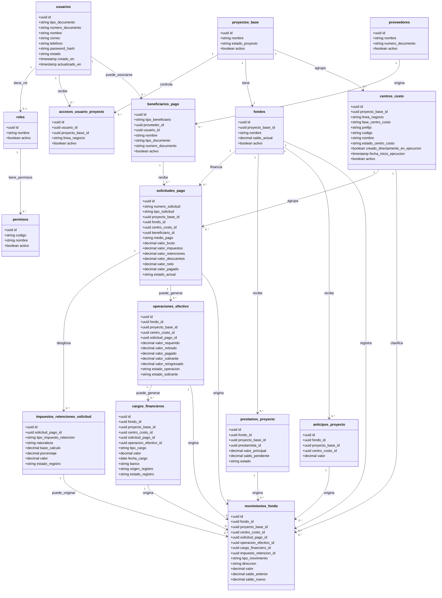

# 06. Modelo de base de datos

## Objetivo

Definir el modelo completo de base de datos para solicitudes de pago, usuarios, roles, acceso por proyecto base y centro de costo, beneficiarios, proveedores, trabajadores, nómina, carga de Excel, fondos generales por proyecto base, préstamos, anticipos, devoluciones, movimientos financieros, operaciones de efectivo, reingresos de sobrantes, cargos financieros, impuestos, retenciones, adjuntos, historial, comentarios, auditoría, referencias internas y OCR futuro.

## Convención de nombres en español

Para reducir fricción entre desarrollo y operación, las convenciones técnicas del sistema se documentan en español.

Esto aplica a:

- Nombres de tablas.
- Nombres de campos.
- Estados.
- Tipos de solicitud.
- Tipos de beneficiario.
- Tipos de movimiento financiero.
- Estados de validación del Excel.
- Endpoints de API.

Los valores técnicos deben mantenerse consistentes entre frontend, backend y base de datos.

Ejemplos:

| Concepto | Convención |
|---|---|
| Solicitud en borrador | `BORRADOR` |
| Pago a proveedor | `PAGO_PROVEEDOR` |
| Nómina agrupada por Excel | `AGRUPADA_EXCEL` |
| Reembolso | `REEMBOLSO` |
| Beneficiario trabajador | `TRABAJADOR` |
| Movimiento de egreso por solicitud pagada | `EGRESO_SOLICITUD_PAGO` |
| Advertencia por nombre diferente | `ADVERTENCIA_NOMBRE_DIFERENTE` |


## Entidades

- `usuarios`
- `roles`
- `usuarios_roles`
- `permisos`
- `roles_permisos`
- `roles_lineas_negocio`
- `proyectos_base`
- `centros_costo`
- `accesos_usuario_proyecto`
- `proveedores`
- `beneficiarios_pago`
- `prestamistas`
- `secuencias_documentales`
- `fondos`
- `prestamos_proyecto`
- `devoluciones_prestamo`
- `anticipos_proyecto`
- `solicitudes_pago`
- `items_solicitud_pago`
- `impuestos_retenciones_solicitud`
- `operaciones_efectivo`
- `cargos_financieros`
- `movimientos_fondo`
- `adjuntos`
- `historial_estados_solicitud`
- `historial_estados_centro_costo`
- `comentarios`
- `auditoria`
- `resultados_ocr`

La entidad `obras` queda absorbida funcionalmente por el modelo de `proyectos_base` y `centros_costo`. Si existiera por migración o compatibilidad histórica, no debe ser la entidad financiera principal.

Actualización implementada:

- `usuarios_roles` representa un único rol activo por usuario mediante restricción única sobre `usuario_id`.
- `permisos`, `roles_permisos` y `roles_lineas_negocio` parametrizan acciones y líneas permitidas por rol.
- `accesos_usuario_proyecto` reemplaza el acceso directo por centro de costo para el MVP. El acceso se asigna por `proyecto_base + linea_negocio`.
- La línea `OBRA` cubre `PRO-OBRA` y `OBRA`.
- La línea `INTERVENTORIA` cubre `PRO-INT` e `INT`.
- `proveedores` y `beneficiarios_pago` se mantienen como entidades de la Épica 4. `beneficiarios_pago` puede representar proveedores, trabajadores u otros beneficiarios.

## Regla de proyecto base, centros de costo y fases

`proyectos_base` representa el negocio, oportunidad o contrato general. Sobre este nivel se registra el fondo general y se consolidan los saldos, préstamos, anticipos y devoluciones.

`centros_costo` representa la clasificación operativa donde se imputa el gasto. No conserva saldo propio. Su función principal es responder en qué línea y fase se gastó el dinero del proyecto base.

El centro de costo combina dos dimensiones:

| Dimensión | Valores | Uso |
|---|---|---|
| Línea de negocio | `OBRA`, `INTERVENTORIA` | Define si el gasto pertenece a obra o interventoría. |
| Fase | `LICITACION`, `EJECUCION` | Define si el gasto pertenece a la fase de propuesta/proyecto o a la fase adjudicada/en ejecución. |

Con esta regla se pueden representar estos escenarios:

| Caso | Centros de costo posibles |
|---|---|
| Licitación de obra | `PRO-OBRA - NOMBRE DEL PROYECTO` |
| Ejecución de obra adjudicada | `OBRA - NOMBRE DEL PROYECTO` |
| Licitación de interventoría | `PRO-INT - NOMBRE DEL PROYECTO` |
| Ejecución de interventoría adjudicada | `INT - NOMBRE DEL PROYECTO` |
| Proyecto que incluye obra e interventoría | `PRO-OBRA`, `PRO-INT`, `OBRA` e `INT`, según aplique |
| Proyecto donde solo se adjudica interventoría | `PRO-INT` e `INT`, sin obligar a crear centros de costo de obra |

Con esta definición, `PRO-OBRA`, `OBRA`, `PRO-INT` e `INT` son centros de costo independientes asociados al mismo proyecto base. No se requiere una tabla adicional para representar fases o líneas de negocio.

## Regla financiera transversal

`solicitudes_pago.tipo_solicitud` clasifica la solicitud, pero no determina por sí solo el movimiento financiero.

Toda operación que afecte el saldo consolidado del proyecto base debe registrarse en:

```text
movimientos_fondo
```

La tabla `fondos` conserva el saldo actual general del proyecto base. Los centros de costo clasifican la imputación del gasto, pero no tienen saldos independientes.

El fondo responde: de dónde sale la plata. El centro de costo responde: en qué línea y fase se gastó.

Para nómina agrupada, `items_solicitud_pago` almacena el detalle de trabajadores y conceptos, pero el descuento financiero se realiza sobre `solicitudes_pago.valor_neto`.

Cuando una solicitud se paga por transferencia directa, el fondo se afecta con `EGRESO_SOLICITUD_PAGO`. Cuando una solicitud se paga mediante retiro de efectivo, el fondo se afecta con `EGRESO_RETIRO_EFECTIVO` por el valor retirado y, si sobra dinero, con `INGRESO_REINGRESO_SOBRANTE_EFECTIVO` por el valor reingresado. En este caso no debe generarse adicionalmente `EGRESO_SOLICITUD_PAGO`, para evitar doble descuento.

Los reingresos de sobrantes de retiros, cargos financieros y pagos de impuestos o retenciones que afecten saldo también deben registrarse en `movimientos_fondo`.

Los préstamos se registran como una deuda en `prestamos_proyecto` y como un ingreso al fondo general mediante `movimientos_fondo`. Cuando el prestamista recoge dinero, la devolución disminuye el saldo del fondo y disminuye el saldo pendiente del préstamo. La devolución puede ocurrir aunque todavía exista dinero disponible del préstamo inicial.

Los cargos financieros corresponden a costos bancarios o financieros generados al retirar, consignar, transferir o mover dinero. Incluyen, entre otros, GMF, 4x1000, comisiones bancarias, costos de retiro, costos de transferencia, costos de consignación y diferencias asociadas a operaciones de efectivo. Estos cargos no se calculan automáticamente como valor oficial; deben registrarse manualmente desde la plataforma por un usuario autorizado, normalmente auxiliar contable o financiero, con soporte cuando aplique. Cuando afecten el saldo del fondo, deben generar un movimiento `EGRESO_CARGO_FINANCIERO`.

| Caso | Tabla de detalle | Movimiento que afecta saldo |
|---|---|---|
| Pago de solicitud | `solicitudes_pago` | `EGRESO_SOLICITUD_PAGO` |
| Reingreso de sobrante | `operaciones_efectivo` | `INGRESO_REINGRESO_SOBRANTE_EFECTIVO` |
| Cargo financiero | `cargos_financieros` | `EGRESO_CARGO_FINANCIERO` |
| Pago de impuesto o retención independiente | `impuestos_retenciones_solicitud` | `EGRESO_IMPUESTO_RETENCION` |
| Anticipo recibido | `anticipos_proyecto` | `INGRESO_ANTICIPO` |
| Préstamo recibido | `prestamos_proyecto` | `INGRESO_PRESTAMO` |
| Devolución a prestamista | `devoluciones_prestamo` | `EGRESO_DEVOLUCION_PRESTAMO` |

## Reglas de acceso a proyectos, líneas y centros de costo

Los roles definen qué acciones puede realizar un usuario. Los permisos asociados al rol autorizan operaciones como crear usuarios, crear proyectos, aprobar solicitudes o marcar pagos.

Los accesos definen dónde puede operar el usuario. Para el MVP, el acceso se asigna mediante:

```text
accesos_usuario_proyecto
```

La granularidad del acceso es:

```text
usuario + proyecto_base + linea_negocio
```

Reglas principales:

- Cada usuario tiene un único rol funcional activo.
- Un rol puede tener varios permisos mediante `roles_permisos`.
- Un rol puede tener líneas de negocio permitidas mediante `roles_lineas_negocio`.
- Un usuario puede tener acceso a uno o varios proyectos base.
- Un usuario puede tener acceso a una o varias líneas dentro de un proyecto.
- La línea `OBRA` autoriza operación sobre centros `PRO-OBRA` y `OBRA` del proyecto.
- La línea `INTERVENTORIA` autoriza operación sobre centros `PRO-INT` e `INT` del proyecto.
- El rol `SOLICITANTE` solo puede tener acceso a `OBRA`.
- Los roles `ADMINISTRADOR`, `DIRECTOR`, `APROBADOR_1`, `APROBADOR_2`, `AUXILIAR_CONTABLE` y `PAGOS` pueden tener acceso a `OBRA` e `INTERVENTORIA`, según asignación.
- La creación de solicitudes debe validar permiso funcional y acceso activo al proyecto/línea seleccionada.
- La consulta de saldo se hace sobre el fondo general del proyecto base, no sobre un saldo independiente del centro de costo.
- La gestión de fondos debe reservarse para usuarios con permisos financieros específicos.

La tabla histórica `accesos_usuario_centro_costo` no debe usarse como eje principal del MVP mientras se mantenga el modelo de acceso por proyecto y línea.

## Reglas de beneficiarios y nómina en el modelo

La tabla `beneficiarios_pago` representa personas o entidades que reciben pagos. No todos los beneficiarios son usuarios del sistema.

Tipos de beneficiario permitidos:

| Tipo | Uso |
|---|---|
| `PROVEEDOR` | Persona o entidad externa que presta bienes o servicios. |
| `TRABAJADOR` | Persona natural incluida en pagos de nómina individual o agrupada. |
| `OTRO` | Beneficiario que no encaja en proveedor o trabajador. |

La tabla `proveedores` conserva información base de proveedores cuando se requiera un catálogo independiente. Un beneficiario de tipo `PROVEEDOR` puede apuntar opcionalmente a `proveedores.id` mediante `beneficiarios_pago.proveedor_id`.

El campo `beneficiarios_pago.usuario_id` es opcional:

- Si `usuario_id` es `NULL`, el beneficiario no tiene acceso al sistema.
- Si `usuario_id` tiene valor, el beneficiario está asociado a un usuario interno.

Reglas principales:

- `tipo_beneficiario` debe ser `PROVEEDOR`, `TRABAJADOR` u `OTRO`.
- `medio_pago_preferido` puede ser `TRANSFERENCIA`, `EFECTIVO` o `NULL`.
- `tipo_cuenta_bancaria` puede ser `AHORROS`, `CORRIENTE`, `OTRO` o `NULL`.
- El documento del beneficiario debe usarse para deduplicación funcional, pero la política de unicidad estricta debe definirse en backend para evitar bloquear casos operativos especiales.
- El proveedor puede existir sin usuario del sistema.
- El trabajador puede existir sin usuario del sistema.
- Crear un beneficiario no debe crear automáticamente un usuario.

Para nómina agrupada, `items_solicitud_pago` conserva datos originales del Excel:

- `nombre_beneficiario_original`
- `tipo_documento_original`
- `numero_documento_original`
- `numero_fila_origen`

Esto permite auditar diferencias entre el nombre registrado del beneficiario y el nombre cargado en el Excel.

El sistema deduplica trabajadores por `tipo_documento_original + numero_documento_original`, no por nombre.

Un documento puede aparecer varias veces en el Excel si corresponde a conceptos diferentes. En ese caso, el sistema debe marcar advertencia `ADVERTENCIA_DOCUMENTO_REPETIDO_ARCHIVO`, pero no bloquear automáticamente la carga.

## Diagrama entidad-relación

```mermaid
erDiagram
    USUARIOS {
        uuid id PK
        string tipo_documento
        string numero_documento
        string nombre
        string correo
        string telefono
        string password_hash
        string estado
        timestamp creado_en
        timestamp actualizado_en
    }

    ROLES {
        uuid id PK
        string nombre
        text descripcion
        boolean activo
        timestamp creado_en
        timestamp actualizado_en
    }

    USUARIOS_ROLES {
        uuid id PK
        uuid usuario_id FK
        uuid rol_id FK
        timestamp creado_en
    }

    PERMISOS {
        uuid id PK
        string codigo
        string nombre
        text descripcion
        boolean activo
        timestamp creado_en
        timestamp actualizado_en
    }

    ROLES_PERMISOS {
        uuid id PK
        uuid rol_id FK
        uuid permiso_id FK
        timestamp creado_en
    }

    ROLES_LINEAS_NEGOCIO {
        uuid id PK
        uuid rol_id FK
        string linea_negocio
        timestamp creado_en
    }

    PROYECTOS_BASE {
        uuid id PK
        string nombre
        text descripcion
        string estado_proyecto
        boolean activo
        timestamp creado_en
        timestamp actualizado_en
    }

    CENTROS_COSTO {
        uuid id PK
        uuid proyecto_base_id FK
        string linea_negocio
        string fase_centro_costo
        string prefijo
        string codigo
        string nombre
        text descripcion
        string estado_centro_costo
        boolean creado_directamente_en_ejecucion
        text motivo_creacion_ejecucion
        timestamp fecha_inicio_ejecucion
        uuid inicio_ejecucion_por FK
        timestamp inicio_ejecucion_en
        boolean activo
        timestamp creado_en
        timestamp actualizado_en
    }

    ACCESOS_USUARIO_PROYECTO {
        uuid id PK
        uuid usuario_id FK
        uuid proyecto_base_id FK
        string linea_negocio
        boolean activo
        uuid asignado_por FK
        timestamp asignado_en
        uuid revocado_por FK
        timestamp revocado_en
    }

    PROVEEDORES {
        uuid id PK
        string nombre
        string numero_documento
        string correo
        string telefono
        text direccion
        boolean activo
    }

    BENEFICIARIOS_PAGO {
        uuid id PK
        string tipo_beneficiario
        uuid proveedor_id FK
        uuid usuario_id FK
        string nombre
        string tipo_documento
        string numero_documento
        string medio_pago_preferido
        string banco
        string tipo_cuenta_bancaria
        string numero_cuenta_bancaria
        boolean activo
    }

    PRESTAMISTAS {
        uuid id PK
        string nombre
        string numero_documento
        string telefono
        string correo
    }

    SECUENCIAS_DOCUMENTALES {
        uuid id PK
        string tipo_secuencia
        uuid proyecto_base_id FK
        uuid centro_costo_id FK
        string prefijo
        int anio
        int valor_actual
    }

    FONDOS {
        uuid id PK
        uuid proyecto_base_id FK
        string nombre
        decimal saldo_actual
        boolean activo
    }

    PRESTAMOS_PROYECTO {
        uuid id PK
        uuid fondo_id FK
        uuid proyecto_base_id FK
        string referencia_sistema
        string referencia_documental
        uuid prestamista_id FK
        string tipo_prestamo
        decimal valor_principal
        decimal saldo_pendiente
        string estado
    }

    DEVOLUCIONES_PRESTAMO {
        uuid id PK
        uuid prestamo_proyecto_id FK
        uuid fondo_id FK
        decimal valor
        string referencia_sistema
        string referencia_documental
        timestamp creado_en
    }

    ANTICIPOS_PROYECTO {
        uuid id PK
        uuid fondo_id FK
        uuid proyecto_base_id FK
        uuid centro_costo_id FK
        decimal valor
        string referencia_sistema
        string referencia_documental
        timestamp creado_en
    }

    SOLICITUDES_PAGO {
        uuid id PK
        string numero_solicitud
        string tipo_solicitud
        uuid proyecto_base_id FK
        uuid fondo_id FK
        uuid centro_costo_id FK
        uuid beneficiario_id FK
        string categoria_gasto
        string categoria_reembolso
        string concepto_nomina
        string modalidad_nomina
        string medio_pago
        decimal valor_bruto
        decimal valor_impuestos
        decimal valor_retenciones
        decimal valor_descuentos
        decimal valor_neto
        decimal valor_pagado
        string estado_actual
    }

    ITEMS_SOLICITUD_PAGO {
        uuid id PK
        uuid solicitud_pago_id FK
        uuid beneficiario_id FK
        int numero_fila_origen
        string nombre_beneficiario_original
        string tipo_documento_original
        string numero_documento_original
        string concepto_nomina
        string estado_validacion
        text mensaje_validacion
        decimal valor_bruto
        decimal valor_neto
    }

    IMPUESTOS_RETENCIONES_SOLICITUD {
        uuid id PK
        uuid solicitud_pago_id FK
        string tipo_impuesto_retencion
        string naturaleza
        decimal base_calculo
        decimal porcentaje
        decimal valor
        boolean afecta_valor_neto
        string estado_registro
    }

    OPERACIONES_EFECTIVO {
        uuid id PK
        uuid fondo_id FK
        uuid proyecto_base_id FK
        uuid centro_costo_id FK
        uuid solicitud_pago_id FK
        string referencia_sistema
        string referencia_retiro
        string referencia_reingreso
        decimal valor_requerido
        decimal valor_retirado
        decimal valor_pagado
        decimal valor_sobrante
        decimal valor_reingresado
        string estado_operacion
        string estado_sobrante
    }

    CARGOS_FINANCIEROS {
        uuid id PK
        uuid fondo_id FK
        uuid proyecto_base_id FK
        uuid centro_costo_id FK
        uuid solicitud_pago_id FK
        uuid operacion_efectivo_id FK
        uuid prestamo_proyecto_id FK
        string tipo_cargo
        decimal valor
        string referencia_sistema
        string referencia_documental
        date fecha_cargo
        string banco
        string referencia_bancaria
        string origen_registro
        uuid soporte_adjunto_id FK
        string estado_registro
    }

    MOVIMIENTOS_FONDO {
        uuid id PK
        uuid fondo_id FK
        uuid proyecto_base_id FK
        uuid centro_costo_id FK
        uuid solicitud_pago_id FK
        uuid prestamo_proyecto_id FK
        uuid devolucion_prestamo_id FK
        uuid anticipo_proyecto_id FK
        uuid operacion_efectivo_id FK
        uuid cargo_financiero_id FK
        uuid impuesto_retencion_id FK
        string tipo_movimiento
        string direccion
        decimal valor
        decimal saldo_anterior
        decimal saldo_nuevo
    }

    ADJUNTOS {
        uuid id PK
        uuid solicitud_pago_id FK
        string nombre_archivo
        text ruta_archivo
        string estado_ocr
    }

    HISTORIAL_ESTADOS_SOLICITUD {
        uuid id PK
        uuid solicitud_pago_id FK
        string estado_anterior
        string estado_nuevo
        string accion
    }

    HISTORIAL_ESTADOS_CENTRO_COSTO {
        uuid id PK
        uuid centro_costo_id FK
        string estado_anterior
        string estado_nuevo
        uuid cambiado_por FK
    }

    COMENTARIOS {
        uuid id PK
        uuid solicitud_pago_id FK
        uuid usuario_id FK
        text comentario
    }

    AUDITORIA {
        uuid id PK
        uuid usuario_id FK
        string tipo_entidad
        uuid entidad_id
        string accion
    }

    RESULTADOS_OCR {
        uuid id PK
        uuid adjunto_id FK
        uuid solicitud_pago_id FK
    }

    USUARIOS ||--o{ USUARIOS_ROLES : tiene
    ROLES ||--o{ USUARIOS_ROLES : asigna
    ROLES ||--o{ ROLES_PERMISOS : tiene
    PERMISOS ||--o{ ROLES_PERMISOS : autoriza
    ROLES ||--o{ ROLES_LINEAS_NEGOCIO : habilita
    USUARIOS ||--o{ ACCESOS_USUARIO_PROYECTO : recibe
    USUARIOS ||--o{ ACCESOS_USUARIO_PROYECTO : asigna
    PROYECTOS_BASE ||--o{ ACCESOS_USUARIO_PROYECTO : controla
    PROYECTOS_BASE ||--o{ CENTROS_COSTO : agrupa
    PROYECTOS_BASE ||--|| FONDOS : tiene
    PROYECTOS_BASE ||--o{ SECUENCIAS_DOCUMENTALES : maneja
    CENTROS_COSTO ||--o{ SECUENCIAS_DOCUMENTALES : puede_manejar
    PROVEEDORES ||--o{ BENEFICIARIOS_PAGO : origina
    USUARIOS ||--o{ BENEFICIARIOS_PAGO : puede_asociarse
    BENEFICIARIOS_PAGO ||--o{ SOLICITUDES_PAGO : recibe
    BENEFICIARIOS_PAGO ||--o{ ITEMS_SOLICITUD_PAGO : recibe
    FONDOS ||--o{ SOLICITUDES_PAGO : financia
    PROYECTOS_BASE ||--o{ SOLICITUDES_PAGO : agrupa
    CENTROS_COSTO ||--o{ SOLICITUDES_PAGO : agrupa
    SOLICITUDES_PAGO ||--o{ ITEMS_SOLICITUD_PAGO : contiene
    SOLICITUDES_PAGO ||--o{ IMPUESTOS_RETENCIONES_SOLICITUD : desglosa
    SOLICITUDES_PAGO ||--o{ OPERACIONES_EFECTIVO : puede_generar
    OPERACIONES_EFECTIVO ||--o{ CARGOS_FINANCIEROS : puede_generar
    FONDOS ||--o{ PRESTAMOS_PROYECTO : recibe
    PRESTAMISTAS ||--o{ PRESTAMOS_PROYECTO : presta
    PRESTAMOS_PROYECTO ||--o{ DEVOLUCIONES_PRESTAMO : recibe
    FONDOS ||--o{ DEVOLUCIONES_PRESTAMO : paga
    FONDOS ||--o{ ANTICIPOS_PROYECTO : recibe
    PROYECTOS_BASE ||--o{ ANTICIPOS_PROYECTO : registra
    CENTROS_COSTO ||--o{ ANTICIPOS_PROYECTO : clasifica_opcionalmente
    FONDOS ||--o{ CARGOS_FINANCIEROS : financia
    FONDOS ||--o{ MOVIMIENTOS_FONDO : registra
    PROYECTOS_BASE ||--o{ MOVIMIENTOS_FONDO : consolida
    CENTROS_COSTO ||--o{ MOVIMIENTOS_FONDO : clasifica
    SOLICITUDES_PAGO ||--o{ MOVIMIENTOS_FONDO : origina
    OPERACIONES_EFECTIVO ||--o{ MOVIMIENTOS_FONDO : origina
    CARGOS_FINANCIEROS ||--o{ MOVIMIENTOS_FONDO : origina
    IMPUESTOS_RETENCIONES_SOLICITUD ||--o{ MOVIMIENTOS_FONDO : puede_originar
    PRESTAMOS_PROYECTO ||--o{ MOVIMIENTOS_FONDO : origina
    DEVOLUCIONES_PRESTAMO ||--o{ MOVIMIENTOS_FONDO : origina
    ANTICIPOS_PROYECTO ||--o{ MOVIMIENTOS_FONDO : origina
    SOLICITUDES_PAGO ||--o{ ADJUNTOS : tiene
    SOLICITUDES_PAGO ||--o{ HISTORIAL_ESTADOS_SOLICITUD : registra
    CENTROS_COSTO ||--o{ HISTORIAL_ESTADOS_CENTRO_COSTO : registra
    SOLICITUDES_PAGO ||--o{ COMENTARIOS : tiene
    ADJUNTOS ||--o{ RESULTADOS_OCR : produce
```



## Diagrama lógico



## DDL completo

```sql
CREATE EXTENSION IF NOT EXISTS pgcrypto;

CREATE TABLE usuarios (
    id UUID PRIMARY KEY DEFAULT gen_random_uuid(),
    tipo_documento VARCHAR(30) NOT NULL,
    numero_documento VARCHAR(50) UNIQUE NOT NULL,
    nombre VARCHAR(150) NOT NULL,
    correo VARCHAR(150) UNIQUE NOT NULL,
    telefono VARCHAR(50),
    password_hash TEXT,
    estado VARCHAR(20) NOT NULL DEFAULT 'ACTIVO',
    creado_en TIMESTAMP NOT NULL DEFAULT NOW(),
    actualizado_en TIMESTAMP NOT NULL DEFAULT NOW(),
    CONSTRAINT restriccion_estado_usuario CHECK (
        estado IN ('ACTIVO', 'INACTIVO')
    )
);

CREATE TABLE roles (
    id UUID PRIMARY KEY DEFAULT gen_random_uuid(),
    nombre VARCHAR(50) UNIQUE NOT NULL,
    descripcion TEXT,
    activo BOOLEAN NOT NULL DEFAULT TRUE,
    creado_en TIMESTAMP NOT NULL DEFAULT NOW(),
    actualizado_en TIMESTAMP NOT NULL DEFAULT NOW()
);

CREATE TABLE usuarios_roles (
    id UUID PRIMARY KEY DEFAULT gen_random_uuid(),
    usuario_id UUID NOT NULL REFERENCES usuarios(id) ON DELETE CASCADE,
    rol_id UUID NOT NULL REFERENCES roles(id),
    creado_en TIMESTAMP NOT NULL DEFAULT NOW(),
    CONSTRAINT unico_rol_por_usuario UNIQUE (usuario_id)
);

CREATE TABLE permisos (
    id UUID PRIMARY KEY DEFAULT gen_random_uuid(),
    codigo VARCHAR(80) UNIQUE NOT NULL,
    nombre VARCHAR(150) NOT NULL,
    descripcion TEXT,
    activo BOOLEAN NOT NULL DEFAULT TRUE,
    creado_en TIMESTAMP NOT NULL DEFAULT NOW(),
    actualizado_en TIMESTAMP NOT NULL DEFAULT NOW()
);

CREATE TABLE roles_permisos (
    id UUID PRIMARY KEY DEFAULT gen_random_uuid(),
    rol_id UUID NOT NULL REFERENCES roles(id) ON DELETE CASCADE,
    permiso_id UUID NOT NULL REFERENCES permisos(id) ON DELETE CASCADE,
    creado_en TIMESTAMP NOT NULL DEFAULT NOW(),
    CONSTRAINT unico_permiso_por_rol UNIQUE (rol_id, permiso_id)
);

CREATE TABLE roles_lineas_negocio (
    id UUID PRIMARY KEY DEFAULT gen_random_uuid(),
    rol_id UUID NOT NULL REFERENCES roles(id) ON DELETE CASCADE,
    linea_negocio VARCHAR(30) NOT NULL,
    creado_en TIMESTAMP NOT NULL DEFAULT NOW(),
    CONSTRAINT restriccion_linea_negocio_rol CHECK (
        linea_negocio IN ('OBRA', 'INTERVENTORIA')
    ),
    CONSTRAINT unica_linea_por_rol UNIQUE (rol_id, linea_negocio)
);

CREATE TABLE proyectos_base (
    id UUID PRIMARY KEY DEFAULT gen_random_uuid(),
    nombre VARCHAR(150) NOT NULL,
    descripcion TEXT,
    estado_proyecto VARCHAR(40) NOT NULL DEFAULT 'EN_LICITACION',
    activo BOOLEAN NOT NULL DEFAULT TRUE,
    creado_por UUID REFERENCES usuarios(id),
    creado_en TIMESTAMP NOT NULL DEFAULT NOW(),
    actualizado_en TIMESTAMP NOT NULL DEFAULT NOW(),
    CONSTRAINT restriccion_estado_proyecto_base CHECK (
        estado_proyecto IN (
            'EN_LICITACION',
            'EN_EJECUCION',
            'FINALIZADO'
        )
    )
);

CREATE TABLE centros_costo (
    id UUID PRIMARY KEY DEFAULT gen_random_uuid(),
    proyecto_base_id UUID NOT NULL REFERENCES proyectos_base(id),
    linea_negocio VARCHAR(30) NOT NULL,
    fase_centro_costo VARCHAR(30) NOT NULL,
    prefijo VARCHAR(20) NOT NULL,
    codigo VARCHAR(120) UNIQUE NOT NULL,
    nombre VARCHAR(180) NOT NULL,
    descripcion TEXT,
    estado_centro_costo VARCHAR(40) NOT NULL DEFAULT 'EN_LICITACION',
    creado_directamente_en_ejecucion BOOLEAN NOT NULL DEFAULT FALSE,
    motivo_creacion_ejecucion TEXT,
    fecha_inicio_ejecucion TIMESTAMP,
    soporte_inicio_ejecucion_adjunto_id UUID,
    observacion_inicio_ejecucion TEXT,
    inicio_ejecucion_por UUID REFERENCES usuarios(id),
    inicio_ejecucion_en TIMESTAMP,
    activo BOOLEAN NOT NULL DEFAULT TRUE,
    creado_en TIMESTAMP NOT NULL DEFAULT NOW(),
    actualizado_en TIMESTAMP NOT NULL DEFAULT NOW(),
    CONSTRAINT restriccion_linea_negocio_centro_costo CHECK (
        linea_negocio IN ('OBRA', 'INTERVENTORIA')
    ),
    CONSTRAINT restriccion_fase_centro_costo CHECK (
        fase_centro_costo IN ('LICITACION', 'EJECUCION')
    ),
    CONSTRAINT restriccion_estado_centro_costo CHECK (
        estado_centro_costo IN (
            'EN_LICITACION',
            'EN_EJECUCION',
            'FINALIZADO'
        )
    ),
    CONSTRAINT unico_centro_por_proyecto_linea_fase UNIQUE (
        proyecto_base_id,
        linea_negocio,
        fase_centro_costo
    )
);

CREATE TABLE accesos_usuario_proyecto (
    id UUID PRIMARY KEY DEFAULT gen_random_uuid(),
    usuario_id UUID NOT NULL REFERENCES usuarios(id) ON DELETE CASCADE,
    proyecto_base_id UUID NOT NULL REFERENCES proyectos_base(id) ON DELETE CASCADE,
    linea_negocio VARCHAR(30) NOT NULL,
    activo BOOLEAN NOT NULL DEFAULT TRUE,
    asignado_por UUID REFERENCES usuarios(id),
    asignado_en TIMESTAMP NOT NULL DEFAULT NOW(),
    revocado_por UUID REFERENCES usuarios(id),
    revocado_en TIMESTAMP,
    creado_en TIMESTAMP NOT NULL DEFAULT NOW(),
    actualizado_en TIMESTAMP NOT NULL DEFAULT NOW(),
    CONSTRAINT restriccion_linea_negocio_acceso CHECK (
        linea_negocio IN ('OBRA', 'INTERVENTORIA')
    ),
    CONSTRAINT unico_acceso_usuario_proyecto_linea UNIQUE (
        usuario_id,
        proyecto_base_id,
        linea_negocio
    )
);

CREATE TABLE proveedores (
    id UUID PRIMARY KEY DEFAULT gen_random_uuid(),
    nombre VARCHAR(150) NOT NULL,
    numero_documento VARCHAR(50),
    correo VARCHAR(150),
    telefono VARCHAR(50),
    direccion TEXT,
    banco VARCHAR(100),
    tipo_cuenta_bancaria VARCHAR(50),
    numero_cuenta_bancaria VARCHAR(100),
    activo BOOLEAN NOT NULL DEFAULT TRUE,
    creado_en TIMESTAMP NOT NULL DEFAULT NOW(),
    actualizado_en TIMESTAMP NOT NULL DEFAULT NOW(),
    CONSTRAINT restriccion_tipo_cuenta_proveedor CHECK (
        tipo_cuenta_bancaria IS NULL OR tipo_cuenta_bancaria IN ('AHORROS', 'CORRIENTE', 'OTRO')
    )
);

CREATE TABLE beneficiarios_pago (
    id UUID PRIMARY KEY DEFAULT gen_random_uuid(),
    tipo_beneficiario VARCHAR(50) NOT NULL,
    proveedor_id UUID REFERENCES proveedores(id),
    usuario_id UUID REFERENCES usuarios(id),
    nombre VARCHAR(150) NOT NULL,
    tipo_documento VARCHAR(30),
    numero_documento VARCHAR(50),
    medio_pago_preferido VARCHAR(30),
    banco VARCHAR(100),
    tipo_cuenta_bancaria VARCHAR(50),
    numero_cuenta_bancaria VARCHAR(100),
    telefono VARCHAR(50),
    correo VARCHAR(150),
    notas TEXT,
    activo BOOLEAN NOT NULL DEFAULT TRUE,
    creado_en TIMESTAMP NOT NULL DEFAULT NOW(),
    actualizado_en TIMESTAMP NOT NULL DEFAULT NOW(),
    CONSTRAINT restriccion_tipo_beneficiario CHECK (
        tipo_beneficiario IN ('PROVEEDOR', 'TRABAJADOR', 'OTRO')
    ),
    CONSTRAINT restriccion_medio_pago_preferido CHECK (
        medio_pago_preferido IS NULL OR medio_pago_preferido IN ('TRANSFERENCIA', 'EFECTIVO')
    ),
    CONSTRAINT restriccion_tipo_cuenta_bancaria CHECK (
        tipo_cuenta_bancaria IS NULL OR tipo_cuenta_bancaria IN ('AHORROS', 'CORRIENTE', 'OTRO')
    )
);

CREATE TABLE prestamistas (
    id UUID PRIMARY KEY DEFAULT gen_random_uuid(),
    nombre VARCHAR(150) NOT NULL,
    numero_documento VARCHAR(50),
    telefono VARCHAR(50),
    correo VARCHAR(150),
    notas TEXT,
    creado_en TIMESTAMP NOT NULL DEFAULT NOW(),
    actualizado_en TIMESTAMP NOT NULL DEFAULT NOW()
);

CREATE TABLE secuencias_documentales (
    id UUID PRIMARY KEY DEFAULT gen_random_uuid(),
    tipo_secuencia VARCHAR(50) NOT NULL,
    proyecto_base_id UUID REFERENCES proyectos_base(id),
    centro_costo_id UUID REFERENCES centros_costo(id),
    prefijo VARCHAR(20) NOT NULL,
    anio INTEGER NOT NULL,
    valor_actual INTEGER NOT NULL DEFAULT 0,
    creado_en TIMESTAMP NOT NULL DEFAULT NOW(),
    actualizado_en TIMESTAMP NOT NULL DEFAULT NOW(),
    CONSTRAINT unico_secuencia_proyecto_centro_anio UNIQUE (tipo_secuencia, proyecto_base_id, centro_costo_id, anio),
    CONSTRAINT restriccion_tipo_secuencia CHECK (
        tipo_secuencia IN (
            'SOLICITUD_PAGO',
            'ANTICIPO',
            'PRESTAMO_PROYECTO',
            'DEVOLUCION_PRESTAMO',
            'MOVIMIENTO_FONDO',
            'CONFIRMACION_PAGO',
            'CARGO_FINANCIERO',
            'OPERACION_EFECTIVO',
            'IMPUESTO_RETENCION'
        )
    ),
    CONSTRAINT restriccion_valor_actual_secuencia CHECK (valor_actual >= 0)
);

CREATE TABLE fondos (
    id UUID PRIMARY KEY DEFAULT gen_random_uuid(),
    proyecto_base_id UUID NOT NULL UNIQUE REFERENCES proyectos_base(id),
    nombre VARCHAR(150) NOT NULL,
    descripcion TEXT,
    saldo_actual NUMERIC(14,2) NOT NULL DEFAULT 0,
    activo BOOLEAN NOT NULL DEFAULT TRUE,
    creado_por UUID REFERENCES usuarios(id),
    creado_en TIMESTAMP NOT NULL DEFAULT NOW(),
    actualizado_en TIMESTAMP NOT NULL DEFAULT NOW(),
    CONSTRAINT restriccion_saldo_fondo CHECK (saldo_actual >= 0)
);

CREATE TABLE prestamos_proyecto (
    id UUID PRIMARY KEY DEFAULT gen_random_uuid(),
    fondo_id UUID NOT NULL REFERENCES fondos(id),
    proyecto_base_id UUID NOT NULL REFERENCES proyectos_base(id),
    referencia_sistema VARCHAR(100) UNIQUE NOT NULL,
    referencia_documental VARCHAR(100),
    prestamista_id UUID NOT NULL REFERENCES prestamistas(id),
    tipo_prestamo VARCHAR(50) NOT NULL DEFAULT 'PERSONA_A_PROYECTO',
    valor_principal NUMERIC(14,2) NOT NULL,
    saldo_pendiente NUMERIC(14,2) NOT NULL,
    estado VARCHAR(50) NOT NULL DEFAULT 'PENDIENTE',
    fecha_prestamo DATE NOT NULL,
    pagado_en TIMESTAMP,
    descripcion TEXT,
    creado_por UUID REFERENCES usuarios(id),
    creado_en TIMESTAMP NOT NULL DEFAULT NOW(),
    actualizado_en TIMESTAMP NOT NULL DEFAULT NOW(),
    CONSTRAINT restriccion_tipo_prestamo CHECK (tipo_prestamo IN ('PERSONA_A_PROYECTO')),
    CONSTRAINT restriccion_estado_prestamo CHECK (estado IN ('PENDIENTE', 'PAGADO_PARCIAL', 'PAGADA', 'ANULADA')),
    CONSTRAINT restriccion_valores_prestamo CHECK (
        valor_principal > 0
        AND saldo_pendiente >= 0
        AND saldo_pendiente <= valor_principal
    )
);

CREATE TABLE devoluciones_prestamo (
    id UUID PRIMARY KEY DEFAULT gen_random_uuid(),
    prestamo_proyecto_id UUID NOT NULL REFERENCES prestamos_proyecto(id),
    fondo_id UUID NOT NULL REFERENCES fondos(id),
    valor NUMERIC(14,2) NOT NULL CHECK (valor > 0),
    referencia_sistema VARCHAR(100) UNIQUE NOT NULL,
    referencia_documental VARCHAR(100),
    descripcion TEXT,
    creado_por UUID REFERENCES usuarios(id),
    creado_en TIMESTAMP NOT NULL DEFAULT NOW()
);

CREATE TABLE anticipos_proyecto (
    id UUID PRIMARY KEY DEFAULT gen_random_uuid(),
    fondo_id UUID NOT NULL REFERENCES fondos(id),
    proyecto_base_id UUID NOT NULL REFERENCES proyectos_base(id),
    centro_costo_id UUID REFERENCES centros_costo(id),
    valor NUMERIC(14,2) NOT NULL CHECK (valor > 0),
    referencia_sistema VARCHAR(100) UNIQUE NOT NULL,
    referencia_documental VARCHAR(100),
    descripcion TEXT,
    creado_por UUID REFERENCES usuarios(id),
    creado_en TIMESTAMP NOT NULL DEFAULT NOW()
);

CREATE TABLE solicitudes_pago (
    id UUID PRIMARY KEY DEFAULT gen_random_uuid(),
    numero_solicitud VARCHAR(80) UNIQUE NOT NULL,
    tipo_solicitud VARCHAR(50) NOT NULL DEFAULT 'PAGO_PROVEEDOR',
    modalidad_nomina VARCHAR(50),
    proyecto_base_id UUID NOT NULL REFERENCES proyectos_base(id),
    fondo_id UUID NOT NULL REFERENCES fondos(id),
    centro_costo_id UUID NOT NULL REFERENCES centros_costo(id),
    beneficiario_id UUID REFERENCES beneficiarios_pago(id),
    proveedor_id UUID REFERENCES proveedores(id),
    categoria_gasto VARCHAR(80),
    categoria_reembolso VARCHAR(80),
    concepto_nomina VARCHAR(80),
    medio_pago VARCHAR(30),
    adjunto_archivo_origen_id UUID,
    descripcion TEXT NOT NULL,
    valor_bruto NUMERIC(14,2) NOT NULL,
    valor_impuestos NUMERIC(14,2) NOT NULL DEFAULT 0,
    valor_retenciones NUMERIC(14,2) NOT NULL DEFAULT 0,
    valor_descuentos NUMERIC(14,2) NOT NULL DEFAULT 0,
    valor_neto NUMERIC(14,2) NOT NULL,
    valor_pagado NUMERIC(14,2),
    valor_reservado NUMERIC(14,2),
    estado_actual VARCHAR(50) NOT NULL DEFAULT 'BORRADOR',
    creado_por UUID REFERENCES usuarios(id),
    aprobado_1_por UUID REFERENCES usuarios(id),
    aprobado_2_por UUID REFERENCES usuarios(id),
    pagado_por UUID REFERENCES usuarios(id),
    enviado_en TIMESTAMP,
    aprobado_1_en TIMESTAMP,
    aprobado_2_en TIMESTAMP,
    devuelto_aprobador_1_en TIMESTAMP,
    devuelto_solicitante_en TIMESTAMP,
    pagado_en TIMESTAMP,
    creado_en TIMESTAMP NOT NULL DEFAULT NOW(),
    actualizado_en TIMESTAMP NOT NULL DEFAULT NOW(),
    CONSTRAINT restriccion_tipo_solicitud CHECK (
        tipo_solicitud IN ('PAGO_PROVEEDOR', 'PAGO_NOMINA', 'REEMBOLSO', 'PAGO_IMPUESTO', 'OTRO_PAGO')
    ),
    CONSTRAINT restriccion_modalidad_nomina CHECK (
        modalidad_nomina IS NULL OR modalidad_nomina IN ('INDIVIDUAL', 'AGRUPADA_EXCEL')
    ),
    CONSTRAINT restriccion_medio_pago CHECK (
        medio_pago IS NULL OR medio_pago IN ('TRANSFERENCIA', 'EFECTIVO')
    ),
    CONSTRAINT restriccion_estado_solicitud CHECK (
        estado_actual IN (
            'BORRADOR',
            'PENDIENTE_APROBADOR_1',
            'PENDIENTE_APROBADOR_2',
            'DEVUELTA_APROBADOR_1',
            'DEVUELTA_SOLICITANTE',
            'PROGRAMADA_PAGO',
            'PAGADA',
            'ANULADA'
        )
    ),
    CONSTRAINT restriccion_valores_solicitud CHECK (
        valor_bruto >= 0
        AND valor_impuestos >= 0
        AND valor_retenciones >= 0
        AND valor_descuentos >= 0
        AND valor_neto >= 0
        AND (valor_pagado IS NULL OR valor_pagado >= 0)
        AND (valor_reservado IS NULL OR valor_reservado >= 0)
    )
);

CREATE TABLE items_solicitud_pago (
    id UUID PRIMARY KEY DEFAULT gen_random_uuid(),
    solicitud_pago_id UUID NOT NULL REFERENCES solicitudes_pago(id) ON DELETE CASCADE,
    beneficiario_id UUID REFERENCES beneficiarios_pago(id),
    numero_fila_origen INTEGER,
    nombre_beneficiario_original VARCHAR(150),
    tipo_documento_original VARCHAR(30),
    numero_documento_original VARCHAR(50),
    concepto_nomina VARCHAR(80),
    categoria_gasto VARCHAR(80),
    concepto_pago VARCHAR(80),
    estado_validacion VARCHAR(80),
    mensaje_validacion TEXT,
    descripcion TEXT,
    valor_bruto NUMERIC(14,2) NOT NULL,
    valor_neto NUMERIC(14,2) NOT NULL,
    creado_en TIMESTAMP NOT NULL DEFAULT NOW(),
    actualizado_en TIMESTAMP NOT NULL DEFAULT NOW(),
    CONSTRAINT restriccion_valores_item CHECK (
        valor_bruto >= 0
        AND valor_neto >= 0
        AND valor_neto <= valor_bruto
    ),
    CONSTRAINT restriccion_estado_validacion_item CHECK (
        estado_validacion IS NULL OR estado_validacion IN (
            'VALIDO',
            'NUEVO_BENEFICIARIO',
            'ADVERTENCIA_NOMBRE_DIFERENTE',
            'ADVERTENCIA_DOCUMENTO_REPETIDO_ARCHIVO',
            'ERROR_DOCUMENTO_FALTANTE',
            'ERROR_CUENTA_BANCARIA_FALTANTE',
            'ERROR_VALOR_INVALIDO',
            'ERROR_FILA_INVALIDA'
        )
    )
);

CREATE TABLE impuestos_retenciones_solicitud (
    id UUID PRIMARY KEY DEFAULT gen_random_uuid(),
    solicitud_pago_id UUID NOT NULL REFERENCES solicitudes_pago(id),
    tipo_impuesto_retencion VARCHAR(50) NOT NULL,
    naturaleza VARCHAR(30) NOT NULL,
    base_calculo NUMERIC(14,2),
    porcentaje NUMERIC(8,4),
    valor NUMERIC(14,2) NOT NULL CHECK (valor >= 0),
    afecta_valor_neto BOOLEAN NOT NULL DEFAULT TRUE,
    estado_registro VARCHAR(30) NOT NULL DEFAULT 'REGISTRADO',
    descripcion TEXT,
    creado_por UUID NOT NULL REFERENCES usuarios(id),
    creado_en TIMESTAMP NOT NULL DEFAULT NOW(),
    actualizado_en TIMESTAMP NOT NULL DEFAULT NOW(),
    ajustado_por UUID REFERENCES usuarios(id),
    ajustado_en TIMESTAMP,
    motivo_ajuste TEXT,
    CONSTRAINT restriccion_tipo_impuesto_retencion CHECK (
        tipo_impuesto_retencion IN (
            'IVA',
            'RETEFUENTE',
            'RETEICA',
            'RETEIVA',
            'ESTAMPILLA',
            'ICA',
            'IMPUESTO_CONSUMO',
            'OTRO_IMPUESTO'
        )
    ),
    CONSTRAINT restriccion_naturaleza_impuesto_retencion CHECK (
        naturaleza IN ('IMPUESTO', 'RETENCION', 'DESCUENTO')
    ),
    CONSTRAINT restriccion_estado_registro_impuesto CHECK (
        estado_registro IN ('REGISTRADO', 'AJUSTADO', 'ANULADO')
    )
);

CREATE TABLE operaciones_efectivo (
    id UUID PRIMARY KEY DEFAULT gen_random_uuid(),
    fondo_id UUID NOT NULL REFERENCES fondos(id),
    proyecto_base_id UUID NOT NULL REFERENCES proyectos_base(id),
    centro_costo_id UUID NOT NULL REFERENCES centros_costo(id),
    solicitud_pago_id UUID REFERENCES solicitudes_pago(id),
    referencia_sistema VARCHAR(80) NOT NULL UNIQUE,
    referencia_retiro VARCHAR(120),
    referencia_reingreso VARCHAR(120),
    valor_requerido NUMERIC(14,2) NOT NULL CHECK (valor_requerido > 0),
    valor_retirado NUMERIC(14,2) NOT NULL CHECK (valor_retirado > 0),
    valor_pagado NUMERIC(14,2) NOT NULL CHECK (valor_pagado > 0),
    valor_sobrante NUMERIC(14,2) NOT NULL DEFAULT 0,
    valor_reingresado NUMERIC(14,2) NOT NULL DEFAULT 0,
    estado_operacion VARCHAR(50) NOT NULL DEFAULT 'PENDIENTE_RETIRO',
    estado_sobrante VARCHAR(50) NOT NULL,
    fecha_retiro TIMESTAMP,
    fecha_pago TIMESTAMP,
    fecha_reingreso TIMESTAMP,
    soporte_retiro_adjunto_id UUID,
    soporte_pago_adjunto_id UUID,
    soporte_reingreso_adjunto_id UUID,
    observacion TEXT,
    creado_por UUID NOT NULL REFERENCES usuarios(id),
    creado_en TIMESTAMP NOT NULL DEFAULT NOW(),
    actualizado_en TIMESTAMP NOT NULL DEFAULT NOW(),
    CONSTRAINT restriccion_estado_operacion_efectivo CHECK (
        estado_operacion IN (
            'PENDIENTE_RETIRO',
            'RETIRADO',
            'PAGADO',
            'SOBRANTE_PENDIENTE_REINGRESO',
            'SOBRANTE_REINGRESADO',
            'CERRADO',
            'ANULADO'
        )
    ),
    CONSTRAINT restriccion_estado_sobrante CHECK (
        estado_sobrante IN (
            'SIN_SOBRANTE',
            'SOBRANTE_PENDIENTE_REINGRESO',
            'SOBRANTE_REINGRESADO',
            'SOBRANTE_AJUSTADO'
        )
    ),
    CONSTRAINT restriccion_valores_efectivo CHECK (valor_retirado >= valor_pagado),
    CONSTRAINT restriccion_sobrante_efectivo CHECK (valor_sobrante = valor_retirado - valor_pagado),
    CONSTRAINT restriccion_reingreso_efectivo CHECK (valor_reingresado <= valor_sobrante)
);

CREATE TABLE cargos_financieros (
    id UUID PRIMARY KEY DEFAULT gen_random_uuid(),
    fondo_id UUID NOT NULL REFERENCES fondos(id),
    proyecto_base_id UUID NOT NULL REFERENCES proyectos_base(id),
    centro_costo_id UUID NOT NULL REFERENCES centros_costo(id),
    solicitud_pago_id UUID REFERENCES solicitudes_pago(id),
    operacion_efectivo_id UUID REFERENCES operaciones_efectivo(id),
    prestamo_proyecto_id UUID REFERENCES prestamos_proyecto(id),
    tipo_cargo VARCHAR(50) NOT NULL,
    valor NUMERIC(14,2) NOT NULL CHECK (valor > 0),
    referencia_sistema VARCHAR(80) NOT NULL UNIQUE,
    referencia_documental VARCHAR(120),
    fecha_cargo DATE NOT NULL,
    banco VARCHAR(100),
    referencia_bancaria VARCHAR(120),
    origen_registro VARCHAR(30) NOT NULL DEFAULT 'MANUAL',
    soporte_adjunto_id UUID,
    estado_registro VARCHAR(30) NOT NULL DEFAULT 'REGISTRADO',
    descripcion TEXT,
    creado_por UUID NOT NULL REFERENCES usuarios(id),
    creado_en TIMESTAMP NOT NULL DEFAULT NOW(),
    CONSTRAINT restriccion_tipo_cargo_financiero CHECK (
        tipo_cargo IN (
            'GMF',
            'CUATRO_POR_MIL',
            'COMISION_BANCARIA',
            'COSTO_RETIRO',
            'COSTO_TRANSFERENCIA',
            'COSTO_CONSIGNACION',
            'DIFERENCIA_RETIRO_EFECTIVO',
            'OTRO_CARGO_FINANCIERO'
        )
    ),
    CONSTRAINT restriccion_origen_registro_cargo_financiero CHECK (
        origen_registro IN ('MANUAL')
    ),
    CONSTRAINT restriccion_estado_registro_cargo_financiero CHECK (
        estado_registro IN ('REGISTRADO', 'AJUSTADO', 'ANULADO')
    )
);

CREATE TABLE movimientos_fondo (
    id UUID PRIMARY KEY DEFAULT gen_random_uuid(),
    fondo_id UUID NOT NULL REFERENCES fondos(id),
    proyecto_base_id UUID NOT NULL REFERENCES proyectos_base(id),
    centro_costo_id UUID REFERENCES centros_costo(id),
    solicitud_pago_id UUID REFERENCES solicitudes_pago(id),
    prestamo_proyecto_id UUID REFERENCES prestamos_proyecto(id),
    devolucion_prestamo_id UUID REFERENCES devoluciones_prestamo(id),
    anticipo_proyecto_id UUID REFERENCES anticipos_proyecto(id),
    operacion_efectivo_id UUID REFERENCES operaciones_efectivo(id),
    cargo_financiero_id UUID REFERENCES cargos_financieros(id),
    impuesto_retencion_id UUID REFERENCES impuestos_retenciones_solicitud(id),
    referencia_sistema VARCHAR(80) NOT NULL UNIQUE,
    referencia_documental VARCHAR(120),
    tipo_movimiento VARCHAR(80) NOT NULL,
    direccion VARCHAR(20) NOT NULL,
    valor NUMERIC(14,2) NOT NULL CHECK (valor > 0),
    saldo_anterior NUMERIC(14,2) NOT NULL,
    saldo_nuevo NUMERIC(14,2) NOT NULL,
    descripcion TEXT,
    creado_por UUID NOT NULL REFERENCES usuarios(id),
    creado_en TIMESTAMP NOT NULL DEFAULT NOW(),
    CONSTRAINT restriccion_direccion_movimiento CHECK (direccion IN ('INGRESO', 'EGRESO')),
    CONSTRAINT restriccion_tipo_movimiento CHECK (
        tipo_movimiento IN (
            'INGRESO_ANTICIPO',
            'INGRESO_PRESTAMO',
            'INGRESO_REINGRESO_SOBRANTE_EFECTIVO',
            'INGRESO_AJUSTE',
            'EGRESO_SOLICITUD_PAGO',
            'EGRESO_RETIRO_EFECTIVO',
            'EGRESO_DEVOLUCION_PRESTAMO',
            'EGRESO_CARGO_FINANCIERO',
            'EGRESO_IMPUESTO_RETENCION',
            'EGRESO_AJUSTE'
        )
    )
);

CREATE TABLE adjuntos (
    id UUID PRIMARY KEY DEFAULT gen_random_uuid(),
    solicitud_pago_id UUID REFERENCES solicitudes_pago(id) ON DELETE CASCADE,
    nombre_archivo VARCHAR(255) NOT NULL,
    ruta_archivo TEXT NOT NULL,
    nombre_bucket VARCHAR(150) NOT NULL,
    tipo_mime VARCHAR(100),
    tamano_archivo BIGINT,
    subido_por UUID REFERENCES usuarios(id),
    subido_en TIMESTAMP NOT NULL DEFAULT NOW(),
    estado_ocr VARCHAR(50) NOT NULL DEFAULT 'NO_PROCESADO',
    texto_ocr TEXT,
    json_ocr JSONB,
    CONSTRAINT restriccion_estado_ocr CHECK (
        estado_ocr IN ('NO_PROCESADO', 'PENDIENTE', 'PROCESADO', 'FALLIDO')
    )
);

ALTER TABLE solicitudes_pago
ADD CONSTRAINT fk_solicitudes_pago_adjunto_archivo_origen
FOREIGN KEY (adjunto_archivo_origen_id) REFERENCES adjuntos(id);

ALTER TABLE cargos_financieros
ADD CONSTRAINT fk_cargos_financieros_soporte_adjunto
FOREIGN KEY (soporte_adjunto_id) REFERENCES adjuntos(id);

CREATE TABLE historial_estados_solicitud (
    id UUID PRIMARY KEY DEFAULT gen_random_uuid(),
    solicitud_pago_id UUID NOT NULL REFERENCES solicitudes_pago(id) ON DELETE CASCADE,
    estado_anterior VARCHAR(50),
    estado_nuevo VARCHAR(50) NOT NULL,
    accion VARCHAR(100) NOT NULL,
    cambiado_por UUID REFERENCES usuarios(id),
    comentario TEXT,
    metadatos JSONB,
    cambiado_en TIMESTAMP NOT NULL DEFAULT NOW()
);

CREATE TABLE historial_estados_centro_costo (
    id UUID PRIMARY KEY DEFAULT gen_random_uuid(),
    centro_costo_id UUID NOT NULL REFERENCES centros_costo(id),
    estado_anterior VARCHAR(40),
    estado_nuevo VARCHAR(40) NOT NULL,
    comentario TEXT,
    soporte_adjunto_id UUID REFERENCES adjuntos(id),
    cambiado_por UUID NOT NULL REFERENCES usuarios(id),
    cambiado_en TIMESTAMP NOT NULL DEFAULT NOW()
);

CREATE TABLE comentarios (
    id UUID PRIMARY KEY DEFAULT gen_random_uuid(),
    solicitud_pago_id UUID NOT NULL REFERENCES solicitudes_pago(id) ON DELETE CASCADE,
    usuario_id UUID REFERENCES usuarios(id),
    comentario TEXT NOT NULL,
    creado_en TIMESTAMP NOT NULL DEFAULT NOW()
);

CREATE TABLE auditoria (
    id UUID PRIMARY KEY DEFAULT gen_random_uuid(),
    usuario_id UUID REFERENCES usuarios(id),
    tipo_entidad VARCHAR(100) NOT NULL,
    entidad_id UUID,
    accion VARCHAR(100) NOT NULL,
    datos_anteriores JSONB,
    datos_nuevos JSONB,
    direccion_ip VARCHAR(100),
    agente_usuario TEXT,
    creado_en TIMESTAMP NOT NULL DEFAULT NOW()
);

CREATE TABLE resultados_ocr (
    id UUID PRIMARY KEY DEFAULT gen_random_uuid(),
    adjunto_id UUID REFERENCES adjuntos(id),
    solicitud_pago_id UUID REFERENCES solicitudes_pago(id),
    nombre_proveedor TEXT,
    valor_bruto NUMERIC(14,2),
    valor_neto NUMERIC(14,2),
    descripcion TEXT,
    fecha_documento DATE,
    numero_documento VARCHAR(100),
    texto_original TEXT,
    respuesta_original JSONB,
    confianza VARCHAR(50),
    creado_por UUID REFERENCES usuarios(id),
    creado_en TIMESTAMP NOT NULL DEFAULT NOW()
);
```

## Índices recomendados

```sql
CREATE INDEX indice_usuarios_tipo_documento ON usuarios(tipo_documento);
CREATE INDEX indice_usuarios_numero_documento ON usuarios(numero_documento);
CREATE INDEX indice_usuarios_correo ON usuarios(correo);
CREATE INDEX indice_usuarios_estado ON usuarios(estado);

CREATE INDEX indice_usuarios_roles_usuario ON usuarios_roles(usuario_id);
CREATE INDEX indice_usuarios_roles_rol ON usuarios_roles(rol_id);

CREATE INDEX indice_roles_activo ON roles(activo);

CREATE INDEX indice_permisos_codigo ON permisos(codigo);
CREATE INDEX indice_permisos_activo ON permisos(activo);

CREATE INDEX indice_roles_permisos_rol ON roles_permisos(rol_id);
CREATE INDEX indice_roles_permisos_permiso ON roles_permisos(permiso_id);

CREATE INDEX indice_roles_lineas_negocio_rol ON roles_lineas_negocio(rol_id);
CREATE INDEX indice_roles_lineas_negocio_linea ON roles_lineas_negocio(linea_negocio);

CREATE INDEX indice_proyectos_base_nombre ON proyectos_base(nombre);
CREATE INDEX indice_proyectos_base_estado ON proyectos_base(estado_proyecto);
CREATE INDEX indice_proyectos_base_activo ON proyectos_base(activo);

CREATE INDEX indice_centros_costo_proyecto ON centros_costo(proyecto_base_id);
CREATE INDEX indice_centros_costo_codigo ON centros_costo(codigo);
CREATE INDEX indice_centros_costo_linea_negocio ON centros_costo(linea_negocio);
CREATE INDEX indice_centros_costo_fase ON centros_costo(fase_centro_costo);
CREATE INDEX indice_centros_costo_estado ON centros_costo(estado_centro_costo);
CREATE INDEX indice_centros_costo_activo ON centros_costo(activo);

CREATE INDEX indice_accesos_usuario_proyecto_usuario ON accesos_usuario_proyecto(usuario_id);
CREATE INDEX indice_accesos_usuario_proyecto_proyecto ON accesos_usuario_proyecto(proyecto_base_id);
CREATE INDEX indice_accesos_usuario_proyecto_linea ON accesos_usuario_proyecto(linea_negocio);
CREATE INDEX indice_accesos_usuario_proyecto_activo ON accesos_usuario_proyecto(activo);

CREATE INDEX indice_proveedores_documento ON proveedores(numero_documento);
CREATE INDEX indice_proveedores_nombre ON proveedores(nombre);
CREATE INDEX indice_proveedores_activo ON proveedores(activo);

CREATE INDEX indice_beneficiarios_pago_tipo ON beneficiarios_pago(tipo_beneficiario);
CREATE INDEX indice_beneficiarios_pago_usuario ON beneficiarios_pago(usuario_id);
CREATE INDEX indice_beneficiarios_pago_proveedor ON beneficiarios_pago(proveedor_id);
CREATE INDEX indice_beneficiarios_pago_documento ON beneficiarios_pago(tipo_documento, numero_documento);
CREATE INDEX indice_beneficiarios_pago_medio_pago ON beneficiarios_pago(medio_pago_preferido);
CREATE INDEX indice_beneficiarios_pago_activo ON beneficiarios_pago(activo);

CREATE INDEX indice_prestamistas_documento ON prestamistas(numero_documento);
CREATE INDEX indice_secuencias_documentales_proyecto ON secuencias_documentales(proyecto_base_id);
CREATE INDEX indice_secuencias_documentales_centro ON secuencias_documentales(centro_costo_id);
CREATE INDEX indice_secuencias_documentales_tipo ON secuencias_documentales(tipo_secuencia);

CREATE UNIQUE INDEX indice_fondos_proyecto_unico ON fondos(proyecto_base_id);
CREATE INDEX indice_fondos_activo ON fondos(activo);

CREATE INDEX indice_prestamos_proyecto_fondo ON prestamos_proyecto(fondo_id);
CREATE INDEX indice_prestamos_proyecto_proyecto ON prestamos_proyecto(proyecto_base_id);
CREATE INDEX indice_prestamos_proyecto_prestamista ON prestamos_proyecto(prestamista_id);
CREATE INDEX indice_prestamos_proyecto_estado ON prestamos_proyecto(estado);
CREATE INDEX indice_prestamos_proyecto_tipo ON prestamos_proyecto(tipo_prestamo);

CREATE INDEX indice_devoluciones_prestamo_prestamo ON devoluciones_prestamo(prestamo_proyecto_id);
CREATE INDEX indice_devoluciones_prestamo_fondo ON devoluciones_prestamo(fondo_id);

CREATE INDEX indice_anticipos_proyecto_fondo ON anticipos_proyecto(fondo_id);
CREATE INDEX indice_anticipos_proyecto_proyecto ON anticipos_proyecto(proyecto_base_id);
CREATE INDEX indice_anticipos_proyecto_centro ON anticipos_proyecto(centro_costo_id);

CREATE INDEX indice_solicitudes_pago_numero ON solicitudes_pago(numero_solicitud);
CREATE INDEX indice_solicitudes_pago_proyecto ON solicitudes_pago(proyecto_base_id);
CREATE INDEX indice_solicitudes_pago_fondo ON solicitudes_pago(fondo_id);
CREATE INDEX indice_solicitudes_pago_centro ON solicitudes_pago(centro_costo_id);
CREATE INDEX indice_solicitudes_pago_beneficiario ON solicitudes_pago(beneficiario_id);
CREATE INDEX indice_solicitudes_pago_tipo ON solicitudes_pago(tipo_solicitud);
CREATE INDEX indice_solicitudes_pago_estado ON solicitudes_pago(estado_actual);
CREATE INDEX indice_solicitudes_pago_medio_pago ON solicitudes_pago(medio_pago);
CREATE INDEX indice_solicitudes_pago_categoria_gasto ON solicitudes_pago(categoria_gasto);
CREATE INDEX indice_solicitudes_pago_categoria_reembolso ON solicitudes_pago(categoria_reembolso);
CREATE INDEX indice_solicitudes_pago_concepto_nomina ON solicitudes_pago(concepto_nomina);
CREATE INDEX indice_solicitudes_pago_creado_por ON solicitudes_pago(creado_por);
CREATE INDEX indice_solicitudes_pago_pagado_por ON solicitudes_pago(pagado_por);
CREATE INDEX indice_solicitudes_pago_creado_en ON solicitudes_pago(creado_en);
CREATE INDEX indice_solicitudes_pago_pagado_en ON solicitudes_pago(pagado_en);

CREATE INDEX indice_items_solicitud_pago_solicitud ON items_solicitud_pago(solicitud_pago_id);
CREATE INDEX indice_items_solicitud_pago_beneficiario ON items_solicitud_pago(beneficiario_id);
CREATE INDEX indice_items_solicitud_pago_documento_original ON items_solicitud_pago(tipo_documento_original, numero_documento_original);
CREATE INDEX indice_items_solicitud_pago_concepto_nomina ON items_solicitud_pago(concepto_nomina);
CREATE INDEX indice_items_solicitud_pago_estado_validacion ON items_solicitud_pago(estado_validacion);

CREATE INDEX indice_impuestos_retenciones_solicitud ON impuestos_retenciones_solicitud(solicitud_pago_id);
CREATE INDEX indice_impuestos_retenciones_tipo ON impuestos_retenciones_solicitud(tipo_impuesto_retencion);
CREATE INDEX indice_impuestos_retenciones_naturaleza ON impuestos_retenciones_solicitud(naturaleza);
CREATE INDEX indice_impuestos_retenciones_estado ON impuestos_retenciones_solicitud(estado_registro);
CREATE INDEX indice_impuestos_retenciones_creado_por ON impuestos_retenciones_solicitud(creado_por);

CREATE INDEX indice_operaciones_efectivo_fondo ON operaciones_efectivo(fondo_id);
CREATE INDEX indice_operaciones_efectivo_proyecto ON operaciones_efectivo(proyecto_base_id);
CREATE INDEX indice_operaciones_efectivo_centro ON operaciones_efectivo(centro_costo_id);
CREATE INDEX indice_operaciones_efectivo_solicitud ON operaciones_efectivo(solicitud_pago_id);
CREATE INDEX indice_operaciones_efectivo_estado_sobrante ON operaciones_efectivo(estado_sobrante);
CREATE INDEX indice_operaciones_efectivo_fecha_retiro ON operaciones_efectivo(fecha_retiro);
CREATE INDEX indice_operaciones_efectivo_fecha_reingreso ON operaciones_efectivo(fecha_reingreso);

CREATE INDEX indice_cargos_financieros_fondo ON cargos_financieros(fondo_id);
CREATE INDEX indice_cargos_financieros_proyecto ON cargos_financieros(proyecto_base_id);
CREATE INDEX indice_cargos_financieros_centro ON cargos_financieros(centro_costo_id);
CREATE INDEX indice_cargos_financieros_solicitud ON cargos_financieros(solicitud_pago_id);
CREATE INDEX indice_cargos_financieros_operacion_efectivo ON cargos_financieros(operacion_efectivo_id);
CREATE INDEX indice_cargos_financieros_prestamo ON cargos_financieros(prestamo_proyecto_id);
CREATE INDEX indice_cargos_financieros_tipo ON cargos_financieros(tipo_cargo);
CREATE INDEX indice_cargos_financieros_fecha_cargo ON cargos_financieros(fecha_cargo);
CREATE INDEX indice_cargos_financieros_banco ON cargos_financieros(banco);
CREATE INDEX indice_cargos_financieros_origen ON cargos_financieros(origen_registro);
CREATE INDEX indice_cargos_financieros_estado ON cargos_financieros(estado_registro);
CREATE INDEX indice_cargos_financieros_soporte ON cargos_financieros(soporte_adjunto_id);
CREATE INDEX indice_cargos_financieros_creado_en ON cargos_financieros(creado_en);

CREATE INDEX indice_movimientos_centro_costo ON movimientos_fondo(centro_costo_id);
CREATE INDEX indice_movimientos_fondo ON movimientos_fondo(fondo_id);
CREATE INDEX indice_movimientos_proyecto ON movimientos_fondo(proyecto_base_id);
CREATE INDEX indice_movimientos_solicitud ON movimientos_fondo(solicitud_pago_id);
CREATE INDEX indice_movimientos_operacion_efectivo ON movimientos_fondo(operacion_efectivo_id);
CREATE INDEX indice_movimientos_cargo_financiero ON movimientos_fondo(cargo_financiero_id);
CREATE INDEX indice_movimientos_impuesto_retencion ON movimientos_fondo(impuesto_retencion_id);
CREATE INDEX indice_movimientos_prestamo ON movimientos_fondo(prestamo_proyecto_id);
CREATE INDEX indice_movimientos_devolucion_prestamo ON movimientos_fondo(devolucion_prestamo_id);
CREATE INDEX indice_movimientos_anticipo ON movimientos_fondo(anticipo_proyecto_id);
CREATE INDEX indice_movimientos_tipo ON movimientos_fondo(tipo_movimiento);
CREATE INDEX indice_movimientos_direccion ON movimientos_fondo(direccion);
CREATE INDEX indice_movimientos_creado_por ON movimientos_fondo(creado_por);
CREATE INDEX indice_movimientos_creado_en ON movimientos_fondo(creado_en);

CREATE INDEX indice_adjuntos_solicitud ON adjuntos(solicitud_pago_id);
CREATE INDEX indice_adjuntos_subido_por ON adjuntos(subido_por);
CREATE INDEX indice_adjuntos_estado_ocr ON adjuntos(estado_ocr);

CREATE INDEX indice_historial_estados_solicitud ON historial_estados_solicitud(solicitud_pago_id);
CREATE INDEX indice_historial_estados_cambiado_por ON historial_estados_solicitud(cambiado_por);
CREATE INDEX indice_historial_estados_cambiado_en ON historial_estados_solicitud(cambiado_en);

CREATE INDEX indice_historial_estados_centro_costo_centro ON historial_estados_centro_costo(centro_costo_id);
CREATE INDEX indice_historial_estados_centro_costo_cambiado_por ON historial_estados_centro_costo(cambiado_por);

CREATE INDEX indice_comentarios_solicitud ON comentarios(solicitud_pago_id);
CREATE INDEX indice_comentarios_usuario ON comentarios(usuario_id);

CREATE INDEX indice_auditoria_entidad ON auditoria(tipo_entidad, entidad_id);
CREATE INDEX indice_auditoria_usuario ON auditoria(usuario_id);
CREATE INDEX indice_auditoria_creado_en ON auditoria(creado_en);

CREATE INDEX indice_resultados_ocr_adjunto ON resultados_ocr(adjunto_id);
CREATE INDEX indice_resultados_ocr_solicitud ON resultados_ocr(solicitud_pago_id);
```
