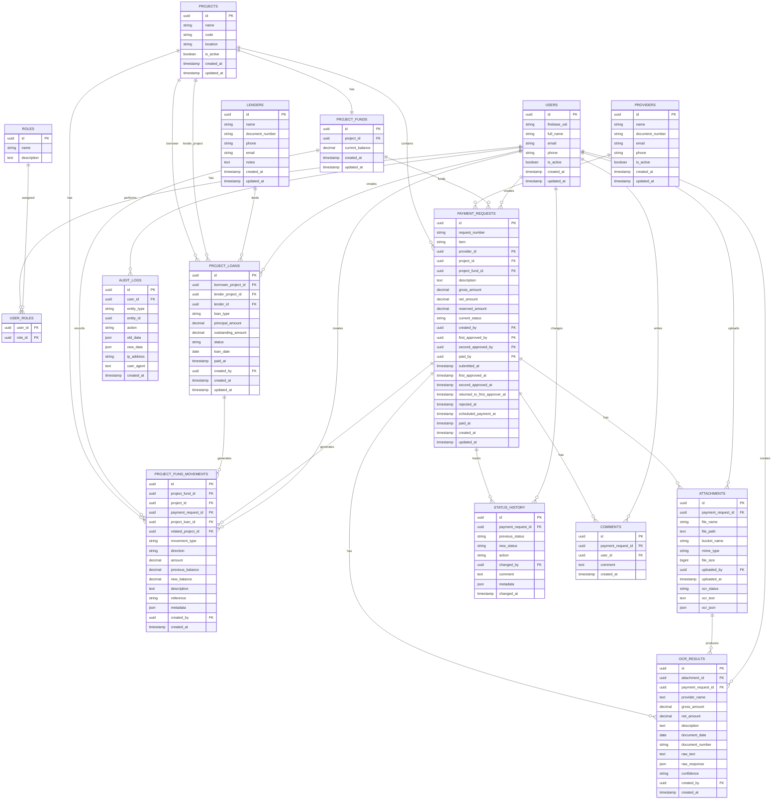
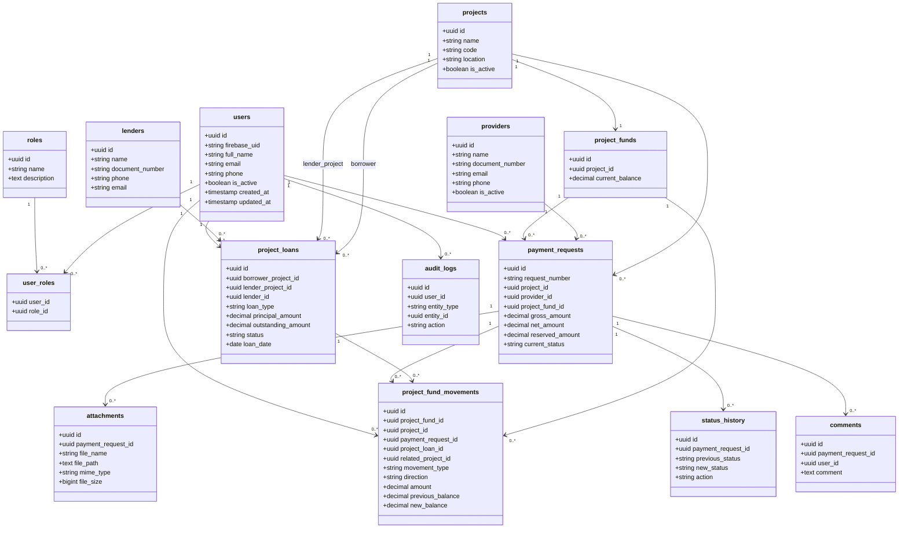

# 06. Modelo de base de datos

## Objetivo

Definir el modelo completo de base de datos relacional para el sistema de gestión de solicitudes de pago de una empresa de obras civiles.

Este modelo cubre:

- Usuarios.
- Roles.
- Asignación de roles.
- Obras/proyectos.
- Proveedores.
- Solicitudes de pago.
- Adjuntos.
- Historial de estados.
- Comentarios.
- Auditoría.
- Cuentas de fondos por obra.
- Movimientos financieros de obra.
- Préstamos de personas a obras.
- Préstamos entre obras.
- Prestamistas.
- Resultados OCR futuros.

El sistema está diseñado para operar con una Aplicación Web, backend en Cloud Run y PostgreSQL en Cloud SQL.

La Aplicación Web no debe conectarse directamente a la base de datos. Toda operación debe pasar por el backend.

---

# 1. Principios del modelo

- Usar PostgreSQL como base de datos transaccional.
- Usar UUID como identificador principal.
- No almacenar archivos binarios en PostgreSQL.
- Guardar únicamente metadatos de archivos en `attachments`.
- Mantener `current_status` en `payment_requests` como estado actual de consulta rápida.
- Mantener `status_history` como fuente de trazabilidad de cambios de estado.
- Mantener `project_fund_movements` como fuente de trazabilidad financiera.
- Mantener `audit_logs` como fuente de auditoría operativa y administrativa.
- Toda reserva, liberación, ajuste, préstamo, devolución o pago debe quedar registrado como movimiento financiero.
- Todo cambio de estado que afecte fondos debe ejecutarse dentro de una transacción.
- El Solicitante no selecciona cuenta de fondos.
- El backend determina automáticamente la cuenta de fondos de la obra/proyecto de la solicitud.

---

# 2. Entidades principales

- `users`
- `roles`
- `user_roles`
- `projects`
- `providers`
- `lenders`
- `project_funds`
- `project_loans`
- `payment_requests`
- `project_fund_movements`
- `attachments`
- `status_history`
- `comments`
- `audit_logs`
- `ocr_results`

---

# 3. Roles iniciales

```text
ADMIN
SOLICITANTE
ACCOUNTING_ASSISTANT
APPROVER_LEVEL_1
APPROVER_LEVEL_2
PAGOS
```

---

# 4. Estados de solicitud

```text
DRAFT
PENDING_FIRST_APPROVAL
PENDING_SECOND_APPROVAL
RETURNED_TO_FIRST_APPROVER
REJECTED
APPROVED
SCHEDULED_FOR_PAYMENT
PAID
CANCELLED
```

---

# 5. Estados de préstamo

```text
PENDING
PARTIALLY_PAID
PAID
CANCELLED
```

---

# 6. Tipos de préstamo

```text
PERSON_TO_PROJECT
PROJECT_TO_PROJECT
```

---

# 7. Tipos de movimiento financiero

| Tipo técnico | Dirección | Descripción |
|---|---|---|
| `INCOME_ADVANCE` | `INCOME` | Anticipo recibido por ejecución de obra |
| `INCOME_LOAN_PERSON` | `INCOME` | Préstamo recibido de una persona o tercero |
| `INCOME_LOAN_PROJECT` | `INCOME` | Préstamo recibido desde otra obra |
| `INCOME_LOAN_REPAYMENT` | `INCOME` | Devolución recibida por préstamo hecho a otra obra |
| `EXPENSE_PAYMENT_REQUEST` | `EXPENSE` | Pago efectivo de una solicitud |
| `EXPENSE_LOAN_REPAYMENT` | `EXPENSE` | Devolución de préstamo a persona u obra |
| `EXPENSE_LOAN_TO_PROJECT` | `EXPENSE` | Préstamo realizado a otra obra |
| `RESERVE_PAYMENT_REQUEST` | `EXPENSE` | Reserva temporal para solicitud enviada |
| `RELEASE_PAYMENT_REQUEST` | `INCOME` | Liberación de reserva por rechazo o anulación |
| `ADJUSTMENT_INCOME` | `INCOME` | Ajuste positivo autorizado |
| `ADJUSTMENT_EXPENSE` | `EXPENSE` | Ajuste negativo autorizado |

---

# 8. Diagrama ER



---

# 9. Diagrama lógico



---

# 10. DDL completo

## 10.1 Extensión requerida

```sql
CREATE EXTENSION IF NOT EXISTS pgcrypto;
```

---

## 10.2 Tabla users

```sql
CREATE TABLE users (
    id UUID PRIMARY KEY DEFAULT gen_random_uuid(),

    firebase_uid VARCHAR(128) UNIQUE NOT NULL,
    full_name VARCHAR(150) NOT NULL,
    email VARCHAR(150) UNIQUE NOT NULL,
    phone VARCHAR(50),

    is_active BOOLEAN DEFAULT TRUE,

    created_at TIMESTAMP DEFAULT NOW(),
    updated_at TIMESTAMP DEFAULT NOW()
);
```

---

## 10.3 Tabla roles

```sql
CREATE TABLE roles (
    id UUID PRIMARY KEY DEFAULT gen_random_uuid(),
    name VARCHAR(50) UNIQUE NOT NULL,
    description TEXT
);
```

---

## 10.4 Tabla user_roles

```sql
CREATE TABLE user_roles (
    user_id UUID NOT NULL REFERENCES users(id) ON DELETE CASCADE,
    role_id UUID NOT NULL REFERENCES roles(id) ON DELETE CASCADE,

    created_at TIMESTAMP DEFAULT NOW(),

    PRIMARY KEY (user_id, role_id)
);
```

---

## 10.5 Tabla projects

```sql
CREATE TABLE projects (
    id UUID PRIMARY KEY DEFAULT gen_random_uuid(),

    name VARCHAR(150) NOT NULL,
    code VARCHAR(50),
    location VARCHAR(150),
    description TEXT,

    is_active BOOLEAN DEFAULT TRUE,

    created_at TIMESTAMP DEFAULT NOW(),
    updated_at TIMESTAMP DEFAULT NOW()
);
```

---

## 10.6 Tabla providers

```sql
CREATE TABLE providers (
    id UUID PRIMARY KEY DEFAULT gen_random_uuid(),

    name VARCHAR(150) NOT NULL,
    document_number VARCHAR(50),
    email VARCHAR(150),
    phone VARCHAR(50),
    address TEXT,

    is_active BOOLEAN DEFAULT TRUE,

    created_at TIMESTAMP DEFAULT NOW(),
    updated_at TIMESTAMP DEFAULT NOW()
);
```

---

## 10.7 Tabla lenders

```sql
CREATE TABLE lenders (
    id UUID PRIMARY KEY DEFAULT gen_random_uuid(),

    name VARCHAR(150) NOT NULL,
    document_number VARCHAR(50),
    phone VARCHAR(50),
    email VARCHAR(150),
    notes TEXT,

    created_at TIMESTAMP DEFAULT NOW(),
    updated_at TIMESTAMP DEFAULT NOW()
);
```

---

## 10.8 Tabla project_funds

```sql
CREATE TABLE project_funds (
    id UUID PRIMARY KEY DEFAULT gen_random_uuid(),

    project_id UUID NOT NULL REFERENCES projects(id),

    current_balance NUMERIC(14,2) NOT NULL DEFAULT 0,

    created_at TIMESTAMP DEFAULT NOW(),
    updated_at TIMESTAMP DEFAULT NOW(),

    CONSTRAINT chk_project_fund_balance CHECK (current_balance >= 0)
);

CREATE UNIQUE INDEX uq_project_funds_project
ON project_funds(project_id);
```

---

## 10.9 Tabla project_loans

```sql
CREATE TABLE project_loans (
    id UUID PRIMARY KEY DEFAULT gen_random_uuid(),

    borrower_project_id UUID NOT NULL REFERENCES projects(id),
    lender_project_id UUID REFERENCES projects(id),
    lender_id UUID REFERENCES lenders(id),

    loan_type VARCHAR(50) NOT NULL,

    principal_amount NUMERIC(14,2) NOT NULL,
    outstanding_amount NUMERIC(14,2) NOT NULL,

    status VARCHAR(50) NOT NULL DEFAULT 'PENDING',

    loan_date DATE NOT NULL,
    paid_at TIMESTAMP,

    reference VARCHAR(100),
    description TEXT,

    created_by UUID REFERENCES users(id),
    created_at TIMESTAMP DEFAULT NOW(),
    updated_at TIMESTAMP DEFAULT NOW(),

    CONSTRAINT chk_project_loan_type CHECK (
        loan_type IN ('PERSON_TO_PROJECT', 'PROJECT_TO_PROJECT')
    ),

    CONSTRAINT chk_project_loan_status CHECK (
        status IN ('PENDING', 'PARTIALLY_PAID', 'PAID', 'CANCELLED')
    ),

    CONSTRAINT chk_project_loan_amounts CHECK (
        principal_amount > 0
        AND outstanding_amount >= 0
        AND outstanding_amount <= principal_amount
    ),

    CONSTRAINT chk_project_loan_lender CHECK (
        (
            loan_type = 'PERSON_TO_PROJECT'
            AND lender_id IS NOT NULL
            AND lender_project_id IS NULL
        )
        OR
        (
            loan_type = 'PROJECT_TO_PROJECT'
            AND lender_project_id IS NOT NULL
            AND lender_id IS NULL
        )
    ),

    CONSTRAINT chk_project_loan_not_same_project CHECK (
        lender_project_id IS NULL
        OR borrower_project_id <> lender_project_id
    )
);
```

---

## 10.10 Tabla payment_requests

```sql
CREATE TABLE payment_requests (
    id UUID PRIMARY KEY DEFAULT gen_random_uuid(),

    request_number VARCHAR(50) UNIQUE NOT NULL,

    item VARCHAR(100),

    provider_id UUID REFERENCES providers(id),
    project_id UUID NOT NULL REFERENCES projects(id),
    project_fund_id UUID REFERENCES project_funds(id),

    description TEXT NOT NULL,

    gross_amount NUMERIC(14,2) NOT NULL,
    net_amount NUMERIC(14,2) NOT NULL,
    reserved_amount NUMERIC(14,2),

    current_status VARCHAR(50) NOT NULL DEFAULT 'DRAFT',

    created_by UUID REFERENCES users(id),
    first_approved_by UUID REFERENCES users(id),
    second_approved_by UUID REFERENCES users(id),
    paid_by UUID REFERENCES users(id),

    submitted_at TIMESTAMP,
    first_approved_at TIMESTAMP,
    second_approved_at TIMESTAMP,
    returned_to_first_approver_at TIMESTAMP,
    rejected_at TIMESTAMP,
    scheduled_payment_at TIMESTAMP,
    paid_at TIMESTAMP,

    created_at TIMESTAMP DEFAULT NOW(),
    updated_at TIMESTAMP DEFAULT NOW(),

    CONSTRAINT chk_payment_request_amounts CHECK (
        net_amount <= gross_amount
    ),

    CONSTRAINT chk_payment_request_positive_amounts CHECK (
        gross_amount >= 0
        AND net_amount >= 0
        AND (reserved_amount IS NULL OR reserved_amount >= 0)
    ),

    CONSTRAINT chk_payment_request_status CHECK (
        current_status IN (
            'DRAFT',
            'PENDING_FIRST_APPROVAL',
            'PENDING_SECOND_APPROVAL',
            'RETURNED_TO_FIRST_APPROVER',
            'REJECTED',
            'APPROVED',
            'SCHEDULED_FOR_PAYMENT',
            'PAID',
            'CANCELLED'
        )
    )
);
```

---

## 10.11 Tabla project_fund_movements

```sql
CREATE TABLE project_fund_movements (
    id UUID PRIMARY KEY DEFAULT gen_random_uuid(),

    project_fund_id UUID NOT NULL REFERENCES project_funds(id),
    project_id UUID NOT NULL REFERENCES projects(id),

    payment_request_id UUID REFERENCES payment_requests(id),
    project_loan_id UUID REFERENCES project_loans(id),
    related_project_id UUID REFERENCES projects(id),

    movement_type VARCHAR(80) NOT NULL,
    direction VARCHAR(20) NOT NULL,

    amount NUMERIC(14,2) NOT NULL,

    previous_balance NUMERIC(14,2) NOT NULL,
    new_balance NUMERIC(14,2) NOT NULL,

    description TEXT,
    reference VARCHAR(100),
    metadata JSONB,

    created_by UUID REFERENCES users(id),
    created_at TIMESTAMP DEFAULT NOW(),

    CONSTRAINT chk_project_fund_movement_direction CHECK (
        direction IN ('INCOME', 'EXPENSE')
    ),

    CONSTRAINT chk_project_fund_movement_amount CHECK (
        amount > 0
    ),

    CONSTRAINT chk_project_fund_movement_balances CHECK (
        previous_balance >= 0
        AND new_balance >= 0
    ),

    CONSTRAINT chk_project_fund_movement_type CHECK (
        movement_type IN (
            'INCOME_ADVANCE',
            'INCOME_LOAN_PERSON',
            'INCOME_LOAN_PROJECT',
            'INCOME_LOAN_REPAYMENT',
            'EXPENSE_PAYMENT_REQUEST',
            'EXPENSE_LOAN_REPAYMENT',
            'EXPENSE_LOAN_TO_PROJECT',
            'RESERVE_PAYMENT_REQUEST',
            'RELEASE_PAYMENT_REQUEST',
            'ADJUSTMENT_INCOME',
            'ADJUSTMENT_EXPENSE'
        )
    )
);
```

---

## 10.12 Tabla attachments

```sql
CREATE TABLE attachments (
    id UUID PRIMARY KEY DEFAULT gen_random_uuid(),

    payment_request_id UUID NOT NULL REFERENCES payment_requests(id) ON DELETE CASCADE,

    file_name VARCHAR(255) NOT NULL,
    file_path TEXT NOT NULL,
    bucket_name VARCHAR(150) NOT NULL,
    mime_type VARCHAR(100),
    file_size BIGINT,

    uploaded_by UUID REFERENCES users(id),
    uploaded_at TIMESTAMP DEFAULT NOW(),

    ocr_status VARCHAR(50) DEFAULT 'NOT_PROCESSED',
    ocr_text TEXT,
    ocr_json JSONB,

    CONSTRAINT chk_attachment_ocr_status CHECK (
        ocr_status IN (
            'NOT_PROCESSED',
            'PENDING',
            'PROCESSED',
            'FAILED'
        )
    )
);
```

---

## 10.13 Tabla status_history

```sql
CREATE TABLE status_history (
    id UUID PRIMARY KEY DEFAULT gen_random_uuid(),

    payment_request_id UUID NOT NULL REFERENCES payment_requests(id) ON DELETE CASCADE,

    previous_status VARCHAR(50),
    new_status VARCHAR(50) NOT NULL,

    action VARCHAR(100) NOT NULL,

    changed_by UUID REFERENCES users(id),
    comment TEXT,
    metadata JSONB,

    changed_at TIMESTAMP DEFAULT NOW()
);
```

---

## 10.14 Tabla comments

```sql
CREATE TABLE comments (
    id UUID PRIMARY KEY DEFAULT gen_random_uuid(),

    payment_request_id UUID NOT NULL REFERENCES payment_requests(id) ON DELETE CASCADE,
    user_id UUID REFERENCES users(id),

    comment TEXT NOT NULL,

    created_at TIMESTAMP DEFAULT NOW()
);
```

---

## 10.15 Tabla audit_logs

```sql
CREATE TABLE audit_logs (
    id UUID PRIMARY KEY DEFAULT gen_random_uuid(),

    user_id UUID REFERENCES users(id),

    entity_type VARCHAR(100) NOT NULL,
    entity_id UUID,

    action VARCHAR(100) NOT NULL,

    old_data JSONB,
    new_data JSONB,

    ip_address VARCHAR(100),
    user_agent TEXT,

    created_at TIMESTAMP DEFAULT NOW()
);
```

---

## 10.16 Tabla ocr_results

```sql
CREATE TABLE ocr_results (
    id UUID PRIMARY KEY DEFAULT gen_random_uuid(),

    attachment_id UUID REFERENCES attachments(id),
    payment_request_id UUID REFERENCES payment_requests(id),

    provider_name TEXT,
    gross_amount NUMERIC(14,2),
    net_amount NUMERIC(14,2),
    description TEXT,
    document_date DATE,
    document_number VARCHAR(100),

    raw_text TEXT,
    raw_response JSONB,

    confidence VARCHAR(50),

    created_by UUID REFERENCES users(id),
    created_at TIMESTAMP DEFAULT NOW()
);
```

---

# 11. Índices recomendados

```sql
CREATE INDEX idx_users_firebase_uid ON users(firebase_uid);
CREATE INDEX idx_users_email ON users(email);
CREATE INDEX idx_users_is_active ON users(is_active);

CREATE INDEX idx_roles_name ON roles(name);

CREATE INDEX idx_projects_code ON projects(code);
CREATE INDEX idx_projects_is_active ON projects(is_active);

CREATE INDEX idx_providers_document_number ON providers(document_number);
CREATE INDEX idx_providers_is_active ON providers(is_active);

CREATE INDEX idx_lenders_document_number ON lenders(document_number);
CREATE INDEX idx_lenders_name ON lenders(name);

CREATE INDEX idx_project_funds_project ON project_funds(project_id);

CREATE INDEX idx_project_loans_borrower_project ON project_loans(borrower_project_id);
CREATE INDEX idx_project_loans_lender_project ON project_loans(lender_project_id);
CREATE INDEX idx_project_loans_lender ON project_loans(lender_id);
CREATE INDEX idx_project_loans_type ON project_loans(loan_type);
CREATE INDEX idx_project_loans_status ON project_loans(status);

CREATE INDEX idx_payment_requests_status ON payment_requests(current_status);
CREATE INDEX idx_payment_requests_project ON payment_requests(project_id);
CREATE INDEX idx_payment_requests_provider ON payment_requests(provider_id);
CREATE INDEX idx_payment_requests_created_by ON payment_requests(created_by);
CREATE INDEX idx_payment_requests_project_fund ON payment_requests(project_fund_id);
CREATE INDEX idx_payment_requests_status_created_at ON payment_requests(current_status, created_at);

CREATE INDEX idx_project_fund_movements_fund ON project_fund_movements(project_fund_id);
CREATE INDEX idx_project_fund_movements_project ON project_fund_movements(project_id);
CREATE INDEX idx_project_fund_movements_request ON project_fund_movements(payment_request_id);
CREATE INDEX idx_project_fund_movements_loan ON project_fund_movements(project_loan_id);
CREATE INDEX idx_project_fund_movements_related_project ON project_fund_movements(related_project_id);
CREATE INDEX idx_project_fund_movements_type ON project_fund_movements(movement_type);
CREATE INDEX idx_project_fund_movements_direction ON project_fund_movements(direction);
CREATE INDEX idx_project_fund_movements_created_at ON project_fund_movements(created_at);

CREATE INDEX idx_attachments_payment_request ON attachments(payment_request_id);
CREATE INDEX idx_attachments_uploaded_by ON attachments(uploaded_by);

CREATE INDEX idx_status_history_payment_request ON status_history(payment_request_id);
CREATE INDEX idx_status_history_changed_by ON status_history(changed_by);
CREATE INDEX idx_status_history_action ON status_history(action);
CREATE INDEX idx_status_history_changed_at ON status_history(changed_at);

CREATE INDEX idx_comments_payment_request ON comments(payment_request_id);
CREATE INDEX idx_comments_user ON comments(user_id);

CREATE INDEX idx_audit_logs_user ON audit_logs(user_id);
CREATE INDEX idx_audit_logs_entity ON audit_logs(entity_type, entity_id);
CREATE INDEX idx_audit_logs_action ON audit_logs(action);
CREATE INDEX idx_audit_logs_created_at ON audit_logs(created_at);

CREATE INDEX idx_ocr_results_attachment ON ocr_results(attachment_id);
CREATE INDEX idx_ocr_results_payment_request ON ocr_results(payment_request_id);
```

---

# 12. Datos semilla sugeridos

## Roles

```sql
INSERT INTO roles (name, description) VALUES
('ADMIN', 'Administrador del sistema'),
('SOLICITANTE', 'Usuario que crea solicitudes de pago'),
('ACCOUNTING_ASSISTANT', 'Auxiliar contable que crea solicitudes y administra fondos de obra'),
('APPROVER_LEVEL_1', 'Aprobador de primer nivel'),
('APPROVER_LEVEL_2', 'Aprobador de segundo nivel'),
('PAGOS', 'Usuario encargado de programación y confirmación de pagos');
```

---

# 13. Reglas transaccionales

## Préstamo de persona a obra

En una sola transacción:

1. Crear o reutilizar prestamista en `lenders`.
2. Crear préstamo `PERSON_TO_PROJECT` en `project_loans`.
3. Aumentar `project_funds.current_balance` de la obra.
4. Crear movimiento `INCOME_LOAN_PERSON`.
5. Registrar auditoría.

## Préstamo entre obras

En una sola transacción:

1. Validar saldo suficiente en la obra prestamista.
2. Disminuir `project_funds.current_balance` de la obra prestamista.
3. Aumentar `project_funds.current_balance` de la obra receptora.
4. Crear préstamo `PROJECT_TO_PROJECT`.
5. Crear movimiento `EXPENSE_LOAN_TO_PROJECT` en la obra prestamista.
6. Crear movimiento `INCOME_LOAN_PROJECT` en la obra receptora.
7. Registrar auditoría.

## Anticipo de obra

En una sola transacción:

1. Aumentar `project_funds.current_balance`.
2. Crear movimiento `INCOME_ADVANCE`.
3. Registrar auditoría.

## Devolución de préstamo

En una sola transacción:

1. Validar que el préstamo esté pendiente o parcialmente pagado.
2. Validar que el valor no supere `outstanding_amount`.
3. Validar saldo suficiente en la obra deudora.
4. Disminuir saldo de obra deudora.
5. Crear movimiento `EXPENSE_LOAN_REPAYMENT`.
6. Si el préstamo es entre obras, aumentar saldo de obra prestamista.
7. Si el préstamo es entre obras, crear movimiento `INCOME_LOAN_REPAYMENT`.
8. Actualizar `outstanding_amount`.
9. Actualizar estado del préstamo.
10. Registrar auditoría.

## Envío de solicitud

En una sola transacción:

1. Validar datos de la solicitud.
2. Validar soportes.
3. Identificar cuenta de fondos de la obra.
4. Validar saldo suficiente si se maneja reserva.
5. Registrar reserva `RESERVE_PAYMENT_REQUEST`, si aplica.
6. Cambiar estado a `PENDING_FIRST_APPROVAL`.
7. Registrar `status_history`.
8. Registrar auditoría.

## Pago de solicitud

En una sola transacción:

1. Validar solicitud en `SCHEDULED_FOR_PAYMENT`.
2. Validar fondos de la obra.
3. Registrar egreso `EXPENSE_PAYMENT_REQUEST`.
4. Cambiar estado a `PAID`.
5. Registrar `status_history`.
6. Registrar auditoría.
